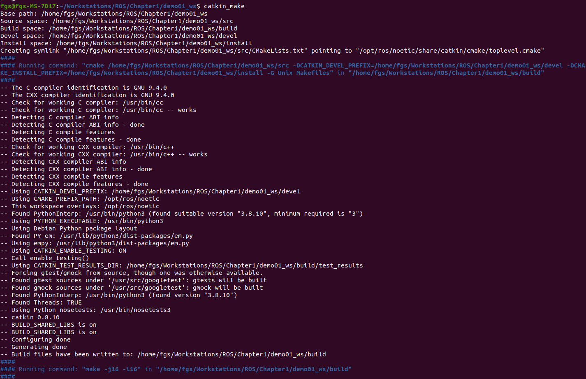
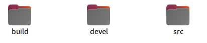
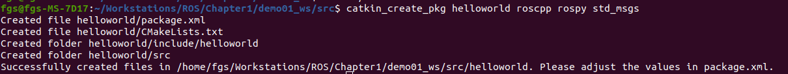
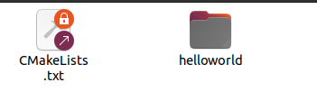
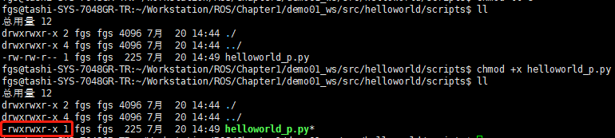
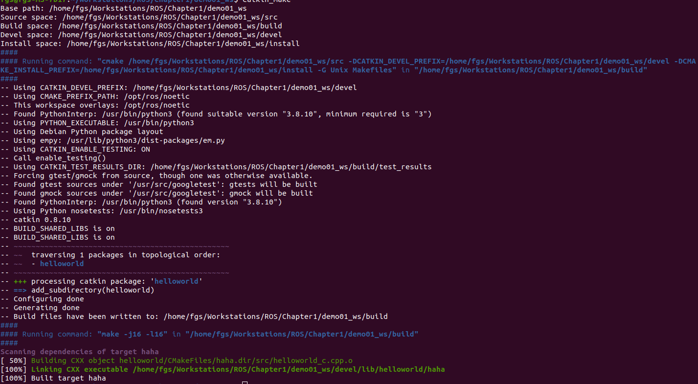
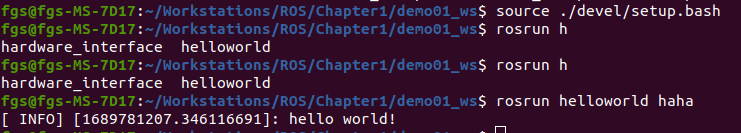
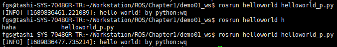

## 实现大致流程
1. 先创建一个工作空间
2. 再创建一个功能包
3. 编辑源文件
4. 编辑配置文件
5. 编译执行
   
### 1.创建工作空间并初始化
```shell
# mkdir -p 自定义空间名称/src
# cd 自定义空间名称
# catkin_make
mkdir -p demo01_ws/src
cd demo01
catkin_make
```
执行命令的结果如下：
<div align="center">
    
</div>
命令执行完成后，在目录下自动生成了 build 以及 devel 目录：
<div align="center">
    
</div>

### 2.进入src文件夹创建ros包并添加依赖
```shell
cd src
#catkin_create_pkg 自定义ROS包名 roscpp rospy std_msgs
catkin_create_pkg helloworld roscpp rospy std_msgs
```
上述命令，会在工作空间下生成一个功能包，该功能包依赖于roscpp、rospy与std_msgs，其中roscpp是使用C++实现的库，而rospy则是使用python实现的库，std_msgs是标准消息库，创建ROS功能包时，一般都会依赖这三个库实现。

执行命令会得到如下输出：
<div align="center">
    
</div>
进入src文件夹，可以看到自动创建了 CMakeLists.txt 文件以及 helloworld 文件夹，这也是我们创建的包。
<div align="center">
    
</div>

### 3. 编辑源文件
#### 3.1 HelloWorld (C++版)
进入ros包的src目录编辑源文件
C++源码实现如下：
```cpp
// 1. 包含 ros 的头文件
#include "ros/ros.h"

// 2. 编写main函数
int main(int argc, char *argv[]) {
    // 3. 初始化 ros 节点
    ros::init(argc, argv, "hello_node"); // “hello_node”是节点名称
    // 4. 输出日志
    ROS_INFO("hello world!");

    return 0;
}
```

#### 3.2 HelloWorld (python版本)
进入工程目录-->进入src-->进入功能包目录(helloworld)-->创建目录scripts并创建python文件：helloworld_p.py
python源码实现如下：
```python
#! /usr/bin/env python
## 指定解释器

# 1. 导包
import rospy

# 2. 编写主入口
if __name__ == "__main__":
    # 3. 初始化 ROS 节点
    rospy.init_node("hello_p")
    # 4. 输出日志
    rospy.loginfo("hello world! by python:wq")
```
python文件不需要编译，但是需要给python文件提供可执行的权限：
```shell
chmod +x helloworld_p.py
```
效果如下：
<div align="center">
    
</div>

### 4. 编辑配置文件
#### 4.1 CMakeLists.txt (C++版)
位置：与功能包目录同级
```cpp
add_executable(haha src/helloworld_c.cpp) # 参数一是可执行文件的命名

target_link_libraries(haha
  ${catkin_LIBRARIES}
)
```

#### 4.2 CMakeLists.txt (python版本)
在功能包同级的目录下，将以下内容释放注释，并修改python文件为上一步创建的文件：
```shell
catkin_install_python(PROGRAMS
  scripts/helloworld_p.py
  DESTINATION ${CATKIN_PACKAGE_BIN_DESTINATION}
)
```
创建的python文件为：helloworld_p.py

### 5. 编译执行
#### 5.1 编译
在项目工程的同级目录下(./demo01_ws/)输入命令：catkin_make 进行编译：
<div align="center">
    
</div>

#### 5.2 执行
```shell
roscore
# 进入项目工程目录下：
source ./devel/setup.bash # 导入环境变量
# rosrun 包名 可执行文件名称
rosrun helloworld haha
```
source ./devel/setup.bash 在终端执行该命令，可以将当前的工程环境更新到当前的终端，如果使用其他终端会失败。

如果想在任意的终端下都可以使用工程的环境，可以将上述命令添加进 .bashrc 文件：
```shell
echo "source ~/工作空间/devel/setup.bash" >> ~/.bashrc
```
<span style="color:red"><B>不建议把工程环境变量添加到.bashrc文件中</B></span>

rosrun执行结果如下：
<div align="center">
    
</div>

#### 5.3 python版本执行
如果是python版本，不会对python文件编译成一个可执行文件，只需要给python文件提供权限后，即可执行。

```shell
catkin_make
source ./devel/setup.bash
rosrun helloworld helloworld_p.py
```
rosrun执行结果如下：
<div align="center">
    
</div>
