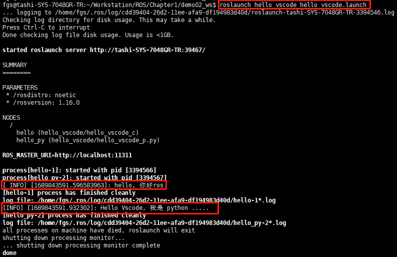

# launch文件演示
## 1. 需求
>一个程序中可能需要启动多个节点，比如：ROS内置的小乌龟案例，如果要控制乌龟运动，要启动多个窗口，分别启动roscore、乌龟界面控制节点、键盘控制节点。如果每次都调用rosrun逐一启动，显然效率低下，如何优化？

官方给出的优化策略是使用 launch 文件，可以一次性启动多个 ROS 节点。

## 2. 实现
 1. 选定功能包右击 --> 添加launch文件夹
 2. 选定 launch 文件夹右击 --> 添加 launch 文件
 3. 编辑 launch 文件内容
 ```launch
 <launch>
    <node pkg="helloworld" type="demo_hello" name="hello" output="screen" />
    <node pkg="turtlesim" type="turtlesim_node" name="t1" />
    <node pkg="turtlesim" type="turtle_teleop_key" name="key1" />
 </launch>
 ```

 说明：
- node ---> 包含的某个节点
- pkg ----> 功能包
- type ---> 被运行的节点文件
- name ---> 为节点命名
- output -> 设置日志的输出目标

举例：
```launch
<launch>
        <node pkg="hello_vscode" type="hello_vscode_c" name="hello" output="screen"/>
        <node pkg="hello_vscode" type="hello_vscode_p.py" name="hello_py" output="screen"/>
</launch>
```
<span style="color:red">注意：name是被运行的节点命名，这个名字可以任意，但是在launch文件中不允许有重复的name命名；如果没有output属性，则结果不会输出到终端。</span>

 4. 运行launch文件
 ```shell
 roslaunch 包名 launch文件名
 ```
 执行之前需要source一下环境：source ./devel/setup.bash

 5. 运行结果：一次性启动了多个节点
 <div>
    
 </div>