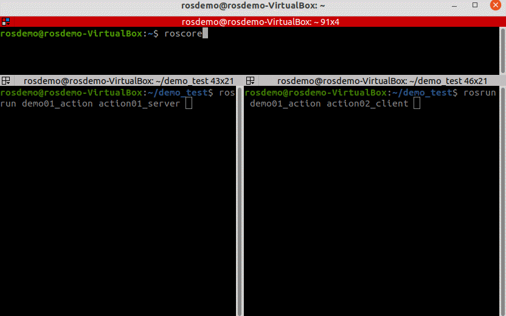
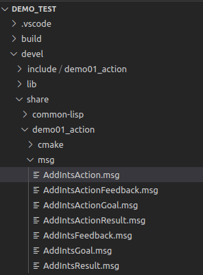
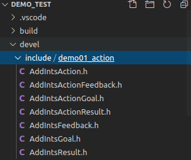
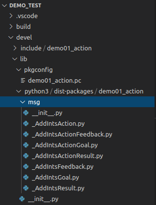

# 10.1 action通信

关于action通信，我们先从之前导航中的应用场景开始介绍，描述如下：

> 机器人导航到某个目标点，此过程需要一个节点A发布目标信息，然后一个节点B接收到请求并控制移动，最终响应目标达成状态信息。

乍一看，这好像是服务通信实现，因为需求中要A发送目标，B执行并返回结果，这是一个典型的基于请求响应的应答模式，不过，如果只是使用基本服务通信实现，存在一个问题：<B>导航是一个过程，是耗时操作，如果使用服务通信，那么只有在导航结束时，才会产生响应结果，而在导航过程中，节点A是不会获取到任何反馈的，从而可能出现程序“假死”的现象，过程的不可控意味着不良的用户体验，以及逻辑处理的缺陷(比如：导航中止的需求无法实现)。</B>更合理的方案应该是：导航过程中，可以连续反馈当前机器人状态信息，当导航终止时，再返回最终的执行结果。在ROS中，该实现策略称之为：action通信。

---

<B>概念</B>

在ROS中提供了actionlib功能包集，用于实现 action 通信。action 是一种类似于服务通信的实现，其实现模型也包含请求和响应，但是不同的是，在请求和响应的过程中，服务端还可以连续的反馈当前任务进度，客户端可以接收连续反馈并且还可以取消任务。

<B>action结构图解：</B>

<div align="center">
    
</div>

<B>action通信接口图解：</B>

<div align="center">
    
</div>

- goal：目标任务；
- cancel：取消任务；
- status：服务端状态；
- result：最终执行结果(只会发布一次)；
- feedback：连续反馈(可以发布多次)。

<B>作用</B>

一般适用于耗时的请求响应场景，用以获取连续的状态反馈。

<B>案例</B>

创建两个ROS节点，服务器和客户端，客户端可以向服务器发送目标数据N(一个整形数据)服务器会计算1到N之间所有整数的和，这是一个循环累加的过程，返回给客户端，这是基于请求响应模式的，又已知服务器从接收到请求到产生响应是一个耗时操作，每累加一次耗时0.1s，为了良好的用户体验，需要服务器在计算过程中，每累加一次，就给客户端响应一次百分比格式的执行进度，使用action实现。

<div align="center">
    
</div>

---

<B>另请参考:</B>

- http://wiki.ros.org/actionlib

- http://wiki.ros.org/actionlib_tutorials/Tutorials


## 10.1.1 action 通信自定义action文件

action、srv、msg 文件内的可用数据类型一致，且三者实现流程类似：

1. 按照固定格式创建action文件；

2. 编辑配置文件；

3. 编译生成中间文件。

### 1. 定义action文件

首先新建功能包，并导入依赖：`roscpp rospy std_msgs actionlib actionlib_msgs`;

然后功能包下新建 action 目录，新增 xxx.action（比如：Addints.action）。

action 文件内容组成分为三部分：请求目标值、最终响应结果、连续反馈，三者之间使用 `---` 分割示例内容如下：

```yaml
# 1. 目标数据变量
int32 num
--
# 2. 最终响应变量
int32 result
---
# 3. 连续反馈变量
float64 progress_bar
```

### 2. 编辑配置文件

<B>CMakeLists.txt</B>

```cmake
find_package(catkin REQUIRED COMPONENTS
  actionlib
  actionlib_msgs
  roscpp
  rospy
  std_msgs
)
```

```cmake
add_action_files(
  FILES
  AddInts.action
)
```

```cmake
generate_messages(
  DEPENDENCIES
  actionlib_msgs
  std_msgs
)
```

```cmake
catkin_package(
#  INCLUDE_DIRS include
#  LIBRARIES demo01_action
 CATKIN_DEPENDS actionlib actionlib_msgs roscpp rospy std_msgs
#  DEPENDS system_lib
)
```

### 3. 编译

编译后会生成一些中间文件。

msg文件(.../工作空间/devel/share/包名/msg/xxx.msg):

<div align="center">
    
</div>

C++ 调用的文件(.../工作空间/devel/include/baomin/xxx.h):

<div align="center">
    
</div>

Python 调用的文件(.../工作空间/devel/lib/python3/dist-package/包名/msg/xxx.py):

<div align="center">
    
</div>

---

## 10.1.2 action通信自定义action文件调用A(C++)

<B>需求：</B>

> 创建两个ROS节点，服务器和客户端，客户端可以向服务器发送目标数据N(一个整形数据)服务器会计算 1 到 N 之间所有整数的和，这是一个循环累加的过程，返回给客户端，这是基于请求响应模式的，又已知服务器从接收到请求到产生响应是一个耗时操作，每累加一次耗时0.1s，为了良好的用户体验，需要服务器在计算过程中，每累加一次，就给客户端响应一次百分比格式的执行进度，使用 action 实现。

<B>流程：</B>

1. 编写action服务端实现；
2. 编写action客户端实现；
3. 编辑CMakeLists.txt；
4. 编译并执行。

### 0. vscode 配置

需要像之前自定义 msg 实现一样配置 c_cpp_properies.json 文件，如果以前已经配置且没有变更工作空间，可以忽略，如果需要配置，配置方式与之前相同：

```json
{
    "configurations": [
        {
            "browse": {
                "databaseFilename": "",
                "limitSymbolsToIncludedHeaders": true
            },
            "includePath": [
                "/opt/ros/noetic/include/**",
                "/usr/include/**",
                "/xxx/yyy工作空间/devel/include/**" //配置 head 文件的路径 
            ],
            "name": "ROS",
            "intelliSenseMode": "gcc-x64",
            "compilerPath": "/usr/bin/gcc",
            "cStandard": "c11",
            "cppStandard": "c++17"
        }
    ],
    "version": 4
}
```

### 1. 服务端

```cpp

```

<B>PS:</B>

可以先配置CMakeLists.txt文件并启动上述action服务端，然后通过 rostopic 查看话题，向 action 相关话题发送消息，或订阅 action 相关话题的消息。

### 2. 客户端

```cpp

```

<B>PS:</B>

等待服务启动，只可以使用`client.waitForServer();`，之前服务中等待启动的另一种方式`ros::service::waitForService("addInts")；`不适用

### 3. 编译配置文件

```cmake

```

### 4. 执行

首先启动 roscore，然后分别启动 action 服务端与 action 客户端，最终运行结果与案例类似。

---