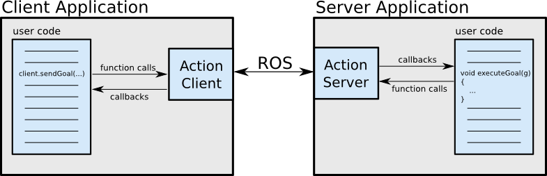
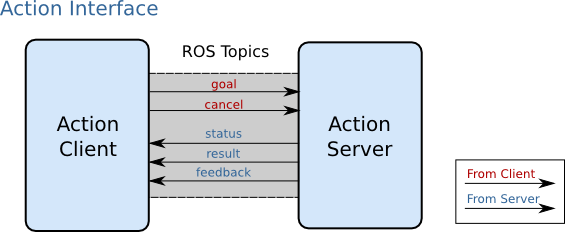

# 10.1 action通信

关于action通信，我们先从之前导航中的应用场景开始介绍，描述如下：

> 机器人导航到某个目标点，此过程需要一个节点A发布目标信息，然后一个节点B接收到请求并控制移动，最终响应目标达成状态信息。

乍一看，这好像是服务通信实现，因为需求中要A发送目标，B执行并返回结果，这是一个典型的基于请求响应的应答模式，不过，如果只是使用基本服务通信实现，存在一个问题：<B>导航是一个过程，是耗时操作，如果使用服务通信，那么只有在导航结束时，才会产生响应结果，而在导航过程中，节点A是不会获取到任何反馈的，从而可能出现程序“假死”的现象，过程的不可控意味着不良的用户体验，以及逻辑处理的缺陷(比如：导航中止的需求无法实现)。</B>更合理的方案应该是：导航过程中，可以连续反馈当前机器人状态信息，当导航终止时，再返回最终的执行结果。在ROS中，该实现策略称之为：action通信。

---

<B>概念</B>

在ROS中提供了actionlib功能包集，用于实现 action 通信。action 是一种类似于服务通信的实现，其实现模型也包含请求和响应，但是不同的是，在请求和响应的过程中，服务端还可以连续的反馈当前任务进度，客户端可以接收连续反馈并且还可以取消任务。

<B>action结构图解：</B>

<div align="center">
    
</div>

<B>action通信接口图解：</B>

<div align="center">
    
</div>

- goal：目标任务；
- cancel：取消任务；
- status：服务端状态；
- result：最终执行结果(只会发布一次)；
- feedback：连续反馈(可以发布多次)。

<B>作用</B>

一般适用于耗时的请求响应场景，用以获取连续的状态反馈。

<B>案例</B>

创建两个ROS节点，服务器和客户端，客户端可以向服务器发送目标数据N(一个整形数据)服务器会计算1到N之间所有整数的和，这是一个循环累加的过程，返回给客户端，这是基于请求响应模式的，又已知服务器从接收到请求到产生响应是一个耗时操作，每累加一次耗时0.1s，为了良好的用户体验，需要服务器在计算过程中，每累加一次，就给客户端响应一次百分比格式的执行进度，使用action实现。

<div align="center">
    
</div>

---

<B>另请参考:</B>

- http://wiki.ros.org/actionlib

- http://wiki.ros.org/actionlib_tutorials/Tutorials


## 10.1.1 action 通信自定义action文件

action、srv、msg 文件内的可用数据类型一致，且三者实现流程类似：

1. 按照固定格式创建action文件；

2. 编辑配置文件；

3. 编译生成中间文件。

### 1. 定义action文件

首先新建功能包，并导入依赖：`roscpp rospy std_msgs actionlib actionlib_msgs`;

然后功能包下新建 action 目录，新增 xxx.action（比如：Addints.action）。

action 文件内容组成分为三部分：请求目标值、最终响应结果、连续反馈，三者之间使用 `---` 分割示例内容如下：

```yaml
# 1. 目标数据变量
int32 num
--
# 2. 最终响应变量
int32 result
---
# 3. 连续反馈变量
float64 progress_bar
```

### 2. 编辑配置文件

<B>CMakeLists.txt</B>

```cmake
find_package(catkin REQUIRED COMPONENTS
  actionlib
  actionlib_msgs
  roscpp
  rospy
  std_msgs
)
```

```cmake
add_action_files(
  FILES
  AddInts.action
)
```

```cmake
generate_messages(
  DEPENDENCIES
  actionlib_msgs
  std_msgs
)
```

```cmake
catkin_package(
#  INCLUDE_DIRS include
#  LIBRARIES demo01_action
 CATKIN_DEPENDS actionlib actionlib_msgs roscpp rospy std_msgs
#  DEPENDS system_lib
)
```

### 3. 编译

编译后会生成一些中间文件。

msg文件(.../工作空间/devel/share/包名/msg/xxx.msg):

<div align="center">
    
</div>

C++ 调用的文件(.../工作空间/devel/include/baomin/xxx.h):

<div align="center">
    
</div>

Python 调用的文件(.../工作空间/devel/lib/python3/dist-package/包名/msg/xxx.py):

<div align="center">
    
</div>

---

## 10.1.2 action通信自定义action文件调用A(C++)

<B>需求：</B>

> 创建两个ROS节点，服务器和客户端，客户端可以向服务器发送目标数据N(一个整形数据)服务器会计算 1 到 N 之间所有整数的和，这是一个循环累加的过程，返回给客户端，这是基于请求响应模式的，又已知服务器从接收到请求到产生响应是一个耗时操作，每累加一次耗时0.1s，为了良好的用户体验，需要服务器在计算过程中，每累加一次，就给客户端响应一次百分比格式的执行进度，使用 action 实现。

<B>流程：</B>

1. 编写action服务端实现；
2. 编写action客户端实现；
3. 编辑CMakeLists.txt；
4. 编译并执行。

### 0. vscode 配置

需要像之前自定义 msg 实现一样配置 c_cpp_properies.json 文件，如果以前已经配置且没有变更工作空间，可以忽略，如果需要配置，配置方式与之前相同：

```json
{
    "configurations": [
        {
            "browse": {
                "databaseFilename": "",
                "limitSymbolsToIncludedHeaders": true
            },
            "includePath": [
                "/opt/ros/noetic/include/**",
                "/usr/include/**",
                "/xxx/yyy工作空间/devel/include/**" //配置 head 文件的路径 
            ],
            "name": "ROS",
            "intelliSenseMode": "gcc-x64",
            "compilerPath": "/usr/bin/gcc",
            "cStandard": "c11",
            "cppStandard": "c++17"
        }
    ],
    "version": 4
}
```

### 1. 服务端

```cpp
#include "ros/ros.h"
#include "actionlib/server/simple_action_server.h"
#include "demo01_action/AddIntsAction.h"

/***
    需求：
        创建两个ROS节点，服务器和客户端，
        客户端可以向服务端发送目标数据N(一个整型数据)
        服务器会计算1到N之间所有整数的和，这是一个循环累加的过程，返回给客户端，这是基于请求响应模式的，
        又已知服务器从接收到请求到产生响应是一个耗时操作，每累加一次耗时0.1s，
        为了良好的用户体验，需要服务器在计算过程中，
        每累加一次，就给客户端响应一次百分比格式的执行进度，使用action实现。
    流程：
        1. 包含头文件;
        2. 初始化ROS节点;
        3. 创建NodeHandle;
        4. 创建 action 服务对象；
        5. 请求处理(a.解析提交的目标值；b.产生连续反馈；c.最终结果响应) --- 回调函数；
        6. spin()回旋。
*/

typedef actionlib::SimpleActionServer<demo01_action::AddIntsAction> Server;

// 5. 请求处理(a.解析提交的目标值；b.产生连续反馈；c.最终结果响应) --- 回调函数；
void cb(const demo01_action::AddIntsGoalConstPtr &goalPtr, Server* server) {
    // a. 解析提交的目标值；
    int goal_num = goalPtr->num;
    ROS_INFO("客户端提交的目标值是：%d", goal_num);

    // b. 产生连续反馈;
    ros::Rate rate(10); // 10 Hz
    int result = 0;
    for (int i = 1; i <= goal_num; ++i) {
        // 累加
        result += i;
        // 休眠
        rate.sleep();
        // 产生连续反馈
        // void publishFeedback(const demo01_action::AddIntsFeedback &feedback)
        demo01_action::AddIntsFeedback fb;
        fb.progress_bar = i / (double)goal_num;
        server->publishFeedback(fb);
    }

    // c. 最终结果响应
    demo01_action::AddIntsResult res;
    res.result = result;
    server->setSucceeded(res);
}

int main(int argc, char *argv[])
{
    setlocale(LC_ALL, "");

    // 2. 初始化ROS节点;
    ros::init(argc, argv, "addInts_server");

    // 3. 创建NodeHandle;
    ros::NodeHandle nh;

    // 4. 创建 action 服务对象；
    /*
        SimpleActionServer(ros::NodeHandle n,
                    std::string name,
                    boost::function<void (const demo01_action::AddIntsGoalConstPtr &)> execute_callback，// 回调函数
                    bool auto_start);
        参数1：NodeHandle
        参数2：话题名称
        参数3：回调函数
        参数4：是否自动启动
    */
    Server server(nh, "addInts", boost::bind(&cb, _1, &server), false); // _1是一个占位符，表示这个参数回调的时候会系统自动帮忙传入
    server.start(); // 如果 auto_start 为 false，那么需要手动调用该函数启动服务
    ROS_INFO("服务启动.....");

    // 6. spin()回旋。
    ros::spin();

    return 0;
}
```

<B>PS:</B>

可以先配置CMakeLists.txt文件并启动上述action服务端，然后通过 rostopic 查看话题，向 action 相关话题发送消息，或订阅 action 相关话题的消息。

CMakeLists.txt配置：

```cmake
add_executable(action01_server src/action01_server.cpp)

add_dependencies(action01_server ${${PROJECT_NAME}_EXPORTED_TARGETS} ${catkin_EXPORTED_TARGETS})

target_link_libraries(action01_server
  ${catkin_LIBRARIES}
)
```

rostopic查看话题：

```bash
/addInts/cancel     # 取消
/addInts/feedback   # 反馈
/addInts/goal       # 目标值设定
/addInts/result     # 结果
/addInts/status     # 状态
```

启动服务端：

```bash
rosrun demo01_action action01_server 

[ INFO] [1699514136.401425977]: 服务启动.....
```

使用rostopic设定goal值：

```bash
rostopic pub /addInts/goal demo01_action/AddIntsActionGoal "header:
  seq: 0
  stamp:
    secs: 0
    nsecs: 0
  frame_id: ''
goal_id:
  stamp:
    secs: 0
    nsecs: 0
  id: ''
goal:
  num: 500"
```

设定目标值为500。

查看反馈值：

```bash
rostopic echo /addInts/feedback
```

查看结果值：
```bash
rostopic echo /addInts/result 

header: 
  seq: 2
  stamp: 
    secs: 1699514481
    nsecs: 471190312
  frame_id: ''
status: 
  goal_id: 
    stamp: 
      secs: 1699514431
      nsecs: 470706497
    id: "/addInts_server-3-1699514431.470706497"
  status: 3
  text: ''
result: 
  result: 125250
---
```

查看状态值：

```bash
rostopic echo /addInts/status
```

### 2. 客户端

```cpp
#include "ros/ros.h"
#include "actionlib/client/simple_action_client.h"
#include "demo01_action/AddIntsAction.h"

/**
    需求：
        创建两个ROS节点，服务器和客户端，
        客户端可以向服务端发送目标数据N(一个整型数据)
        服务器会计算1到N之间所有整数的和，这是一个循环累加的过程，返回给客户端，这是基于请求响应模式的，
        又已知服务器从接收到请求到产生响应是一个耗时操作，每累加一次耗时0.1s，
        为了良好的用户体验，需要服务器在计算过程中，
        每累加一次，就给客户端响应一次百分比格式的执行进度，使用action实现。
    流程：
        1. 包含头文件;
        2. 初始化ROS节点;
        3. 创建NodeHandle;
        4. 创建 action 客户端对象；
        5. 发送请求；
            a. 连接建立；--- 回调函数
            b. 处理连续反馈； --- 回调函数
            c. 处理最终响应； --- 回调函数
        6. spin()回旋。
*/

// 响应成功时代的回调
void done_cb(const actionlib::SimpleClientGoalState &state, const demo01_action::AddIntsResultConstPtr &result)
{
    // 响应状态是否成功
    if (state.state_ == state.SUCCEEDED) {
        ROS_INFO("响应成功，最终结果 = %d", result->result);
    } else {
        ROS_INFO("响应失败");
    }
}

// 激活回调
void action_cb()
{
    ROS_INFO("客户端与服务端连接建立...");
}

// 连续反馈的回调
void feedback_cb(const demo01_action::AddIntsFeedbackConstPtr &feedback)
{
    ROS_INFO("当前进度：%.2f", feedback->progress_bar);
}

int main(int argc, char *argv[])
{
    setlocale(LC_ALL, "");

    // 2. 初始化ROS节点;
    ros::init(argc, argv, "addInts_client");

    // 3. 创建NodeHandle;
    ros::NodeHandle nh;

    // 4. 创建 action 客户端对象；
    actionlib::SimpleActionClient<demo01_action::AddIntsAction> client(nh, "addInts");

    // 5. 发送请求；
    // 注意：先等待服务
    ROS_INFO("等待服务器启动....");
    client.waitForServer();

    //     a. 连接建立；--- 回调函数
    //     b. 处理连续反馈； --- 回调函数
    //     c. 处理最终响应； --- 回调函数
    /*
        void sendGoal(const demo01_action::AddIntsGoal &goal,
            boost::function<void (const actionlib::SimpleClientGoalState &state, const demo01_action::AddIntsResultConstPtr &result)> done_cb,
            boost::function<void ()> action_cb,
            boost::function<void (const demo01_action::AddIntsFeedbackConstPtr &feedback)> feedback_cb)
    */

    // 参数1：设置目标值
    demo01_action::AddIntsGoal goal;
    goal.num = 100;

    client.sendGoal(goal, &done_cb, &action_cb, &feedback_cb);

    // 6. spin()回旋。
    ros::spin();
    return 0;
}
```

<B>PS:</B>

等待服务启动，只可以使用`client.waitForServer();`，之前服务中等待启动的另一种方式`ros::service::waitForService("addInts")；`不适用

### 3. 编译配置文件

```cmake
add_executable(action01_server src/action01_server.cpp)
add_executable(action01_client src/action01_client.cpp)

add_dependencies(action01_server ${${PROJECT_NAME}_EXPORTED_TARGETS} ${catkin_EXPORTED_TARGETS})
add_dependencies(action01_client ${${PROJECT_NAME}_EXPORTED_TARGETS} ${catkin_EXPORTED_TARGETS})

target_link_libraries(action01_server
  ${catkin_LIBRARIES}
)
target_link_libraries(action01_client
  ${catkin_LIBRARIES}
)
```

### 4. 执行

首先启动 roscore，然后分别启动 action 服务端与 action 客户端，最终运行结果与案例类似。

---

##  10.1.3 action通信自定义action文件调用(Python)

<B>需求：</B>

> 创建两个ROS 节点，服务器和客户端，客户端可以向服务器发送目标数据N(一个整型数据)服务器会计算 1 到 N 之间所有整数的和,这是一个循环累加的过程，返回给客户端，这是基于请求响应模式的，又已知服务器从接收到请求到产生响应是一个耗时操作，每累加一次耗时0.1s，为了良好的用户体验，需要服务器在计算过程中，每累加一次，就给客户端响应一次百分比格式的执行进度，使用 action实现。

<B>流程：</B>

1. 编写action服务端实现；
2. 编写action客户端实现；
3. 编辑CMakeLists.txt；
4. 编译并执行。

### 0.vscode配置

需要像之前自定义 msg 实现一样配置settings.json 文件，如果以前已经配置且没有变更工作空间，可以忽略，如果需要配置，配置方式与之前相同:

```json
{
    "python.autoComplete.extraPaths": [
        "/opt/ros/noetic/lib/python3/dist-packages",
        "/xxx/yyy工作空间/devel/lib/python3/dist-packages"
    ]
}
```

### 1. 服务端

```python
#! /usr/bin/env python

import rospy
import actionlib
from demo01_action.msg import *

"""
    需求:
        创建两个ROS 节点，服务器和客户端，
        客户端可以向服务器发送目标数据N(一个整型数据)服务器会计算 1 到 N 之间所有整数的和,
        这是一个循环累加的过程，返回给客户端，这是基于请求响应模式的，
        又已知服务器从接收到请求到产生响应是一个耗时操作，每累加一次耗时0.1s，
        为了良好的用户体验，需要服务器在计算过程中，
        每累加一次，就给客户端响应一次百分比格式的执行进度，使用 action实现。
    流程:
        1.导包
        2.初始化 ROS 节点
        3.使用类封装，然后创建对象
        4.创建 action 服务器对象
        5.处理请求(a.解析目标值；b.发送连续反馈；c.响应最终结果)数据产生响应结果，中间还要连续反馈
        6.spin 回旋。
"""

# 4.创建 action 服务器对象
# 5.处理请求(a.解析目标值；b.发送连续反馈；c.响应最终结果)数据产生响应结果，中间还要连续反馈
class MyAction:
    
    def __init__(self):
        # SimpleActionServer(name, ActionSpec, execute_cb=None, auto_start=True)
        self.server = actionlib.SimpleActionServer("addInts", AddIntsAction, self.cb, False)
        self.server.start()
        rospy.loginfo("服务端启动.....")

    # 回调函数
    # 参数：目标值
    def cb(self, goal):
        # a.解析目标值；
        goal_num = goal.num
        rospy.loginfo("目标值：%d", goal_num)
        # b.发送连续反馈；
        rate = rospy.Rate(10)
        sum = 0 # 接收求和结果变量
        for i in range(1, goal_num + 1):
            sum = sum + i
            rate.sleep()
            # 发送连续反馈
            fb_obj = AddIntsFeedback()
            fb_obj.progress_bar = i /  goal_num
            self.server.publish_feedback(fb_obj)
        
        # c.响应最终结果
        result = AddIntsResult()
        result.result = sum
        self.server.set_succeeded(result)

if __name__ == "__main__":

    # 2.初始化 ROS 节点
    rospy.init_node("action_server_p")

    # 3.使用类封装，然后创建对象
    myAction = MyAction()

    # 6.spin 回旋。
    rospy.spin()
```

<B>PS:</B>

可以先配置CMakeLists.tx文件并启动上述action服务端，然后通过 rostopic 查看话题，向action相关话题发送消息，或订阅action相关话题的消息。


### 2. 客户端

```python
#! /usr/bin/env python

import rospy
import actionlib
from demo01_action.msg  import *

"""
    需求:
        创建两个ROS 节点，服务器和客户端，
        客户端可以向服务器发送目标数据N(一个整型数据)服务器会计算 1 到 N 之间所有整数的和,
        这是一个循环累加的过程，返回给客户端，这是基于请求响应模式的，
        又已知服务器从接收到请求到产生响应是一个耗时操作，每累加一次耗时0.1s，
        为了良好的用户体验，需要服务器在计算过程中，
        每累加一次，就给客户端响应一次百分比格式的执行进度，使用 action实现。
    流程:
        1.导包
        2.初始化 ROS 节点
        3.创建 action Client 对象
        4.等待服务
        5.组织目标对象并发送
        6.编写回调, 激活、连续反馈、最终响应
        7.spin
"""

def done_cb(status, result):
    if status == actionlib.GoalStatus.SUCCEEDED:
        rospy.loginfo("最终响应结果：%d", result.result)
    else:
        rospy.loginfo("响应失败！")


def active_cb():
    rospy.loginfo("连接建立了...")

def feedback_cb(feedback):
    rospy.loginfo("当前进度：%.2f", feedback.progress_bar)

if __name__ == "__main__":

    # 2.初始化 ROS 节点
    rospy.init_node("action_client_p")

    # 3.创建 action Client 对象
    client = actionlib.SimpleActionClient("addInts", AddIntsAction)
    # 4.等待服务
    client.wait_for_server()

    # 5.组织目标对象并发送
    # send_goal(goal, done_cb=None, active_cb=None, feedback_cb=None)
    # 参数1：目标值
    # 参数2：最终结果回调
    # 参数3：连接被激活的回调
    # 参数4：连续反馈回调
    goal_obj = AddIntsGoal()
    goal_obj.num = 200
    client.send_goal(goal_obj, done_cb, active_cb, feedback_cb)
    # 6.编写回调, 激活、连续反馈、最终响应

    # 7.spin
    rospy.spin()
```

###  3. 编辑配置文件

先为 Python 文件添加可执行权限：`chmod a+x *.py`

```cmake
catkin_install_python(PROGRAMS
  scripts/action01_server_p.py
  scripts/action02_client_p.py
  DESTINATION ${CATKIN_PACKAGE_BIN_DESTINATION}
)
```

### 4. 执行

首先启动 roscore，然后分别启动action服务端与action客户端，最终运行结果与案例类似。

---