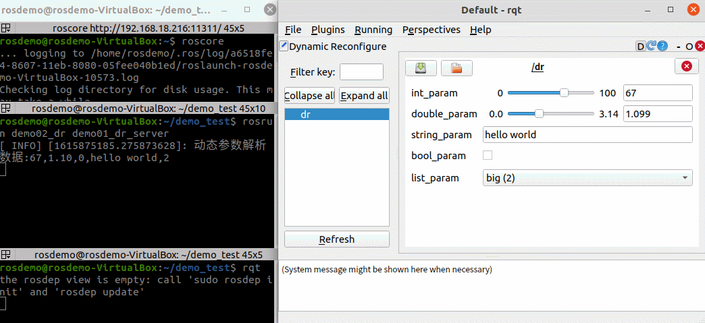
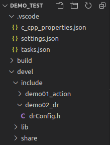
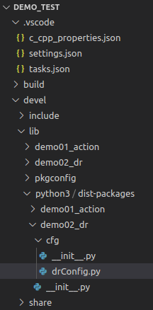

# 10.2 动态参数

参数服务器的数据被修改时，如果节点不重新访问，那么就不能获取修改后的数据，例如在乌龟背景色修改的案例中，先启动乌龟显示节点，然后再修改参数服务器中关于背景色设置的参数，那么窗体的背景色是不会修改的，必须要重启乌龟显示节点才能生效。而一些特殊场景下，是要求要能做到动态获取的，也即，参数一旦修改，能够通知节点参数已经iu该并读取修改后的数据，比如：

> 机器人调试时，需要修改机器人轮廓信息(长宽高)、传感器位姿信息...，如果这些信息存储在参数服务器中，那么意味着需要重启节点，才能使更新设置生效，但是希望修改完毕之后，某些节点能够及时更新这些参数信息。

在ROS中针对这种场景已经给出的解决方案：dynamic reconfigure 动态配置参数。

动态配置参数，之所以能够实现及时更新，因为被设计成CS架构，客户端修改参数就是向服务器发送请求，服务器接收到请求之后，读取修改后的是参数。

---

<B>概念</B>

一种可以在运行时更新参数而无需重启节点的参数配置策略。

<B>作用</B>

主要应用于需要动态更新参数的场景，比如参数调试、功能切换等。典型应用：导航时参数的动态调试。

<B>案例</B>

编写两个节点，一个节点可以动态修改参数，另一个节点实时解析修改后的数据。

<div align="center">
    
</div>

---

<B>另请参考:</B>

- http://wiki.ros.org/dynamic_reconfigure

- http://wiki.ros.org/dynamic_reconfigure/Tutorials


## 10.2.1 动态参数客户端

<B>需求：</B>

> 编写两个节点，一个节点可以动态修改参数，另一个节点实时解析修改后的数据。

<B>客户端实现流程：</B>

- 新建并编辑 .cfg 文件；
- 编辑 CMakeLists.txt；
- 编译。

### 1. 新建功能包

新建功能包，添加依赖：`roscpp rospy std_msgs dynamic_reconfigure`

### 2. 添加 .cfg 文件

新建 cfg 文件夹，添加 xxx.cfg 文件(并添加可执行权限)，cfg 文件其实就是一个 python 文件，用于生成参数修改的客户端(GUI)。

```python
#! /usr/bin/env python

from dynamic_reconfigure.parameter_generator_catkin import *

"""
    动态参数客户端：
        1. 导包；
        2. 创建一个参数生成器；
        3. 往生成器添加参数；
        4. 配置节点，并退出
"""

# 2. 创建一个参数生成器；
gen = ParameterGenerator()

# 3. 往生成器添加参数；
# add(name, paramtype, level, description, default=None, min=None, max=None, edit_method="")
gen.add("int_param", int_t, 0, "整数参数", 10, 1, 100)

# 4. 配置节点，并退出
# generate(pkgname, nodename, name)
exit(gen.generate("demo02_dr", "dr_client", "dr"))
```

### 3. 配置 CMakeLists.txt

```cmake
generate_dynamic_reconfigure_options(
  cfg/dr.cfg
)
```

### 4. 编译

编译后会生成中间文件
C++需要调用的头文件：

<div align="center">
    
</div>

Python 需要调用的文件：

<div align="center">
    
</div>

---

## 10.2.2 动态参数服务端A(C++)

<B>需求：</B>

> 编写两个节点，一个节点可以动态修改参数，另一个节点实时解析修改后的数据。

<B>服务端实现流程：</B>

- 新建并编辑C++文件；
- 编辑CMakeLists.txt；
- 编译并执行。

---

### 0. vscode配置

需要像之前自定义 msg 实现一样配置settings.json文件，如果以前已经配置且没有变更工作空间，可以忽略，如果需要配置，配置方式与之前相同：

```json
{
    "configurations": [
        {
            "browse": {
                "databaseFilename": "",
                "limitSymbolsToIncludedHeaders": true
            },
            "includePath": [
                "/opt/ros/noetic/include/**",
                "/usr/include/**",
                "/xxx/yyy工作空间/devel/include/**" //配置 head 文件的路径 
            ],
            "name": "ROS",
            "intelliSenseMode": "gcc-x64",
            "compilerPath": "/usr/bin/gcc",
            "cStandard": "c11",
            "cppStandard": "c++17"
        }
    ],
    "version": 4
}
```

### 1. 服务器代码实现

新建cpp文件，内容如下：

```cpp
#include "ros/ros.h"
#include "dynamic_reconfigure/server.h"
#include "demo02_dr/drConfig.h"

/*
    动态参数服务端流程：
        1. 包含头文件；
        2. 初始化操作；
        3. 创建服务端对象；
        4. 回调函数解析修改后的参数；
        5. spin()。
*/
// 解析动态参数
void callback(demo02_dr::drConfig &config, uint32_t level)
{
    ROS_INFO("修改后的整形数据是：%d", config.int_param);
    ROS_INFO("修改后的浮点型数据是：%.2f", config.double_param);
    ROS_INFO("修改后的字符串数据是：%s", config.str_param.c_str());
    ROS_INFO("修改后的布尔数据是：%d", config.bool_param);
    ROS_INFO("修改后的列表数据是：%d", config.list_param);
}

int main(int argc, char *argv[])
{
    setlocale(LC_ALL, "");
    // 2. 初始化操作；
    ros::init(argc, argv, "dr_server");

    // 3. 创建服务端对象；
    dynamic_reconfigure::Server<demo02_dr::drConfig> server;

    // 4. 回调函数解析修改后的参数；
    // void setCallback(const boost::function<void (demo02_dr::drConfig &, uint32_t level)> &callback);
    server.setCallback(boost::bind(&callback, _1, _2));

    // 5. spin()。
    ros::spin();

    return 0;
}
```

### 2. 编译配置文件

```cmake
add_executable(dr01_server src/dr01_server.cpp)

add_dependencies(dr01_server ${${PROJECT_NAME}_EXPORTED_TARGETS} ${catkin_EXPORTED_TARGETS})

target_link_libraries(dr01_server
  ${catkin_LIBRARIES}
)
```

### 3. 执行

先启动 `roscore`

启动服务端：`rosrun 功能包 xxx`

启动客户端：`rosrun rqt_gui rqt_gui -s rqt_reconfigure` 或 `rosrun rqt_reconfigure rqt_reconfigure`

最终可以通过客户端提供的界面修改数据，并且修改完毕后，服务端会及时输出修改后的结果，最终运行结果与示例类似。

<B>PS:</B>ROS版本较新时，可能没有提供客户端相关的功能包导致：`rosrun rqt_reconfigure rqt_reconfigure`调用会抛出异常。

---

## 10.2.3 动态参数服务端B(python)

<B>需求:</B>

> 编写两个节点，一个节点可以动态修改参数，另一个节点时时解析修改后的数据。

<B>服务端实现流程:</B>

- 新建并编辑 Python 文件;
- 编辑CMakeLists.txt;
- 编译并执行。

---

### 0.vscode配置

需要像之前自定义 msg 实现一样配置settings.json 文件，如果以前已经配置且没有变更工作空间，可以忽略，如果需要配置，配置方式与之前相同:

```json
{
    "python.autoComplete.extraPaths": [
        "/opt/ros/noetic/lib/python3/dist-packages",
        "/xxx/yyy工作空间/devel/lib/python3/dist-packages"
    ]
}
```

### 1. 服务器代码实现

新建python文件，内容如下：

```python
#! /usr/bin/env python

import rospy
from dynamic_reconfigure.server import Server
from demo02_dr.cfg import drConfig

"""
    动态参数服务端流程：
        1. 导包
        2. 初始化ROS节点
        3.  创建服务端对象
        4. 回调函数解析参数
        5. spin()
"""

def callback(drConfig, lebel):
    rospy.loginfo("解析的参数：%d, %.2f, %s, %d, %d",
                drConfig.int_param,
                drConfig.double_param,
                drConfig.str_param,
                drConfig.bool_param,
                drConfig.list_param)
    return drConfig

if __name__ == "__main__":

    # 2. 初始化ROS节点
    rospy.init_node("dr_server_p")

    # 3.  创建服务端对象
    # Server(type, callback, namespace="")
    # type 类型 callback 回调函数
    server = Server(drConfig, callback)

    # 4. 回调函数解析参数
    # 5. spin()
    rospy.spin()
```

### 2. 编辑配置文件

先为python文件添加可执行权限：`chmod +x *.py`

```cmake
catkin_install_python(PROGRAMS
  scripts/dr01_server_p.py
  DESTINATION ${CATKIN_PACKAGE_BIN_DESTINATION}
)
```

### 3. 执行

先启动 `roscore`

启动服务端：`rosrun 功能包 xxx.py`

启动客户端：`rosrun rqt_gui rqt_gui -s rqt_reconfigure` 或 `rosrun rqt_reconfigure rqt_reconfigure`

最终可以通过客户端提供的界面修改数据，并且修改完毕后，服务端会及时输出修改后的结果，最终运行结果与示例类似。

<B>PS:</B>  ROS版本较新时，可能没有提供客户端相关的功能包导致：`rosrun rqt_reconfigure rqt_reconfigure`调用会抛出异常。

---

