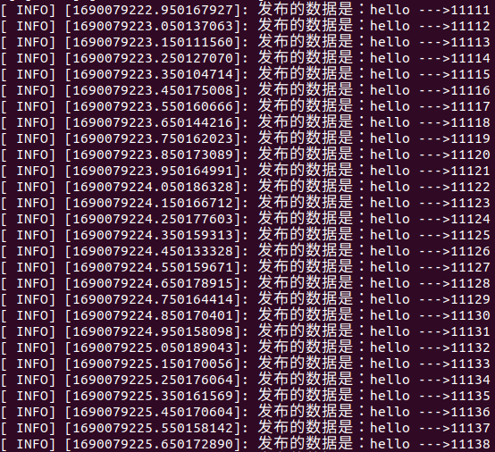
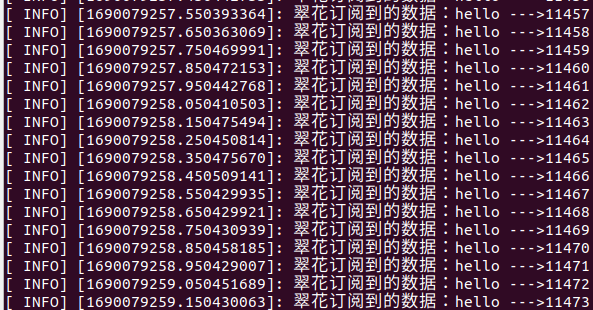
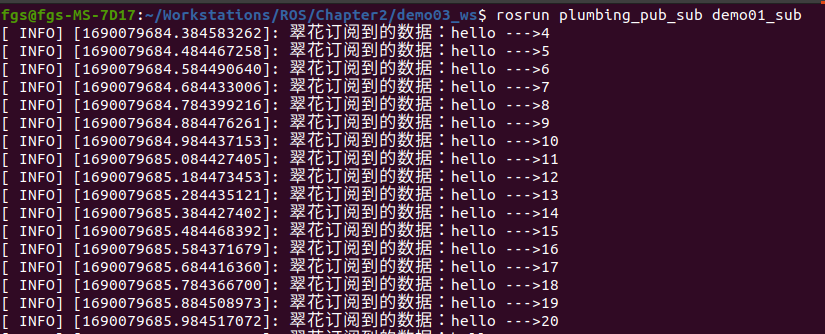
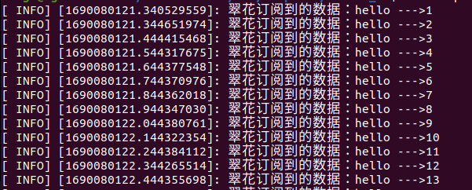
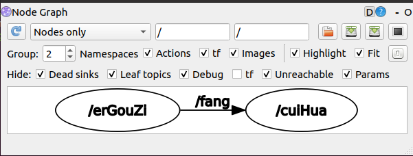

# ROS通信机制
机器人是一种高度复杂的系统性实现，在机器人上可能集成各种传感器(雷达、摄像头、GPS...)以及运动控制实现，为了解耦合，<B>在ROS中每一个功能点都是一个单独的进程，每一个进程都是独立运行的</B>  。更确切的讲，ROS是进程（也称为Nodes）的分布式框架。 因为这些进程甚至还可分布于不同主机，不同主机协同工作，从而分散计算压力。不过随之也有一个问题: 不同的进程是如何通信的？也即不同进程间如何实现数据交换的？在此我们就需要介绍一下ROS中的通信机制了。

ROS 中的基本通信机制主要有如下三种实现策略:

- 话题通信(发布订阅模式)

- 服务通信(请求响应模式)

- 参数服务器(参数共享模式)


# 1.1 话题通信

话题通信是ROS中使用频率最高的一种通信模式，话题通信是基于<B>发布订阅</B>模式的，也即：一个节点发布消息，另一个节点订阅该消息。话题通信的应用场景也极其广泛，比如下面一个常见的场景：

>机器人在执行导航功能，使用的传感器是激光雷达，机器人会采集激光雷达感知到的信息并计算，然后生成运动控制信息驱动机器人底盘运动。

在上述场景中，就不止一次使用到了话题通信。

- 以激光雷达信息的采集处理为例，在ROS中有一个节点需要实时的发布当前雷达采集到的数据，导航模块中也有节点会订阅并解析雷达数据。
- 再以运动消息的发布为例，导航模块会根据传感器采集的数据实时的计算出运动控制新洗并发布给底盘，底盘也可以有一个节点订阅运动信息并最终转换成控制电机的脉冲信号。

以此类推，像雷达、摄像头、GPS...等等一些传感器数据的采集，也都是使用了话题通信，换言之，<B>话题通信适用于不断更新的数据传输相关的应用场景</B>。  

##### 概念

以发布订阅的方式实现不同节点之间数据交互的通信模式。

##### 作用

用于不断更新的、少逻辑处理的数据传输场景。

##### 案例

1. 实现最基本的发布订阅模型，发布方以固定频率发送一段文本，订阅方接收文档并输出。
2. 实现对自定义消息的发布与订阅。

### 1.1.1 理论模型

话题通信实现模型是比较复杂的，该模型如下图所示，该模型中涉及到三个角色：

- ROS Master (管理者)
- Talker (发布者)
- Listener (订阅者)

ROS Master负责保管 Talker 和 Listener 注册的信息，并匹配话题相同的 Talker 与 Listener，帮助Talker与Listener建立连接，连接建立后，Talker可以发布消息，且发布的消息会被Listener订阅。

<div align="center">
    
</div>

整个流程由以下步骤实现：

#### 0.Talker注册

Talker启动后，会通过RPC在ROS Master中注册自身信息，包含需要订阅消息的话题名。ROS Master会将节点的注册信息加入到注册表中。

#### 1.Listener注册

Listener启动后，也会通过RPC在ROS Master中注册自身信息，包含需要订阅消息的话题名。ROS Master会将节点的注册信息加入到注册表中。

#### 2.ROS Master实现信息匹配

ROS Master会根据注册表中的信息匹配Talker和Listener，并通过RPC向Listener发送Talker的RPC地址信息。

#### 3.Listener向Talker发送请求

Listener根据接收到的RPC地址，通过RPC向Talker发送连接请求，传输订阅的话题名称、消息类型以及通信协议(TCP/UDP)。

#### 4.Talker确认请求

Talker接收到Listener的请求后，也是通过RPC向Listener确认连接信息，并发送自身的TCP地址信息。

#### 5.Listener与Talker建立连接

Listener根据步骤4返回的消息使用TCP与Talker建立网络连接。

#### 6.Talker向Listener发送消息

建立连接后，Talker开始向Listener发布消息。

>注意1：上述实现流程中，前五步使用的RPC协议，最后两步使用的是TCP协议
>注意2：Talker与Listener的启动无先后顺序要求
>注意3：Talker与Listener都可以有多个
>注意4：Talker与Listener连接建立后，不再需要ROS Master。也即，即便关闭ROS Master，Talker与Listener照常通信。

### 话题通信关注点

0. 大部分实现已经封装了
1. 话题设置
2. 关注发布者实现
3. 关注订阅者实现
4. 关注消息载体

### 1.1.2 话题通信基本操作A(C++)

<B>需求：</B>

>编写发布订阅实现，要求发布方以10HZ(每秒10次)的频率发布文本消息，订阅方订阅消息并将消息内容打印输出。

<B>分析：</B>

在模型实现中，ROS Master不需要实现，而连接的建立也已经被封装了，需要关注的关键点有三个：

1. 发布方
2. 接收方
3. 数据(此处为普通文本)

<B>流程：</B>

1. 编写发布方实现；
2. 编写订阅方实现；
3. 编辑配置文件；
4. 编译并执行。

#### 1.发布方实现
```cpp
// 1. 包含头文件；
#include "ros/ros.h"
#include "std_msgs/String.h"
#include <sstream>

/*
    发布方实现：
        1. 包含头文件；
            ROS中文本类型 ---> std_msgs/String.h
        2. 初始化 ROS 节点；
        3. 创建节点句柄；
        4. 创建发布者对象；
        5. 编写发布逻辑并发布数据。
*/

int main(int argc, char *argv[])
{
    // 设置编码
    setlocale(LC_ALL, "");

    // 2. 初始化 ROS 节点；
    // 参数1和参数2 后期为节点传值会使用
    // 参数3 是节点名称，是一个标识符，需要保证运行后，在 ROS 网络拓扑中唯一
    ros::init(argc, argv, "erGouZi"); // erGouZi是节点名称，需要唯一

    // 3. 创建节点句柄；
    ros::NodeHandle nh; // 该类封装了 ROS 中的一些常用功能

    // 4. 创建发布者对象；
    // 泛型：发布的消息类型
    // 参数1：要发布到的话题
    // 参数2：队列中最大保存的消息数，超出此阈值时，先进的先销毁
    ros::Publisher pub = nh.advertise<std_msgs::String>("fang", 10); // "fang"是话题名，10是消息队列的长度，超过10条消息，就把之前的消息清除。

    // 5. 编写发布逻辑并发布数据。
    // 要求以 10 Hz 的频率发布数据，并且文本后添加编号
    // 先创建被发布的消息
    std_msgs::String msg;
    // 发布频率
    ros::Rate rate(10); // 1秒10次
    // 设置编号
    int msg_count = 0;
    // 发布者注册后，休眠3s，让订阅者完成订阅
    ros::Duration(3.0).sleep();
    // 编写循环，循环中发布数据
    while (ros::ok())   // 只要节点还活着，条件就成立
    {
        msg_count++;
        // 实现字符串拼接数字
        std::stringstream ss;
        ss << "hello --->" << msg_count;
        // msg.data = "hello --- " + std::to_string(msg_count)
        msg.data = ss.str();

        pub.publish(msg);
        // 添加日志：
        ROS_INFO("发布的数据是：%s", ss.str().c_str());
        rate.sleep();

        // ros::spinOnce(); // 官方建议，处理回调函数，但是因为这里没有回调函数，所以也可以不需要这句。
    }
    return 0;
}
```

- 发布频率
```cpp
// 发布频率
ros::Rate rate(10); // 10HZ
rate.sleep();   // 睡眠 1/10hz
```

- 字符串拼接
```cpp
#include <sstream>
// 实现字符串拼接数字
std::stringstream ss;
ss << "hello --->" << msg_count;
msg.data = ss.str();    // sstream 转 std_msgs::String
pub.publish(msg);   // 发布
// 添加日志：
ROS_INFO("发布的数据是：%s", ss.str().c_str()); // sstream 转 std_msgs::String 转 char*（c_str()）
```

#### 2.订阅方

```cpp
#include "ros/ros.h"
#include "std_msgs/String.h"

/*
    订阅方实现：
        1.包含头文件；
            ROS中文本类型 ---> std_msgs/String.h
        2.初始化 ROS 节点；
        3.创建节点句柄；
        4.创建订阅者对象；
        5.处理订阅到的数据;
        6.spin()函数。
*/


void doMsg(const std_msgs::String::ConstPtr &msg) {
    // 通过msg获取并操作订阅到的数据
    ROS_INFO("翠花订阅到的数据：%s", msg->data.c_str());
}

int main(int argc, char *argv[])
{
    setlocale(LC_ALL, "");
    // 2.初始化 ROS 节点；
    ros::init(argc, argv, "cuiHua");
    // 3.创建节点句柄；
    ros::NodeHandle nh;
    // 4.创建订阅者对象；
    ros::Subscriber sub = nh.subscribe("fang", 10, doMsg);  // doMsg 是回调函数
    // 5.处理订阅到的数据；
    // 处理订阅数据使用回调函数，回调函数的启用使用ros::spin()启动。

    ros::spin();    // ros::spin()是一个用于处理ROS消息和回调函数的函数，它是一个阻塞函数，会一直运行直到节点被关闭。
    // 当调用ros::spin()时，ROS节点将开始接收和处理来自其他节点的消息，并调用相应的回调函数来处理这些消息。它会持续监听消息队列，并在有新消息到达时触发回调函数。
    // 通常，在ROS节点的主循环中，我们会调用ros::spin()来保持节点的活动状态，以便能够及时处理传入的消息。如果不调用ros::spin()，节点将无法接收和处理消息。
    // 调用 ros::spin() 来启动节点的消息处理循环。
    return 0;
}
```

- ros::spin()

```shell
在ROS中，ros::spin()是一个用于处理ROS消息和回调函数的函数。它是一个阻塞函数，会一直运行直到节点被关闭。

当调用ros::spin()时，ROS节点将开始接收和处理来自其他节点的消息，并调用相应的回调函数来处理这些消息。它会持续监听消息队列，并在有新消息到达时触发回调函数。

通常，在ROS节点的主循环中，我们会调用ros::spin()来保持节点的活动状态，以便能够及时处理传入的消息。如果不调用ros::spin()，节点将无法接收和处理消息。

当调用ros::spin()后，节点将开始接收来自"chatter"话题的消息，并在有新消息到达时调用messageCallback函数进行处理。

请注意，ros::spin()是一个阻塞函数，它会一直运行直到节点被关闭。因此，在调用ros::spin()之后的代码将不会执行，除非节点被关闭或显式地调用ros::shutdown()来终止节点的运行。
```

- ros::spinOnce()

```shell
在ROS中，ros::spinOnce()是一个用于处理ROS消息和回调函数的函数。与ros::spin()不同，ros::spinOnce()只会处理一次消息队列中的消息，并立即返回。

当调用ros::spinOnce()时，ROS节点将检查消息队列中是否有新的消息到达。如果有新消息，则会触发相应的回调函数进行处理。然后，ros::spinOnce()会立即返回，而不会阻塞节点的执行。

通常，在需要控制节点的执行流程或需要在主循环中执行其他任务时，我们会使用ros::spinOnce()来处理ROS消息。通过定期调用ros::spinOnce()，我们可以确保节点能够及时处理传入的消息，同时还能执行其他任务。

请注意，与ros::spin()不同，ros::spinOnce()不会阻塞节点的执行。因此，在调用ros::spinOnce()之后的代码将立即执行，而不需要等待新的消息到达。
```

#### 3. 编辑配置文件

发布方配置：
```shell
add_executable(demo01_pub src/demo01_pub.cpp)

target_link_libraries(demo01_pub
  ${catkin_LIBRARIES}
)
```

订阅方配置：
```shell
add_executable(demo01_pub src/demo01_sub.cpp)

target_link_libraries(demo01_sub
  ${catkin_LIBRARIES}
)
```

#### 4. 编译并执行

- 发布方：
```shell
roscore
rosrun plumbing_pub_sub demo01_pub
# 如果只写了发布节点，可以用 ROS 自带的命令在模仿订阅者
rostopic echo fang # fang 是发布者定义的话题名
```
<div align="center">
    
</div>

- 订阅方：
```shell
rosrun plumbing_pub_sub demo01_sub
```
<div align="center">
    
</div>

- 问题一：
如下图所示，先启动了订阅者，然后启动发布者，但是依然无法订阅到前面0，1，2，3数据，发生了数据丢失的情况。
<div align="center">
    
</div>

原因：发送第一条数据时，publisher还未在roscore注册完毕。（因为Master需要拿到订阅相同topic的sub和pub，匹配成功后才会让他们开始建立连接。）
解决：注册后，加入休眠 ros::Duration(3.0).sleep();延迟第一条数据的发送
<div align="center">
    
</div>

通过 rosrun rqt_graph rqt_graph 可以查看发布订阅节点的拓扑图结构：
<div align="center">
    
</div>

### 1.1.3 话题通信基本操作B(Python)

<B>需求：</B>

>编写发布订阅实现，要求发布方以10HZ(每秒10次)的频率发布文本消息，订阅方订阅消息并将消息内容打印输出。

<B>分析：</B>

在模型实现中，ROS Master不需要实现，而连接的建立也已经被封装了，需要关注的关键点有三个：

1. 发布方
2. 接收方
3. 数据(此处为普通文本)

<B>流程：</B>

1. 编写发布方实现；
2. 编写订阅方实现；
3. 为Python文件添加可执行权限；
4. 编辑配置文件；
5. 编译并执行。

#### 1.编写发布方实现

```python
#! /usr/bin/env python
# 1. 导包；
import rospy
from std_msgs.msg import String # 发布的消息的类型

"""
    使用 python 实现消息发布：
        1. 导包；
        2. 初始化 ROS 节点；
        3. 创建发布者对象；
        4. 编写发布逻辑并发布数据。
"""

if __name__ == "__main__":
    # 2. 初始化 ROS 节点；
    rospy.init_node("sanDai") # 传入节点名称
    # 3. 创建发布者对象；
    pub = rospy.Publisher("che", String, queue_size=10)
    # 4. 编写发布逻辑并发布数据。
    # 创建数据
    msg = String()
    # 指定发布频率
    rate = rospy.Rate(1)
    # 设置计数器
    count = 0
    # 发布者注册后，休眠3s，让订阅者完成订阅
    rospy.sleep(3)
    # 使用循环发布数据
    while not rospy.is_shutdown(): # 节点是否关闭
        count += 1
        msg.data = "hello" + str(count)
        # 发布数据
        pub.publish(msg)
        # 日志输出
        rospy.loginfo("发布的数据：%s", msg.data)
        # 休眠 1/hz 时间
        rate.sleep()
```

#### 2.编写订阅方实现

```python
#! /usr/bin/env python
# 1. 导包；
import rospy
from std_msgs.msg import String

"""
    订阅实现流程：
        1. 导包；
        2. 初始化 ROS 节点；
        3. 创建订阅者对象；
        4. 回调函数处理数据；
        5. spin()
"""

def doMsg(msg):
    rospy.loginfo("我订阅的数据：%s", msg.data)

if __name__ == "__main__":
    # 2. 初始化 ROS 节点；
    rospy.init_node("huahua")
    # 3. 创建订阅者对象；
    sub = rospy.Subscriber("che", String, doMsg, queue_size=10)
    # 4. 回调函数处理数据；
    # 5. spin()
    rospy.spin()
```

#### 3.为Python文件添加可执行权限
```shell
chmod +x demo01_pub_p.py
chmod +x demo01_sub_p.py
```
#### 4.编辑配置文件

```cmake
catkin_install_python(PROGRAMS
  scripts/demo01_pub_p.py
  DESTINATION ${CATKIN_PACKAGE_BIN_DESTINATION}
)

catkin_install_python(PROGRAMS
  scripts/demo01_sub_p.py
  DESTINATION ${CATKIN_PACKAGE_BIN_DESTINATION}
)
```

#### 5.编译并执行
```shell
catkin_make
roscore
rosrun plumbing_pub_sub demo01_pub_p.py
rosrun plumbing_pub_sub demo01_sub_p.py
```

发布订阅拓扑图结构：
```shell
rosrun rqt_graph rqt_graph
```

### 1.1.4 话题通信自定义msg
### 1.1.5 话题通信自定义msg调用
### 1.1.6 话题通信自定义msg调