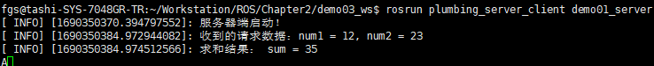
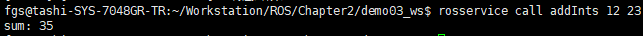

# 2. 服务通信

服务通信也是ROS中一种及其常用的通信模式，服务通信基于<B>请求响应</B>模式的，是一种应答机制。也即：一个节点A向另一个节点B发送请求，B接收处理请求并产生响应结果返回给A。比如如下场景：

>机器人巡逻过程中，控制系统分析传感器数据发现可疑物体或人...此时需要拍摄照片并留存。

在上述场景中，就使用到了服务通信。

- 一个节点需要向相机节点发送拍照请求，相机节点处理请求，并返回处理结果。

与上述应用类似的，服务通信更适用于对实时性有要求、具有一定逻辑处理的应用场景。

<B>概念</B>

以请求响应的方式实现不同节点之间数据交互的通信模式。

<B>注意：</B>需要保证客户端发起请求时，服务端需要已经启动；客户端和服务端都可以存在多个。

<B>作用</B>

用于偶然的、对实时性有要求、有一定逻辑处理需求的数据传输场景。

## 2.1 服务通信理论模型

服务通信较之于话题通信更简单些，理论模型如下图所示，该模型中涉及到三个角色：

- ROS Master (管理者)
- Server (服务端)
- Client (客户端)

ROS Master负责保管 Server 和 Client 注册的信息，并匹配话题相同的 Server 与 Client，帮助 Server 与 Client 建立连接，连接建立后，Client 发送请求信息，Server 返回响应信息。

<div align=center>
    
</div>

整个流程由以下步骤实现：

### 0. Server注册

Server启动后，会通过RPC在ROS Master中注册自身信息，其中包含提供的服务的名称。ROS Master 会将节点的注册信息加入到注册表中。

### 1. Client注册

Client启动后，也会通过RPC在ROS Master中注册自身信息，包含需要请求的服务的名称。ROS Master会将节点的注册信息加入到注册表中。

### 2. ROS Master实现信息匹配

ROS Master会根据注册表中的信息匹配Server 和 Client，并通过RPC向Client发送Server的TCP地址信息。

### 3. Client发送请求

Client根据步骤2响应的信息，使用TCP与Server建立网络连接，并发送请求数据。

### 4. Server发送响应

Server接收、解析请求的数据，并产生响应结果返回给Client。

>注意：
>1. 客户端请求被处理时，需要保证服务器已经启动；
>2. 服务端和客户端都可以存在多个。

## 2.2 服务通信自定义srv

<B>需求：</B>
>服务通信中，客户端提交两个整数至服务端，服务端求和并响应结果到客户端，请创建服务器与客户端通信的数据载体。

<B>流程：</B>

srv文件内的可用数据类型与msg文件一致，且定义srv实现流程与自定义msg实现流程类似：

1. 按照固定格式创建srv文件
2. 编辑配置文件
3. 编译生成中间文件

### 1. 定义srv文件

服务通信中，数据分成两部分，请求与响应，在srv文件中请求和响应使用```---```分割，具体实现如下：

功能包下新建srv目录，添加xxx.srv文件，内容：
```srv
# 客户端请求时发送的两个数字
int32 num1
int32 num2
---
# 服务器响应发送的数据
int32 sum
```

### 2. 编辑配置文件

package.xml 中添加编译依赖与执行依赖
```xml
<build_depend>message_generation</build_depend>
<exec_depend>message_runtime</exec_depend>
<!--
    exec_dpend 以前对应的是 run_depend 现在非法
-->
```

### 3. CMakeLists.txt编辑srv相关配置

```cmake
find_package(catkin REQUIRED COMPONENTS
    roscpp
    rospy
    std_msgs
    message_generation
)
# 需要加入 message_generation，必须有 std_msgs
```

```cmake
add_service_files(
    FILES
    AddInts.srv
)
```

```cmake
generate_message(
    DEPENDENCIES
    std_msgs
)
```

注意：官网没有在catkin_package中配置message_runtime,经测试配置也可以

### 3. 编译

编译后的中间文件查看：
C++ 需要调用的中间文件(../工作空间/devel/include/包名/xxx.h)

Python需要调用的中间文件(../工作空间/devel/lib/python3/dist-package/包名/srv)


后续调用相关srv时，是从这些中间文件调用的。

## 2.3 服务通信自定义srv调用A(C++)

<B>需求:</B>

>编写服务通信，客户端提交两个整数至服务端，服务端求和并响应结果到客户端。

<B>分析:</B>

>在模型实现中，ROS master 不需要实现，而连接的建立也已经被封装了，需要关注的关键点有三个:

1. 服务端
2. 客户端
3. 数据

<B>流程:</B>

1. 编写服务端实现；
2. 编写客户端实现；
3. 编辑配置文件；
4. 编译并执行。

### 0.vscode配置

需要像之前自定义 msg 实现一样配置c_cpp_properies.json 文件，如果以前已经配置且没有变更工作空间，可以忽略，如果需要配置，配置方式与之前相同:

```json
{
    "configurations": [
        {
            "browse": {
                "databaseFilename": "",
                "limitSymbolsToIncludedHeaders": true
            },
            "includePath": [
                "/opt/ros/noetic/include/**",
                "/usr/include/**",
                "/xxx/yyy工作空间/devel/include/**" //配置 head 文件的路径 
            ],
            "name": "ROS",
            "intelliSenseMode": "gcc-x64",
            "compilerPath": "/usr/bin/gcc",
            "cStandard": "c11",
            "cppStandard": "c++17"
        }
    ],
    "version": 4
}
```

### 1.服务端

```cpp

// 1. 包含头文件；
#include "ros/ros.h"
#include "plumbing_server_client/AddInts.h"

/*
    服务端实现：解析客户端提交的数据，并运算再产生响应
        1. 包含头文件；
        2. 初始化ROS节点；
        3. 创建节点句柄；
        4. 创建一个服务对象；
        5. 处理请求并产生响应；
        6. spin()
*/

// 两个参数，一个请求，一个响应
bool doNums(plumbing_server_client::AddInts::Request &request, plumbing_server_client::AddInts::Response &response) { // 服务请求的回调函数是一个返回bool值的回调函数，因为需要反馈服务结果
    // 1. 处理请求
    int num1 = request.num1;
    int num2 = request.num2;
    ROS_INFO("收到的请求数据：num1 = %d, num2 = %d", num1, num2);

    // 2. 组织响应
    int sum = num1 + num2;
    response.sum = sum;
    ROS_INFO("求和结果： sum = %d", sum);

    return true;
}

int main(int argc, char *argv[])
{
    setlocale(LC_ALL, "");
    // 2. 初始化ROS节点；
    ros::init(argc, argv, "heishui");

    ROS_INFO("服务器端启动！");
    
    // 3. 创建节点句柄；
    ros::NodeHandle nh;

    // 4. 创建一个服务对象；
    ros::ServiceServer server = nh.advertiseService("addInts", doNums); // doNums是回调函数，因为有回调函数，所以不需要定义泛型;advertiseService是泛型函数

    // 5. 处理请求并产生响应；
    // 6. spin()
    ros::spin();
    return 0;
}
```

服务端使用回调函数来处理数据。所以在`nh.advertiseService(topicname, callback)`函数中可以不定义泛型。

ROS自带了`service`节点，使用命令:`rosservice call addInts 12 23` 可以当成是client对service发送请求。

<B>service结果：</B>

<div align=center>
    
</div>

<B>系统自带service:</B>
<div align=center>
    
</div>

### 2.客户端

```cpp
#include "ros/ros.h"
#include "plumbing_server_client/AddInts.h"


/*
    客户端：提交两个整数，并处理响应的结果。

        1. 包含头文件；
        2. 初始化ROS节点；
        3. 创建节点句柄；
        4. 创建一个客户端对象；
        5. 提交请求并处理响应。
        客户端没有回调函数，可以不需要spin()函数回头

    实现参数的动态提交：
        1.格式：rosrun xxxx xxx 12 34
        2.节点执行时，需要获取命令中的参数，并组织进 request

    问题：
        如果先启动客户端，那么会请求异常
    需求：
        如果先启动客户端，不要直接抛出异常，而是挂起，等服务器启动后，再正常请求。
    解决：
        在ROS中内置了相关函数，这些函数可以让客户端启动后挂起，等待服务器启动。
        client.waitForExistence();
        ros::service::waitForService("addInts");
*/

int main(int argc, char *argv[]) {
    // 优化实现，获取命令中参数
    if (argc != 3) {
        ROS_INFO("提交的参数个数不对。");
        return 1;
    }

    setlocale(LC_ALL, "");
    
    // 2. 初始化ROS节点；
    ros::init(argc, argv, "daBao");

    // 3. 创建节点句柄；
    ros::NodeHandle nh;

    // 4. 创建一个客户端对象；
    ros::ServiceClient client = nh.serviceClient<plumbing_server_client::AddInts>("addInts");

    // 5. 提交请求并处理响应。
    plumbing_server_client::AddInts ai;

    // 5-1 组织请求
    // ai.request.num1 = 100;
    // ai.request.num2 = 200;
    ai.request.num1 = atoi(argv[1]);
    ai.request.num2 = atoi(argv[2]);

    // 5-2 处理响应
    // 调用判断服务器状态的函数
    // 函数1
    // client.waitForExistence();
    // 函数2
    ros::service::waitForService("addInts");
    bool flag = client.call(ai);

    if (flag) {
        ROS_INFO("响应成功！");
        // 获取结果
        ROS_INFO("响应结果 = %d", ai.response.sum);
    } else {
        ROS_INFO("响应失败...");
    }
    
    return 0;
}
```

```shell
问题：
    如果先启动客户端，那么会请求异常
需求：
    如果先启动客户端，不要直接抛出异常，而是挂起，等服务器启动后，再正常请求。
解决：
    在ROS中内置了相关函数，这些函数可以让客户端启动后挂起，等待服务器启动。
    client.waitForExistence();
    ros::service::waitForService("addInts");
```

### 3.配置 CMakeLists.txt

```cmake
add_executable(demo01_server src/demo01_server.cpp)
add_executable(demo01_client src/demo01_client.cpp)

add_dependencies(demo01_server ${PROJECT_NAME}_gencpp)
add_dependencies(demo01_client ${PROJECT_NAME}_gencpp)

target_link_libraries(demo01_server
  ${catkin_LIBRARIES}
)
target_link_libraries(demo01_client
  ${catkin_LIBRARIES}
)
```

### 4.执行

<B>流程：</B>

- 启动ros核心：`roscore` 
- 先启动服务：`rosrun plumbing_server_client demo01_server`
- 然后调用客户端：`rosrun plumbing_server_client demo01_client`

<B>结果：</B>

会根据提交的数据响应相加后的结果

<B>注意：</B>

如果先启动客户端，那么会导致运行失败

<B>优化：</B>

在客户端发送请求前添加:`client.waitForExistence();`

或:`ros::service::waitForService("AddInts");`

这是一个阻塞式函数，只有服务启动成功后才会继续执行

此处可以使用 launch 文件优化，但是需要注意 args 传参特点

## 2.4 服务通信自定义srv调用B(Python)

<B>需求：</B>

>编写服务通信，客户端提交两个整数至服务器，服务端求和并响应结果到客户端。

<B>分析：</B>

在模型实现中，ROS master 不需要实现，而连接的建立也已经被封装了，需要关注的关键点有三个:

1. 服务端
2. 客户端
3. 数据

<B>流程：</B>

1. 编写服务端实现；
2. 编写客户端实现；
3. 为python文件添加可执行权限；
4. 编辑配置文件；
5. 编译并执行。

### 0.vscode配置

需要像之前自定义 msg 实现一样配置settings.json 文件，如果以前已经配置且没有变更工作空间，可以忽略，如果需要配置，配置方式与之前相同:

```json
{
    "python.autoComplete.extraPaths": [
        "/opt/ros/noetic/lib/python3/dist-packages",
    ]
}
```

### 1.服务端

```python
#! /usr/bin/env python

import rospy
# from plumbing_server_client.srv import AddInts, AddIntsRequest, AddInsResponse
from plumbing_server_client.srv import *
"""
    服务端：解析客户端请求，产生响应。
        
        1. 导包；
        2. 初始化ROS节点；
        3. 创建服务端对象；
        4. 处理逻辑(回调函数)；
        5. spin()
"""

# 参数：封装了请求数据
# 返回值： 响应数据
def doNum(request):
    # 1.解析提交的两个整数
    num1 = request.num1
    num2 = request.num2

    # 2.求和
    sum = num1 + num2

    # 3.将结果封装进响应
    response = AddIntsResponse()
    response.sum = sum

    rospy.loginfo("服务器解析的数据: num1 = %d, num2 = %d, sum = %d", num1, num2, sum)

    return response


if __name__ == "__main__":
    # 2. 初始化ROS节点；
    rospy.init_node("heishui")

    # 3. 创建服务端对象；
    server = rospy.Service("addInts", AddInts, doNum)

    rospy.loginfo("服务器已经启动了！")

    # 4. 处理逻辑(回调函数)；

    # 5. spin()
    rospy.spin()
```

### 2.客户端

```python
#! /usr/bin/env python

import rospy
from plumbing_server_client.srv import AddIntsRequest, AddInts
import sys

"""
    客户端：组织并提交请求，处理服务端响应。
        1. 导包；
        2. 初始化ROS节点；
        3. 创建客户端对象；
        4. 组织请求数据，并发送请求；
        5. 处理响应
    
    优化实现：
        可以在执行节点时，动态传入参数

    问题：
        客户端先于服务端启动，会抛出异常
    需求：
        客户端先于服务端启动，不要抛出异常，而是挂起等待服务器启动后，再发送请求
    实现：
        ROS中内置了相关函数，这些函数可以判断服务器的状态，如果服务器没有启动，那么就让客户端挂起。

        方案一：
        client.wait_for_service()
        方案二：
        rospy.wait_for_service("话题名称")

"""

if __name__ == "__main__":
    # 判断参数长度
    if (len(sys.argv) != 3):
        rospy.logerr("传入的参数个数不正确！")
        sys.exit(1)
    
    # 2. 初始化ROS节点；
    rospy.init_node("erHei")

    # 3. 创建客户端对象；
    client = rospy.ServiceProxy("addInts", AddInts)
    rospy.loginfo("客户端创建！")

    # 4. 组织请求数据，并发送请求；
    # 解析传入的参数
    num1 = int(sys.argv[1])
    num2 = int(sys.argv[2])

    # 等待服务启动
    # client.wait_for_service()
    rospy.wait_for_service("addInts")

    response = client.call(num1, num2)

    # 5. 处理响应。
    rospy.loginfo("响应的数据：%d", response.sum)
```

```shell
问题：
        客户端先于服务端启动，会抛出异常
    需求：
        客户端先于服务端启动，不要抛出异常，而是挂起等待服务器启动后，再发送请求
    实现：
        ROS中内置了相关函数，这些函数可以判断服务器的状态，如果服务器没有启动，那么就让客户端挂起。

        方案一：
        client.wait_for_service()
        方案二：
        rospy.wait_for_service("话题名称")
```

```shell
优化实现：
        可以在执行节点时，动态传入参数
import sys
if (len(sys.argv) != 3):
    rospy.logerr("传入的参数个数不正确！")
    sys.exit(1)
num1 = int(sys.argv[1])
num2 = int(sys.argv[2])
```

### 3.设置权限

进入scripts文件夹，执行：`chmod +x *.py`

### 4.配置CMakeLists.txt

```cmake
catkin_install_python(PROGRAMS
  scripts/demo01_server_p.py
  scripts/demo01_client_p.py
  DESTINATION ${CATKIN_PACKAGE_BIN_DESTINATION}
)
```

### 5.执行

<B>流程：</B>

- 需要先启动服务：`rosrun plumbing_server_client demo01_server_p.py`
- 然后再调用客户端：`rosrun plumbing_server_client demo01_client_p.py` 

<B>结果：</B>

会根据提交的数据响应相加后的结果