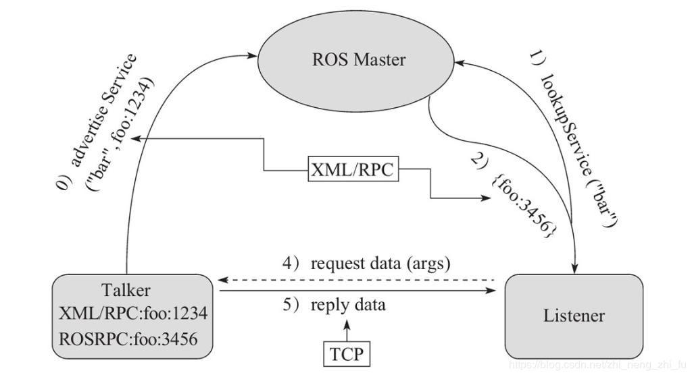

# 2. 服务通信

服务通信也是ROS中一种及其常用的通信模式，服务通信基于<B>请求响应</B>模式的，是一种应答机制。也即：一个节点A向另一个节点B发送请求，B接收处理请求并产生响应结果返回给A。比如如下场景：

>机器人巡逻过程中，控制系统分析传感器数据发现可疑物体或人...此时需要拍摄照片并留存。

在上述场景中，就使用到了服务通信。

- 一个节点需要向相机节点发送拍照请求，相机节点处理请求，并返回处理结果。

与上述应用类似的，服务通信更适用于对实时性有要求、具有一定逻辑处理的应用场景。

<B>概念</B>

以请求响应的方式实现不同节点之间数据交互的通信模式。

<B>注意：</B>需要保证客户端发起请求时，服务端需要已经启动；客户端和服务端都可以存在多个。

<B>作用</B>

用于偶然的、对实时性有要求、有一定逻辑处理需求的数据传输场景。

## 2.1 服务通信理论模型

服务通信较之于话题通信更简单些，理论模型如下图所示，该模型中涉及到三个角色：

- ROS Master (管理者)
- Server (服务端)
- Client (客户端)

ROS Master负责保管 Server 和 Client 注册的信息，并匹配话题相同的 Server 与 Client，帮助 Server 与 Client 建立连接，连接建立后，Client 发送请求信息，Server 返回响应信息。

<div align=center>
    
</div>

整个流程由以下步骤实现：

### 0. Server注册

Server启动后，会通过RPC在ROS Master中注册自身信息，其中包含提供的服务的名称。ROS Master 会将节点的注册信息加入到注册表中。

### 1. Client注册

Client启动后，也会通过RPC在ROS Master中注册自身信息，包含需要请求的服务的名称。ROS Master会将节点的注册信息加入到注册表中。

### 2. ROS Master实现信息匹配

ROS Master会根据注册表中的信息匹配Server 和 Client，并通过RPC向Client发送Server的TCP地址信息。

### 3. Client发送请求

Client根据步骤2响应的信息，使用TCP与Server建立网络连接，并发送请求数据。

### 4. Server发送响应

Server接收、解析请求的数据，并产生响应结果返回给Client。

>注意：
>1. 客户端请求被处理时，需要保证服务器已经启动；
>2. 服务端和客户端都可以存在多个。

## 2.2 服务通信自定义srv

<B>需求：</B>
>服务通信中，客户端提交两个整数至服务端，服务端求和并响应结果到客户端，请创建服务器与客户端通信的数据载体。

<B>流程：</B>

srv文件内的可用数据类型与msg文件一致，且定义srv实现流程与自定义msg实现流程类似：

1. 按照固定格式创建srv文件
2. 编辑配置文件
3. 编译生成中间文件

### 1. 定义srv文件

服务通信中，数据分成两部分，请求与响应，在srv文件中请求和响应使用```---```分割，具体实现如下：

功能包下新建srv目录，添加xxx.srv文件，内容：
```srv
# 客户端请求时发送的两个数字
int32 num1
int32 num2
---
# 服务器响应发送的数据
int32 sum
```

### 2. 编辑配置文件

package.xml 中添加编译依赖与执行依赖
```xml
<build_depend>message_generation</build_depend>
<exec_depend>message_runtime</exec_depend>
<!--
    exec_dpend 以前对应的是 run_depend 现在非法
-->
```

### 3. CMakeLists.txt编辑srv相关配置

```cmake
find_package(catkin REQUIRED COMPONENTS
    roscpp
    rospy
    std_msgs
    message_generation
)
# 需要加入 message_generation，必须有 std_msgs
```

```cmake
add_service_files(
    FILES
    AddInts.srv
)
```

```cmake
generate_message(
    DEPENDENCIES
    std_msgs
)
```

注意：官网没有在catkin_package中配置message_runtime,经测试配置也可以

### 3. 编译

编译后的中间文件查看：
C++ 需要调用的中间文件(../工作空间/devel/include/包名/xxx.h)

Python需要调用的中间文件(../工作空间/devel/lib/python3/dist-package/包名/srv)


后续调用相关srv时，是从这些中间文件调用的。

## 2.3 服务通信自定义srv调用A(C++)
## 2.4 服务通信自定义srv调用B(Python)