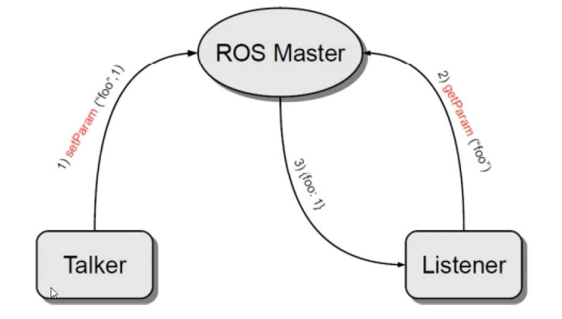

# 2.3 参数服务器

参数服务器在ROS中主要用于实现不同节点之间的数据共享。参数服务器相当于是独立于所有节点的一个公共容器，可以将数据存储在该容器中，被不同的节点调用，当然不同的节点也可以往其中存储数据，关于参数服务器的典型应用场景如下：

>导航实现时，会进行路径规划，比如：全局路径规划，设计一个从出发点到目标点的大致路径。本地路径规划，会根据当前路况生成实时的行进路径。

上述场景中，全局路径规划和本地路径规划时，就会使用到参数服务器：

- 路径规划时，需要参考小车的尺寸，我们可以将这些尺寸信息存储到参数服务器，全局路径规划节点与本地路径规划节点都可以从参数服务器中调用这些参数。

参数服务器，一般适用于存在数据数据共享的一些应用场景。

<B>概念</B>

以共享的方式实现不同节点之间数据交互的通信模式。

<B>作用</B>

存储一些多节点共享的数据，类似于全局变量。

<B>案例</B>

实现参数增删改查操作。

## 2.3.1 参数服务器理论模型

参数服务器实现是最为简单的，该模型如下图所示，该模型中涉及到三个角色：

- ROS Master （管理者）
- Talker (参数设置者)
- Listener (参数调用者)

ROS Master作为一个公共容器保存参数，Talker可以向容器中设置参数，Listener可以获取参数。

<div align=center>
    
</div>

整个流程由以下步骤实现：

### 1.Talker设置参数

Talker通过RPC向参数服务器发送参数(包括参数名与参数值)，ROS Master将参数保存到参数列表中。

### 2.Listener获取参数

Listener通过RPC向参数服务器发送参数查找请求，请求中包含要查找的参数名。

### 3.ROS Master向Listener发送参数值

ROS Master根据步骤2请求提供的参数名查找参数值，并将查询结果通过RPC发送给Listener。

---

<B>参数可使用数据类型</B>

- 32-bit integers
- booleans
- strings
- doubles
- iso8601 dates
- lists
- base64-encoded binary data
- 字典

>注意：参数服务器不是为高性能而设计的，因此最好用于存储静态的非二进制的简单数据。

## 2.3.2 参数操作A(C++)

<B>需求：</B>实现参数服务器参数的增删改查操作。

在C++中实现参数服务器数据的增删改查，可以通过两套API实现：

- ros::NodeHandle
- ros::param

下面为具体操作演示

### 1. 参数服务器新增(修改)参数

```cpp
#include "ros/ros.h"

/*
    需要实现参数的新增与修改
    需求：
        首先设置机器人的共享参数：类型，半径（0.15）
        再修改半径（0.2）
    实现：
        ros::NodeHandle
            setParam("键", 值)
        ros::param
            set("键", 值)
    修改，只需要继续调用 setParam 或 set 函数，保证键是已经存在的，使用新的值进行覆盖即可。
*/

int main(int argc, char *argv[]) {
    
    // 初始化ROS节点
    ros::init(argc, argv, "set_param_c");

    // 创建ROS节点句柄
    ros::NodeHandle nh;

    // 参数增
    // 方案一：nh
    nh.setParam("type","xiaoHuang");
    nh.setParam("radius", 0.15);
    
    // 方案二： ros::param
    ros::param::set("type_param", "xiaoBai");
    ros::param::set("radius_param", 0.15);

    // 参数改
    // 方案一：nh
    nh.setParam("radius", 0.2);

    // 方案二： ros::param
    ros::param::set("radius_param", 0.5);

    return 0;
}
```

修改和添加的操作一样，只是修改的时候用的是已经存在的键。


### 2. 参数服务器获取参数

```cpp
#include "ros/ros.h"

/*
    演示参数的查询
    实现：
        ros::NodeHandle ----------------------
            param(键， 默认值)
                存在，返回对应结果，否则返回默认值
            
            getParam(键， 存储结果的变量)
                存在，返回 true， 且将值赋值给参数2
                若键不存在，那么返回false，且不为参数2赋值
            
            getParamCached(键，存储结果的变量)----提高变量获取效率
                存在，返回 true， 且将值赋值给参数2
                若键不存在，那么返回值为 false， 且不为参数2赋值
            
            getParamNames(std::vector<std::string>)
                获取所有的键，并存储在参数 vector 中
            
            hasParam(键)
                是否包含某个键，存在返回 true， 否则返回 false
            
            searchParam（参数1， 参数2）
                搜索键，参数1是被搜索的键，参数2存储搜索结果的变量
        

        ros::param ---------------------------------


    需求：首先设置机器人的共享参数，
*/

int main(int argc, char *argv[]) {
    // 设置编码
    setlocale(LC_ALL, "");

    // 初始化参数节点
    ros::init(argc, argv, "get_param_c");

    // 创建节点句柄
    ros::NodeHandle nh;

    // ros::NodeHandle -------------------
    // 1. param(键， 默认值)
    double radius = nh.param("radius", 0.5); // 查找键为radius的值，如果没有radius这个键，则返回结果0.5
    ROS_INFO("radius = %.2f", radius);

    // 2. getParam(键， 存储结果的变量)
    double radius2 = 0.0f;
    bool result = nh.getParam("radius", radius2);
    if (result) {
        ROS_INFO("获得的半径是：%.2f", radius2);
    } else {
        ROS_INFO("查询的结果不存在！");
    }

    // 3.getParamCached(键，存储结果的变量)----提高变量获取效率, 以往的获取方式，是经过RPC远程连接获取，该函数从缓存里面获取数据，如果之前获取过该key，则直接从缓存中返回结果，否则通过RPC远程获取。
    // getParamCached 与 getParam 类似，只是性能上的提升。
    result = nh.getParamCached("radius", radius2);
    if (result) {
        ROS_INFO("获得的半径是：%.2f", radius2);
    } else {
        ROS_INFO("查询的结果不存在！");
    }

    // 4. getParamNames(std::vector<std::string>)
    std::vector<std::string> names;
    nh.getParamNames(names);
    for_each(names.begin(), names.end(), [](std::string name) {
        ROS_INFO("遍历的元素：%s", name.c_str());
    });

    // 5. hasParam(键) 判断某个键是否存在
    bool flag1 = nh.hasParam("radius");
    bool flag2 = nh.hasParam("radiusxxx");

    ROS_INFO("radius 存在吗？ %d", flag1);
    ROS_INFO("radiusxxx 存在吗？ %d", flag2);

    // 6. searchParam（参数1， 参数2）
    std::string key;
    nh.searchParam("type", key);
    ROS_INFO("搜索结果：%s", key.c_str());

    ROS_INFO("++++++++++++++++++++++++++++++++++++++++++++++");
    // ros::param -------------------------------------------
    // 1. param()函数
    double radius_param = ros::param::param("radius_param", 100.5);   // 不存在就返回默认值100.5
    double radius_param2 = ros::param::param("radiusxx", 100.5);   // 不存在就返回默认值100.5
    
    ROS_INFO("radius_param = %.2f", radius_param);
    ROS_INFO("radius_param2 = %.2f", radius_param2);

    // 2. getParam()函数
    bool flag = ros::param::get("radius_param", radius_param);
    if (flag) {
        ROS_INFO("radius_param = %.2f", radius_param);
    } else {
        ROS_INFO("未获取到参数！");
    }
    

    // 3. getParamCached()函数
    flag = ros::param::getCached("radius_param", radius_param);
    if (flag) {
        ROS_INFO("radius_param = %.2f", radius_param);
    } else {
        ROS_INFO("未获取到参数！");
    }


    // 4. getParamNames()函数
    std::vector<std::string> names_param;
    ros::param::getParamNames(names_param);
    for_each(names_param.begin(), names_param.end(), [](std::string name){
        ROS_INFO("键：%s", name.c_str());
    });

    // 5. has()判断某个键是否存在
    flag = ros::param::has("type_param");
    if (flag) {
        ROS_INFO("存在参数type_param!");
    } else {
        ROS_ERROR("不存在参数type_param!");
    }

    // 6.searchParam(参数1，参数2)
    ros::param::search("type_param", key);
    ROS_INFO("搜索键：%s", key.c_str());

    return 0;
}
```


<table align="center" border="1" id="t1">
    <tr align="center">
        <td>ros::NodeHandle</td>
        <td>ros::param</td>
        <td>功能</td>
        <td>描述</td>
    </tr>
    <tr>
        <td>param(键， 默认值)</td>
        <td>param(键， 默认值)</td>
        <td>尝试获取键对应的值</td>
        <td>存在，返回对应结果，否则返回默认值</td>
    </tr>
    <tr>
        <td>getParam(键， 存储结果的变量)</td>
        <td>get(键， 存储结果的变量)</td>
        <td>获取键对应的值，并赋值给第二个变量</td>
        <td>存在，返回 true， 且将值赋值给参数2
                若键不存在，那么返回值为 false，且不为参数2赋值</td>
    </tr>
    <tr>
        <td>getParamCached(键，存储结果的变量)</td>
        <td>getCached(键，存储结果的变量)</td>
        <td>从缓存中获取键对应的值，并赋值给第二个变量</td>
        <td>存在，返回 true， 且将值赋值给参数2;若键不存在，那么返回值为 false， 且不为参数2赋值
            提高变量获取效率, 以往的获取方式，是经过RPC远程连接获取，该函数从缓存里面获取数据，如果之前获取过该key，则直接从缓存中返回结果，否则通过RPC远程获取。
        </td>
    </tr>
    <tr>
        <td>getParamNames(std::vector<std::string>)</td>
        <td>getParamNames(std::vector<std::string>)</td>
        <td>获取系统中所有的键，并存储在vector中</td>
        <td>/</td>
    </tr>
    <tr>
        <td>hasParam(键)</td>
        <td>has(键)</td>
        <td>判断是否包含该键</td>
        <td>存在返回 true， 否则返回 false</td>
    </tr>
    <tr>
        <td>searchParam(参数1， 参数2)</td>
        <td>search(参数1， 参数2)</td>
        <td>搜索键</td>
        <td>参数1是被搜索的键，参数2存储搜索结果的变量</td>
    </tr>
</table>

### 3. 参数服务器删除参数

```cpp
#include "ros/ros.h"
/*
    演示参数的删除：
    实现：
        ros::NodeHandle
            deleteParam()
        ros::param
            del()
*/

int main(int argc, char *argv[])
{
    setlocale(LC_ALL, "");
    ros::init(argc, argv, "param_del_c");
    ros::NodeHandle nh;

    // 删除：NodeHandle--------------------------------
    bool flag1 = nh.deleteParam("radius");
    if (flag1) {
        ROS_INFO("删除成功！");
    } else {
        ROS_INFO("删除失败！");
    }


    // 删除：ros::param--------------------------------
    bool flag2 = ros::param::del("radius_param");
    if (flag2) {
        ROS_INFO("删除成功！");
    } else {
        ROS_INFO("删除失败！");
    }

    return 0;
}
```

<table align="center">
    <tr align="center" border="1">
        <td>ros::NodeHandle</td>
        <td>ros::param</td>
        <td>功能</td>
        <td>描述</td>
    </tr>
    <tr>
        <td>deleteParam(键)</td>
        <td>del(键)</td>
        <td>从系统中删除该键</td>
        <td>删除成功返回true，否则返回false</td>
    </tr>
</table>


## 2.3.3 参数操作B(Python)