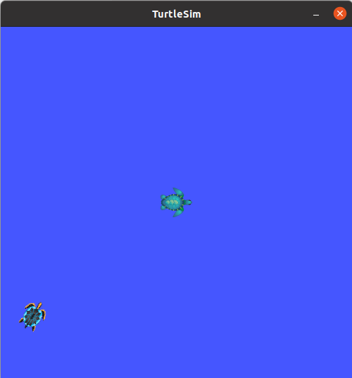
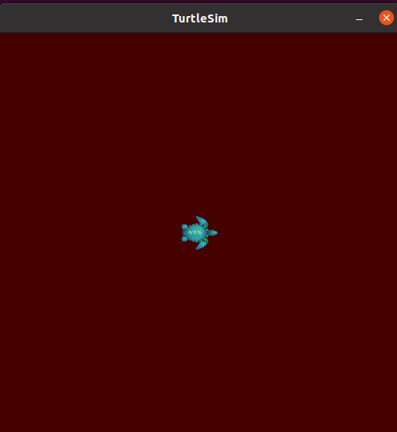

- [2.4 常用命令](#24-常用命令)
  - [案例](#案例)
    - [1.rosnode](#1rosnode)
    - [2.rostopic](#2rostopic)
    - [3.rosservice](#3rosservice)
    - [4.rosmsg](#4rosmsg)
    - [5.rossrv](#5rossrv)
    - [6.rosparam](#6rosparam)


# 2.4 常用命令

机器人系统中启动的节点少则几个，多则十几个、几十个，不同的节点名称各异，通信时使用话题、服务、消息、参数等等都各不相同，一个显而易见的问题是：当需要自定义节点和其他某个已经存在的节点通信时，如何获取对方的话题、以及消息载体的格式呢？

在ROS中提供了一些实用的命令行工具，可以用于获取不同节点的各类信息，常用的命令如下：

- rosnode：操作节点
- rostopic：操作话题
- rosservice：操作服务
- rosmsg：操作msg消息
- rossrv：操作srv消息
- rosparam：操作参数

---

<B>作用</B>

和之前介绍的文件系统操作命令比较，文件操作命令是静态的，操作的是磁盘上的文件，而上述命令是动态的，在ROS程序启动后，可以动态的获取运行中的节点或参数的相关信息。

## <B>案例</B>

### 1.rosnode

rosnode是用于获取节点信息的命令

```shell
rosnode ping 测试节点的连接状态
rosnode list 列出活动节点
rosnode info 打印节点信息
rosnode machine 列出指定设备上节点
rosnode kill 杀死某个节点
rosnode cleanup 清除不可连接的节点
```

- rosnode ping
    测试节点的连接状态
    举例：
         `roscore`
         `rosrun turtlesim turtlesim_node`
         `rosrun turtlesim turtlesim_teleop_key`
         `rosnode ping turtlesim`
    
```shell
rosnode: node is [/turtlesim]
pinging /turtlesim with a timeout of 3.0s
xmlrpc reply from http://fgs-MS-7D17:39477/	time=0.273943ms
xmlrpc reply from http://fgs-MS-7D17:39477/	time=1.099348ms
xmlrpc reply from http://fgs-MS-7D17:39477/	time=1.041412ms
xmlrpc reply from http://fgs-MS-7D17:39477/	time=1.061916ms
xmlrpc reply from http://fgs-MS-7D17:39477/	time=1.053333ms
```

- rosnode list
    列出活动节点

```shell
/rosout
/teleop_turtle
/turtlesim
```

- rosnode info
    打印节点信息
    举例：`rosnode info turtlesim`

```shell
--------------------------------------------------------------------------------
Node [/turtlesim] # 节点名称
Publications: 
 * /rosout [rosgraph_msgs/Log]
 * /turtle1/color_sensor [turtlesim/Color]
 * /turtle1/pose [turtlesim/Pose]

Subscriptions: 
 * /turtle1/cmd_vel [geometry_msgs/Twist]

Services: 
 * /clear
 * /kill
 * /reset
 * /spawn
 * /turtle1/set_pen
 * /turtle1/teleport_absolute
 * /turtle1/teleport_relative
 * /turtlesim/get_loggers
 * /turtlesim/set_logger_level


contacting node http://fgs-MS-7D17:39477/ ...
Pid: 5849
Connections:
 * topic: /rosout
    * to: /rosout
    * direction: outbound (56643 - 127.0.0.1:54908) [30]
    * transport: TCPROS
 * topic: /turtle1/cmd_vel
    * to: /teleop_turtle (http://fgs-MS-7D17:46477/)
    * direction: inbound (44706 - fgs-MS-7D17:40067) [32]
    * transport: TCPROS
```


- rosnode machine
    列出指定设备上节点

```shell
fgs@fgs-MS-7D17:~$ rosnode machine fgs-MS-7D17
/rosout
/teleop_turtle
/turtlesim
```

- rosnode kill
    杀死某个节点

```shell
fgs@fgs-MS-7D17:~$ rosnode kill /turtlesim 
killing /turtlesim
killed

fgs@fgs-MS-7D17:~$ rosrun turtlesim turtlesim_node 
[ INFO] [1690639423.010046241]: Starting turtlesim with node name /turtlesim
[ INFO] [1690639423.011864944]: Spawning turtle [turtle1] at x=[5.544445], y=[5.544445], theta=[0.000000]
[ WARN] [1690639472.947970089]: Shutdown request received.
[ WARN] [1690639472.947994507]: Reason given for shutdown: [user request]
QFileSystemWatcher::removePaths: list is empty
QFileSystemWatcher::removePaths: list is empty
```

- rosnode cleanup
    清除无用节点，启动乌龟节点，然后 `ctrl+c` 关闭，该节点并没被彻底清除，可以使用 `cleanup` 清除节点

`ctrl+c`之后依然存在节点`/turtlesim`
```shell
fgs@fgs-MS-7D17:~$ rosnode list
/rosout
/teleop_turtle
/turtlesim
```

使用`rosnode cleanup`清理关闭但未彻底清除的节点。

```shell
fgs@fgs-MS-7D17:~$ rosnode cleanup
ERROR: connection refused to [http://fgs-MS-7D17:46651/]
Unable to contact the following nodes:
 * /turtlesim
Warning: these might include alive and functioning nodes, e.g. in unstable networks.
Cleanup will purge all information about these nodes from the master.
Please type y or n to continue:
y
Unregistering /turtlesim
done
fgs@fgs-MS-7D17:~$ rosnode list
/rosout
/teleop_turtle
```

### 2.rostopic

<B>rostopic</B>包含rostopic命令行工具，用于显示有关ROS主题的调试信息，包括发布者、订阅者、发布频率和ROS消息。它还包含一个实验性Python库，用于动态获取有关主题的信息并与之交互。

```shell
rostopic bw     # 显示主题使用的带宽
rostopic delay  # 显示带有 header 的主题延迟
rostopic echo   # 将订阅消息打印到屏幕
rostopic find   # 根据类型查找主题
rostopic hz     # 显示主题的发布频率
rostopic info   # 显示主题相关信息
rostopic list   # 显示所有活动状态下的主题
rostopic pub    # 将数据发布到主题
rostopic type   # 打印主题类型
```

- rostopic list(-v)

>直接调用即可，控制台将打印当前状态下的主题名称
rostopic list -v：获取话题详情(比如列出：发布者和订阅者个数)

```shell
fgs@fgs-MS-7D17:~/Workstations/ROS/Chapter2/demo03_ws$ rostopic list -v

Published topics:
 * /rosout_agg [rosgraph_msgs/Log] 1 publisher
 * /rosout [rosgraph_msgs/Log] 2 publishers
 * /turtle1/cmd_vel [geometry_msgs/Twist] 1 publisher
 * /turtle1/pose [turtlesim/Pose] 1 publisher
 * /turtle1/color_sensor [turtlesim/Color] 1 publisher

Subscribed topics:
 * /rosout [rosgraph_msgs/Log] 1 subscriber
 * /turtle1/cmd_vel [geometry_msgs/Twist] 1 subscriber
```

- rostopic pub

>可以直接调用命令向订阅者发布消息

`rostopic pub -r 1`表示循环以1hz的频率发布消息。

```shell
fgs@fgs-MS-7D17:~/Workstations/ROS/Chapter2/demo03_ws$ rostopic pub -r 1 /liaotian plumbing_pub_sub/Person "name: 'haiwang'
age: 18
height: 1.85"
```

```shell
rostopic pub /turtle1/cmd_vel geometry_msgs/Twist
 "linear:
  x: 1.0
  y: 0.0
  z: 0.0
angular:
  x: 0.0
  y: 0.0
  z: 2.0"
//只发布一次运动信息

rostopic pub -r 10 /turtle1/cmd_vel geometry_msgs/Twist
 "linear:
  x: 1.0
  y: 0.0
  z: 0.0
angular:
  x: 0.0
  y: 0.0
  z: 2.0"
// 以 10HZ 的频率循环发送运动信息
```

- rostopic echo

>后面接 话题名称， 可以订阅到话题对应的消息，并打印到屏幕上。

- rostopic info

>获取当前话题的相关信息
消息类型
发布者信息
订阅者信息

```shell
fgs@fgs-MS-7D17:~/Workstations/ROS/Chapter2/demo03_ws$ rostopic info /liaotian
Type: plumbing_pub_sub/Person

Publishers: 
 * /rostopic_84229_1690642183007 (http://fgs-MS-7D17:33367/)

Subscribers: 
 * /listener (http://fgs-MS-7D17:35355/)
 * /rostopic_83274_1690642032219 (http://fgs-MS-7D17:43853/)
```

>使用了rostopic来发布消息，自定义的程序/listener 和 rostopic作为订阅方。

- rostopic type

>列出话题的消息类型

```shell
fgs@fgs-MS-7D17:~/Workstations/ROS/Chapter2/demo03_ws$ rostopic type /liaotian 
plumbing_pub_sub/Person
```

- rostopic find 消息类型

>根据消息类型查找话题。

```shell
fgs@fgs-MS-7D17:~/Workstations/ROS/Chapter2/demo03_ws$ rostopic find plumbing_pub_sub/Person 
/liaotian
```

- rostopic delay

>列出消息头信息

```shell
fgs@fgs-MS-7D17:~/Workstations/ROS/Chapter2/demo03_ws$ rostopic delay /liaotian
subscribed to [/liaotian]
[ERROR] [1690642696.461801]: msg does not have header
[ERROR] [1690642697.461673]: msg does not have header
```
>我们自定义的消息没有 header 信息。

- rostopic hz

>查看话题发布的频率

```shell
fgs@fgs-MS-7D17:~/Workstations/ROS/Chapter2/demo03_ws$ rostopic hz /liaotian
subscribed to [/liaotian]
no new messages
average rate: 1.000
	min: 1.000s max: 1.000s std dev: 0.00000s window: 2
```

- rostopic bw

>查看消息发布的带宽

```shell
fgs@fgs-MS-7D17:~/Workstations/ROS/Chapter2/demo03_ws$ rostopic bw /liaotian 
subscribed to [/liaotian]
average: 31.39B/s
	mean: 19.00B min: 19.00B max: 19.00B window: 2
average: 25.77B/s
	mean: 19.00B min: 19.00B max: 19.00B window: 3
average: 23.65B/s
	mean: 19.00B min: 19.00B max: 19.00B window: 4
average: 22.54B/s
	mean: 19.00B min: 19.00B max: 19.00B window: 5
average: 21.86B/s
	mean: 19.00B min: 19.00B max: 19.00B window: 6
average: 21.40B/s
	mean: 19.00B min: 19.00B max: 19.00B window: 7
```

### 3.rosservice

rosservice包含用于列出和查询ROSServices的rosservice命令行工具。

调用部分服务时，如果对相关工作空间没有配置path，需要进入工作空间调用`source ./devel/setup.bash`

```shell
rosservice args # 打印服务参数
rosservice call # 使用提供的参数调用服务
rosservice find # 按照服务类型查找服务
rosservice info # 打印有关服务的信息
rosservice list # 列出所有活动的服务
rosservice type # 打印服务类型
rosservice uri  # 打印服务的 ROSRPC uri
```

- rosservice list

>列出所有活动的service

```shell
fgs@fgs-MS-7D17:~/Workstations/ROS/Chapter2/demo03_ws$ rosservice list
/addInts    # 自定义的service
/clear
/heishui/get_loggers        # 自定义的addInts service的server使用的服务，和日志相关
/heishui/set_logger_level   # 自定义的addInts service的server使用的服务，和日志相关
/kill
/reset
/rosout/get_loggers
/rosout/set_logger_level
/spawn
/teleop_turtle/get_loggers
/teleop_turtle/set_logger_level
/turtle1/set_pen
/turtle1/teleport_absolute
/turtle1/teleport_relative
/turtlesim/get_loggers
/turtlesim/set_logger_level
```

- rosservice args

>打印服务参数

```shell
fgs@fgs-MS-7D17:~/Workstations/ROS/Chapter2/demo03_ws$ rosservice args /addInts 
num1 num2
# num1和num2是服务addInts的两个输入

fgs@fgs-MS-7D17:~/Workstations/ROS/Chapter2/demo03_ws$ rosservice args /spawn 
x y theta name

x y theta name 是服务的输入的参数
```

- rosservice call

>调用服务

```shell
fgs@fgs-MS-7D17:~/Workstations/ROS/Chapter2/demo03_ws$ rosservice call /addInts "num1: 89
num2: 56" 
sum: 145
```

为小乌龟的案列生成一只新的乌龟
```shell
fgs@fgs-MS-7D17:~/Workstations/ROS/Chapter2/demo03_ws$ rosservice call /spawn "x: 1.0
y: 2.0
theta: 1.0
name: 'new_turtlesim'" 

name: "new_turtlesim"
```
查看结果：
<div align="center">
    
</div>

- rosservice find

>根据消息类型获取话题

```shell
fgs@fgs-MS-7D17:~/Workstations/ROS/Chapter2/demo03_ws$ rosservice find plumbing_server_client/AddInts
/addInts
```

- rosservice info

fgs@fgs-MS-7D17:~/Workstations/ROS/Chapter2/demo03_ws$ rosservice info /spawn 
Node: /turtlesim
URI: rosrpc://fgs-MS-7D17:54507
Type: turtlesim/Spawn
Args: x y theta name

fgs@fgs-MS-7D17:~/Workstations/ROS/Chapter2/demo03_ws$ rosservice info /addInts 
Node: /heishui
URI: rosrpc://fgs-MS-7D17:35211
Type: plumbing_server_client/AddInts
Args: num1 num2

- rosservice type

>获取消息类型

```shell
fgs@fgs-MS-7D17:~/Workstations/ROS/Chapter2/demo03_ws$ rosservice type /spawn 
turtlesim/Spawn

fgs@fgs-MS-7D17:~/Workstations/ROS/Chapter2/demo03_ws$ rosservice type /addInts 
plumbing_server_client/AddInts
```

- rosservice uri

>获取服务器 uri

```shell
fgs@fgs-MS-7D17:~/Workstations/ROS/Chapter2/demo03_ws$ rosservice uri /spawn 
rosrpc://fgs-MS-7D17:54507

fgs@fgs-MS-7D17:~/Workstations/ROS/Chapter2/demo03_ws$ rosservice uri /addInts 
rosrpc://fgs-MS-7D17:35211
```

### 4.rosmsg

rosmsg是用于显示有关ROS消息类型的信息的命令行工具。

<B>rosmsg演示</B>

```shell
rosmsg show     # 显示消息描述
rosmsg info     # 显示消息信息
rosmsg list     # 列出所有消息
rosmsg md5      # 显示 md5 加密后的消息
rosmsg package  # 显示某个功能包下的所有消息
rosmsg packages # 列出包含消息的功能包
```

- rosmsg list

>会列出当前ROS中的所有msg

```shell
fgs@fgs-MS-7D17:~/Workstations/ROS/Chapter2/demo03_ws$ rosmsg list
actionlib/TestAction
actionlib/TestActionFeedback
actionlib/TestActionGoal
actionlib/TestActionResult
actionlib/TestFeedback
actionlib/TestGoal
actionlib/TestRequestAction
actionlib/TestRequestActionFeedback
actionlib/TestRequestActionGoal
actionlib/TestRequestActionResult
actionlib/TestRequestFeedback
actionlib/TestRequestGoal
actionlib/TestRequestResult
actionlib/TestResult
actionlib/TwoIntsAction
actionlib/TwoIntsActionFeedback
actionlib/TwoIntsActionGoal
actionlib/TwoIntsActionResult
actionlib/TwoIntsFeedback
actionlib/TwoIntsGoal
```

>可以使用管道进行筛选

```shell
fgs@fgs-MS-7D17:~/Workstations/ROS/Chapter2/demo03_ws$ rosmsg list | grep -i "person"
plumbing_pub_sub/Person
```

- rosmsg packages

>列出包含消息的所有包

```shell
fgs@fgs-MS-7D17:~/Workstations/ROS/Chapter2/demo03_ws$ rosmsg packages
actionlib
actionlib_msgs
actionlib_tutorials
bond
control_msgs
controller_manager_msgs
diagnostic_msgs
dynamic_reconfigure
gazebo_msgs
geometry_msgs
map_msgs
nav_msgs
pcl_msgs
plumbing_pub_sub    # 这个包是自定义的包，里面有msg
roscpp
rosgraph_msgs
rospy_tutorials
sensor_msgs
shape_msgs
smach_msgs
std_msgs
stereo_msgs
tf
tf2_msgs
theora_image_transport
trajectory_msgs
turtle_actionlib
turtlesim
visualization_msgs
```

- rosmsg package

>列出某个包下的所有msg

```shell
fgs@fgs-MS-7D17:~/Workstations/ROS/Chapter2/demo03_ws$ rosmsg package plumbing_pub_sub 
plumbing_pub_sub/Person

fgs@fgs-MS-7D17:~/Workstations/ROS/Chapter2/demo03_ws$ rosmsg package turtlesim 
turtlesim/Color
turtlesim/Pose
```

- rosmsg show

>显示消息描述

```shell
fgs@fgs-MS-7D17:~/Workstations/ROS/Chapter2/demo03_ws$ rosmsg show plumbing_pub_sub/Person 
string name
int32 age
float32 height

fgs@fgs-MS-7D17:~/Workstations/ROS/Chapter2/demo03_ws$ rosmsg show turtlesim/Pose 
float32 x
float32 y
float32 theta
float32 linear_velocity
float32 angular_velocity

fgs@fgs-MS-7D17:~/Workstations/ROS/Chapter2/demo03_ws$ rosmsg show turtlesim/Color 
uint8 r
uint8 g
uint8 b
```

- rosmsg info

>作用与rosmsg show一样
rosmsg info	Alias for rosmsg show

- rosmsg md5

>一种校验算法，保证数据传输的一致性

```shell
fgs@fgs-MS-7D17:~/Workstations/ROS/Chapter2/demo03_ws$ rosmsg md5 plumbing_pub_sub/Person 
0478132ca0c3bd1c734b5491000dabb1
```

### 5.rossrv

rossrv是用于显示有关ROS服务类型的信息的命令行工具，与rosmsg使用语法高度雷同。

```shell
rossrv show     # 显示服务消息类型
rossrv info     # 显示服务消息相关信息
rossrv list     # 列出所有服务信息
rossrv md5      # 显示 md5 加密后的服务消息
rossrv package  # 显示某个包下所有服务消息
rossrv packages # 显示包含服务消息的所有包
```

- rossrv list
  
>会列出当前ROS中的所有srv消息

```shell
fgs@fgs-MS-7D17:~/Workstations/ROS/Chapter2/demo03_ws$ rossrv list
control_msgs/QueryCalibrationState
control_msgs/QueryTrajectoryState
control_toolbox/SetPidGains
controller_manager_msgs/ListControllerTypes
controller_manager_msgs/ListControllers
controller_manager_msgs/LoadController
controller_manager_msgs/ReloadControllerLibraries
controller_manager_msgs/SwitchController
controller_manager_msgs/UnloadController
diagnostic_msgs/AddDiagnostics
diagnostic_msgs/SelfTest
```

>使用管道符进行筛选

```shell
fgs@fgs-MS-7D17:~/Workstations/ROS/Chapter2/demo03_ws$ rossrv list | grep -i "addInts"
plumbing_server_client/AddInts
```

- rossrv packages

>列出包含服务消息的所有包

```shell
fgs@fgs-MS-7D17:~/Workstations/ROS/Chapter2/demo03_ws$ rossrv packages 
control_msgs
control_toolbox
controller_manager_msgs
diagnostic_msgs
dynamic_reconfigure
gazebo_msgs
laser_assembler
map_msgs
nav_msgs
nodelet
pcl_msgs
plumbing_server_client  # 这个是自定义的包
polled_camera
roscpp
roscpp_tutorials
rospy_tutorials
rviz
sensor_msgs
std_srvs
tf
tf2_msgs
topic_tools
turtlesim
```

- rossrv package

>列出某个包下的所有srv

```shell
fgs@fgs-MS-7D17:~/Workstations/ROS/Chapter2/demo03_ws$ rossrv package plumbing_server_client 
plumbing_server_client/AddInts
```

- rossrv show

>显示消息描述

```shell
fgs@fgs-MS-7D17:~/Workstations/ROS/Chapter2/demo03_ws$ rossrv show plumbing_server_client/AddInts 
int32 num1
int32 num2
---
int32 sum
```

- rossrv info
  
>作用与rossrv show一致
rossrv info	Alias for rossrv show


- rossrv md5

>对service数据使用 md5 校验(加密)

```shell
fgs@fgs-MS-7D17:~/Workstations/ROS/Chapter2/demo03_ws$ rossrv md5 plumbing_server_client/AddInts 
4781436a0c2affec8025955a6041e481
```


### 6.rosparam

rosparam包含rosparam命令行工具，用于使用YAML编码文件在参数服务器上获取和设置ROS参数。

```shell
rosparam set    # 设置参数
rosparam get    # 获取参数
rosparam load   # 从外部文件加载参数
rosparam dump   # 将参数写出到外部文件
rosparam delete # 删除参数
rosparam list   # 列出所有参数
```

- rosparam list

>列出所有参数

```shell
fgs@fgs-MS-7D17:~/Workstations/ROS/Chapter2/demo03_ws$ rosparam list
/p_bool         # 自定义
/p_dict/age     # 自定义
/p_dict/name    # 自定义
/p_double       # 自定义
/p_int          # 自定义
/p_list         # 自定义
/p_string       # 自定义
/radius         # 自定义
/radius_param   # 自定义
/rosdistro      
/roslaunch/uris/host_fgs_ms_7d17__44649
/rosversion
/run_id
/turtlesim/background_b
/turtlesim/background_g
/turtlesim/background_r
/type           # 自定义
/type_param     # 自定义
```

- rosparam set

>设置参数

```shell
fgs@fgs-MS-7D17:~/Workstations/ROS/Chapter2/demo03_ws$ rosparam set name huluwa


fgs@fgs-MS-7D17:~/Workstations/ROS/Chapter2/demo03_ws$ rosparam list
/name   # 新增
/p_bool
/p_dict/age
/p_dict/name
/p_double
...
```

>修改小乌龟的背景颜色

```shell
rosparam set /turtlesim/background_b 0
rosparam set /turtlesim/background_g 0
```

>结果：

<div align="center">
    
</div>

- rosparam get

>获取参数

```shell
fgs@fgs-MS-7D17:~/Workstations/ROS/Chapter2/demo03_ws$ rosparam get name
huluwa
fgs@fgs-MS-7D17:~/Workstations/ROS/Chapter2/demo03_ws$ rosparam get type
xiaoHuang
fgs@fgs-MS-7D17:~/Workstations/ROS/Chapter2/demo03_ws$ rosparam get type_param
xiaoBai
```

- rosparam delete

>删除参数

```shell
fgs@fgs-MS-7D17:~/Workstations/ROS/Chapter2/demo03_ws$ rosparam delete type

fgs@fgs-MS-7D17:~/Workstations/ROS/Chapter2/demo03_ws$ rosparam list
/name
/p_bool
/p_dict/age
/p_dict/name
/p_double
/p_int
/p_list
/p_string
/radius
/radius_param
/rosdistro
/roslaunch/uris/host_fgs_ms_7d17__44649
/rosversion
/run_id
/turtlesim/background_b
/turtlesim/background_g
/turtlesim/background_r
/type_param # /type不再出现
```

- rosparam load(先准备yaml文件)

>从外部文件加载参数

>yaml文件内容如下：

```yaml
name: fgs
age: 19
height: 185
```

```shell
fgs@fgs-MS-7D17:~/Workstations/ROS/Chapter2/demo03_ws/src/param$ rosparam load ./my_param.yaml 
fgs@fgs-MS-7D17:~/Workstations/ROS/Chapter2/demo03_ws/src/param$ rosparam list
/age
/height
/name
```

- rosparam dump

>将参数写出到外部文件

```yaml
fgs@fgs-MS-7D17:~/Workstations/ROS/Chapter2/demo03_ws/src/param$ cat ros.yaml 
age: 19
height: 185
name: fgs
p_bool: true
p_dict:
  age: 18
  name: hulu
p_double: 3.14
p_int: 100
p_list:
- hello
- haha
- xixi
p_string: hello python
radius: 0.2
radius_param: 0.5
rosdistro: 'noetic

  '
roslaunch:
  uris:
    host_fgs_ms_7d17__44649: http://fgs-MS-7D17:44649/
rosversion: '1.16.0

  '
run_id: da723cac-2dfc-11ee-9c66-4186feb8d171
turtlesim:
  background_b: 255
  background_g: 86
  background_r: 69
type_param: xiaoBai
```
