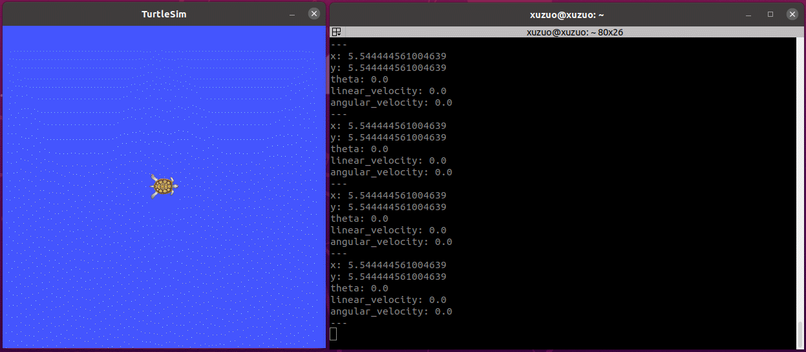

# 2.6 通信机制实操

本节主要是通过ROS内置的turtlesim案例，结合已经介绍ROS命令获取节点、话题、话题消息、服务、服务消息与参数的信息，最终再以编码的方式实现乌龟运动的控制、乌龟位姿的订阅、乌龟生成与乌龟窗体背景颜色的修改。

---
目的:熟悉、强化通信模式应用

## 2.6.1 实操01_话题发布

<B>需求描述：</B>编码实现乌龟运动控制，让小乌龟做圆周运动。


<B>结果演示：</B>


<div align="center">
    
</div>

<B>实现分析：</B>

1. 乌龟运动控制实现，关键节点有两个，一个是乌龟运动显示节点`turtlesim_node`，另一个是控制节点，二者是订阅发布模式实现通信的，乌龟运动显示节点直接调用即可，运动控制节点之前是使用的`turtle_teleop_key`通过键盘控制，现在需要自定义控制节点。

2. 控制节点自实现时，首先需要了解控制节点与显示节点通信使用的话题与消息，可以使用ros命令结合计算图来获取。

3. 了解了话题与消息之后，通过 C++ 或 Python 编写运动控制节点，通过指定的话题，按照一定的逻辑发布消息即可。

<B>实现流程：</B>

1. 通过计算图结合ros命令获取话题与消息信息。
2. 编码实现运动控制节点。
3. 启动roscore、turtlesim_node以及自定义的控制节点，查看运行结果。

### 2.6.1.1 话题与消息获取

<B>准备：</B>先启动键盘控制乌龟运动案例。

```shell
roscore
rosrun turtlesim turtlesim_node
rosrun turtlesim turtle_teleop_key
```

#### 1.话题获取

<B>获取话题：</B>`/turtle1/cmd_vel`

通过计算图查看话题，启动计算图：

```shell
rqt_graph
```

<div align="center">
    
</div>

或者通过`rostopic`列出话题：

```shell
rostopic list


/rosout
/rosout_agg
/statistics
/turtle1/cmd_vel        # 小乌龟运动的话题
/turtle1/color_sensor
/turtle1/pose
```

#### 2.消息获取

<B>获取消息类型：</B>`geometry_msgs/Twist`

```shell
rostopic type /turtle1/cmd_vel

geometry_msgs/Twist
```

<B>获取消息格式：</B>

```shell
rosmsg info geometry_msgs/Twist

geometry_msgs/Vector3 linear
  float64 x # 小乌龟只有x方向上的速度，因为只能前进和后退； √
  float64 y # y方向是指左右
  float64 z # z方向是指上下 
geometry_msgs/Vector3 angular
  float64 x # 小乌龟没有翻滚角度
  float64 y # 没有俯仰角度
  float64 z # 只有偏航角度；    √
```

linear(线速度)下的xyz分别对应在x、y、z方向上的速度(单位是m/s);
angular(角速度)下的xyz分别对应x轴上的翻滚、y轴上俯仰和z轴上偏航的速度(单位是rad/s)。

<B>简单实现：</B>

```shell
fgs@fgs-MS-7D17:~$ rostopic pub -r 1 /turtle1/cmd_vel geometry_msgs/Twist "linear:
  x: 3.0
  y: 0.0
  z: 0.0
angular:
  x: 0.0
  y: 0.0
  z: 2.0" 
```


### 2.6.1.2 实现发布节点

创建功能包需要依赖的功能包：`roscpp rospy std_msgs geometry_msgs`

<B>实现方案A:</B>C++

```cpp
#include "ros/ros.h"
#include "geometry_msgs/Twist.h"

/*
    需求：发布速度消息
        话题：/turtle1/cmd_vel
        消息：geometry_msgs/Twist

    1. 包含头文件；
    2. 初始化 ROS 节点；
    3. 创建节点句柄；
    4. 创建发布对象；
    5. 发布逻辑；
    6. spinOnce();
*/

int main(int argc, char *argv[]) {
    // 2. 初始化 ROS 节点；
    ros::init(argc, argv, "turtle_customer_control");

    // 3. 创建节点句柄；
    ros::NodeHandle nh;

    // 4. 创建发布对象；
    ros::Publisher pub = nh.advertise<geometry_msgs::Twist>("/turtle1/cmd_vel", 10);

    // 5. 发布逻辑；
    ros::Rate rate(1); // 设置发布频率
    // 组织被发布的消息
    geometry_msgs::Twist twist;
    twist.linear.x = 1.0;
    twist.linear.y = 0.0;
    twist.linear.z = 0.0;

    twist.angular.x = 0.0;
    twist.angular.y = 0.0;
    twist.angular.z = 0.5; 

    // 循环发布
    while (ros::ok()) {
        pub.publish(twist);

        // 休眠
        rate.sleep();
        
        // 6. spinOnce();
        ros::spinOnce();
    }

    return 0;
}
```

<B>实现方案B：</B>Python

```python
#! /usr/bin/env python

import rospy
from geometry_msgs.msg import Twist


"""
    发布方：发布速度消息
        话题：/turtle1/cmd_vel
        消息：geometry_msgs/Twist
    
    1. 导包；
    2. 初始化 ROS 节点；
    3. 创建发布者对象；
    4. 组织数据并发布数据。
"""

if __name__ == "__main__":
    # 2. 初始化 ROS 节点；
    rospy.init_node("turtle_customer_control_p")

    # 3. 创建发布者对象；
    pub = rospy.Publisher("/turtle1/cmd_vel", Twist, queue_size=1000)

    # 4. 组织数据并发布数据。
    # 设置发布频率
    rate = rospy.Rate(1)

    # 创建速度消息
    twist = Twist()
    twist.linear.x = 0.5
    twist.linear.y = 0.0
    twist.linear.z = 0.0

    twist.angular.x = 0.0
    twist.angular.y = 0.0
    twist.angular.z = 0.5

    # 循环发布
    while not rospy.is_shutdown():
        pub.publish(twist)

        rate.sleep()
```

### 2.6.1.3 运行

首先，启动`roscore`;

然后启动乌龟显示节点：`rosrun turtlesim turtlesim_node`

最后执行控制节点；

最终执行结果与演示结果类似。


## 2.6.2 实操02_话题订阅

<B>需求描述：</B>已知turtlesim中的乌龟显示节点，会发布当前乌龟的位姿(窗体中乌龟的坐标以及朝向)，要求控制乌龟运动，并实时打印当前乌龟的位姿。

<B>结果演示：</B>

<div align="center">
    
</div>

<B>实现分析：</B>

1. 首先，需要启动乌龟显示以及运动控制节点并控制乌龟运动；
2. 要通过ROS命令，来获取乌龟位姿发布的话题以及消息；
3. 编写订阅节点，订阅并打印乌龟的位姿。

<B>实现流程：</B>

1. 通过ros命令获取话题与消息信息；
2. 编码实现位姿获取节点；
3. 启动`roscore`、`turtlesim_node`、控制节点以及位姿订阅节点，控制乌龟运动并输出乌龟的位姿。

### 1. 话题与消息获取

<B>获取话题：</B>`/turtle1/pose`

```shell
rostopic list

fgs@fgs-MS-7D17:~/Workstations/ROS/Chapter2/demo03_ws$ rostopic list
/rosout
/rosout_agg
/turtle1/cmd_vel
/turtle1/color_sensor
/turtle1/pose   # 小乌龟的位姿话题
```

<B>获取消息类型：</B>`turtlesim/Pose`

```shell
fgs@fgs-MS-7D17:~/Workstations/ROS/Chapter2/demo03_ws$ rostopic type /turtle1/pose
turtlesim/Pose # 位姿话题对应的消息类型
```

<B>获取消息格式：</B>

```shell
fgs@fgs-MS-7D17:~/Workstations/ROS/Chapter2/demo03_ws$ rosmsg info turtlesim/Pose 
float32 x
float32 y
float32 theta
float32 linear_velocity
float32 angular_velocity
```

<B>简易实现：</B>

```shell
rostopic echo /turtle1/pose
```

### 2. 实现订阅节点

创建功能包需要依赖的功能包：`roscpp rospy std_msgs turtlesim`

<B>实现方案A：</B>C++

```cpp
#include "ros/ros.h"
#include "turtlesim/Pose.h"

/*
    需求：订阅乌龟的位姿，并输出到控制台
    准备工作：
        1. 获取话题名称 /turtle1/pose
        2. 获取消息类型 turtlesim/Pose
            float32 x
            float32 y
            float32 theta
            float32 linear_velocity
            float32 angular_velocity
        3. 运行前启动 turtlesim_node 与 turtle_teleop_key 节点


    1. 包含头文件；
    2. 初始化 ROS 节点；
    3. 创建节点句柄；
    4. 创建订阅对象；
    5. 处理订阅到的数据（回调函数）；
    6. spin()
*/

void doPose(const turtlesim::Pose::ConstPtr& pose) {
    ROS_INFO("乌龟位姿信息：x=%.2f, y=%.2f, theta=%.2f, lv=%.2f, av=%.2f",
        pose->x, pose->y, pose->theta, pose->linear_velocity, pose->angular_velocity);
}

int main(int argc, char *argv[])
{
    setlocale(LC_ALL, "");

    // 2. 初始化 ROS 节点；
    ros::init(argc, argv, "sub_pose_customer");

    // 3. 创建节点句柄；
    ros::NodeHandle nh;

    // 4. 创建订阅对象；
    ros::Subscriber sub = nh.subscribe<turtlesim::Pose>("/turtle1/pose", 1000, doPose);

    // 5. 处理订阅到的数据（回调函数）；
    // 6. spin()

    ros::spin();


    return 0;
}
```

<B>实现方案B：</B>Python

```python
#! /usr/bin/env python
import rospy
from turtlesim.msg import Pose

"""
    需求：订阅并输出乌龟位姿信息
    准备工作：
        1. 获取话题名称 /turtle1/pose
        2. 获取消息类型 turtlesim/Pose
            float32 x
            float32 y
            float32 theta
            float32 linear_velocity
            float32 angular_velocity
        3. 运行前启动 turtlesim_node 与 turtle_teleop_key 节点
    
    1.导包；
    2.初始化ROS节点；
    3.创建订阅对象；
    4.使用回调函数处理订阅到的信息；
    5.spin()
"""

def doPose(pose):
    rospy.loginfo("乌龟坐标：x=%.2f, y=%.2f, theta=%.2f, vl=%.2f, ve=%.2f", pose.x, pose.y, pose.theta, pose.linear_velocity, pose.angular_velocity)


if __name__ == "__main__":
    # 2.初始化ROS节点；
    rospy.init_node("sub_pose_customer_p")

    # 3.创建订阅对象；
    sub = rospy.Subscriber("/turtle1/pose", Pose, doPose, queue_size=1000)

    # 4.使用回调函数处理订阅到的信息；
    # 5.spin()
    rospy.spin()
```

### 3.运行

首先，启动 roscore；

然后启动乌龟显示节点，执行运动控制节点；

最后启动乌龟位姿订阅节点；

最终执行结果与演示结果类似。