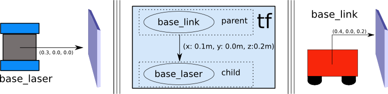
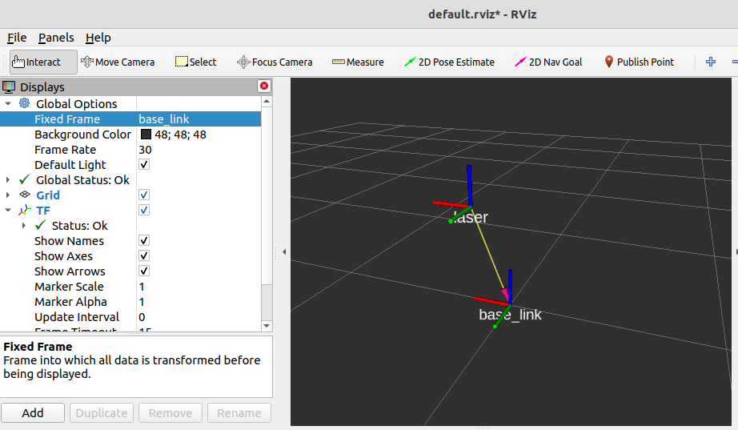
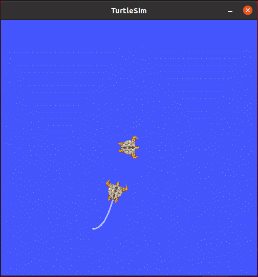

- [5.1 TF坐标变换](#51-tf坐标变换)
  - [5.1.1 坐标msg消息](#511-坐标msg消息)
    - [1. geometry\_msgs/TransformStamped](#1-geometry_msgstransformstamped)
    - [2. geometry\_msgs/PointStamped](#2-geometry_msgspointstamped)
  - [5.1.2 静态坐标变换](#512-静态坐标变换)
    - [1. 创建功能包](#1-创建功能包)
    - [2. 发布方](#2-发布方)
    - [3. 订阅方](#3-订阅方)
    - [4. 执行](#4-执行)
    - [1. 创建功能包](#1-创建功能包-1)
    - [2. 发布方](#2-发布方-1)
    - [3. 订阅方](#3-订阅方-1)
    - [4. 执行](#4-执行-1)
  - [5.1.3 动态坐标变换](#513-动态坐标变换)
    - [方案A:C++实现](#方案ac实现)
      - [1. 创建功能包](#1-创建功能包-2)
      - [2. 发布方](#2-发布方-2)
      - [3. 订阅方](#3-订阅方-2)
      - [4. 执行](#4-执行-2)
    - [方案B:Python实现](#方案bpython实现)
      - [1. 创建功能包](#1-创建功能包-3)
      - [2. 发布方](#2-发布方-3)
      - [3. 订阅方](#3-订阅方-3)
      - [4. 执行](#4-执行-3)
  - [5.1.4 多坐标变换](#514-多坐标变换)
      - [方案A:C++实现](#方案ac实现-1)
        - [1.创建功能包](#1创建功能包)
        - [2.发布方](#2发布方)
        - [3.订阅方](#3订阅方)
        - [4.执行](#4执行)
      - [方案B:Python实现](#方案bpython实现-1)
        - [1.创建功能包](#1创建功能包-1)
        - [2.发布方](#2发布方-1)
        - [3.订阅方](#3订阅方-1)
        - [4.执行](#4执行-1)
  - [5.1.5 坐标系关系查看](#515-坐标系关系查看)
    - [5.1.5.1 准备](#5151-准备)
    - [5.1.5.2 使用](#5152-使用)
      - [5.1.5.2.1 生成pdf文件](#51521-生成pdf文件)
      - [5.1.5.2.2 查看文件](#51522-查看文件)
  - [5.1.6 TF坐标变换实操](#516-tf坐标变换实操)
    - [5.1.6.1 需求描述](#5161-需求描述)
    - [5.1.6.2 实现分析](#5162-实现分析)
    - [5.1.6.3 流程](#5163-流程)
      - [准备工作](#准备工作)
        - [方案A:C++实现](#方案ac实现-2)
        - [方案B:Python实现](#方案bpython实现-2)
  - [5.1.6 TF2与TF](#516-tf2与tf)
    - [1. TF2 与 TF 比较\_简介](#1-tf2-与-tf-比较_简介)
    - [2. TF2与TF比较\_静态坐标变换演示](#2-tf2与tf比较_静态坐标变换演示)
      - [2.1 启动TF2与TF两个版本的静态坐标变换](#21-启动tf2与tf两个版本的静态坐标变换)
      - [2.2 运行结果比对](#22-运行结果比对)
      - [2.3 结论](#23-结论)
  - [5.1.8 小结](#518-小结)

---

# 5.1 TF坐标变换

机器人系统上，有多个传感器，如激光雷达、摄像头等，有的传感器是可以感知机器人周边的物体方位(或者称之为:坐标，横向、纵向、高度的距离信息)的，以协助机器人定位障碍物，可以直接将物体相对该传感器的方位信息，等价于物体相对于机器人系统或机器人其它组件的方位信息吗？显然是不行的，这中间需要一个转换过程。更具体描述如下:

>场景1:雷达与小车
>
>现有一移动式机器人底盘，在底盘上安装了一雷达，雷达相对于底盘的偏移量已知，现雷达检测到一障碍物信息，获取到坐标分别为(x,y,z)，该坐标是以雷达为参考系的，如何将这个坐标转换成以小车为参考系的坐标呢？

<div align="center">
    
    
</div>

>场景2:现有一带机械臂的机器人(比如:PR2)需要夹取目标物，当前机器人头部摄像头可以探测到目标物的坐标(x,y,z)，不过该坐标是以摄像头为参考系的，而实际操作目标物的是机械臂的夹具，当前我们需要将该坐标转换成相对于机械臂夹具的坐标，这个过程如何实现？

<div align="center">
    
</div>

当然，根据我们高中学习的知识，在明确了不同坐标系之间的的相对关系，就可以实现任何坐标点在不同坐标系之间的转换，但是该计算实现是较为常用的，且算法也有点复杂，因此在 ROS 中直接封装了相关的模块: 坐标变换(TF)。

---

<B>概念</B>

<B>TF:</B>TransForm Frame， 坐标变换

<B>坐标系：</B>ROS中是通过坐标系来标定物体的，确切的是通过右手坐标系来标定的。

<div align="center">
    
</div>

<B>作用</B>

在ROS中用于实现不同坐标系之间的点或向量的转换。

<B>案例</B>

<B>小乌龟跟随案例：</B>如本章引言部分演示。

<B>说明</B>

在ROS中坐标变换最初对应的是tf，不过在hydro版本开始，tf被弃用，迁移到tf2，后者更为简洁高效，tf2对应得常用功能包有：

tf2_geometry_msgs:可以将ROS消息转换成tf2消息。

tf2：封装了坐标变换的常用消息。

tf2_ros:为tf2提供了roscpp和rospy绑定，封装了坐标变换常用的API。

---


## 5.1.1 坐标msg消息

订阅发布模型中数据载体msg是一个重要实现，首先需要了解一下，在坐标转换实现中常用的msg:`geometry_msgs/TransformStamped`和`geometry_msgs/PointStamped`

前者用于传输坐标系相关位置信息，后者用于传输某个坐标系内坐标点的信息。在坐标变换中，频繁的需要使用到坐标系的相对关系以及坐标点信息。

### 1. geometry_msgs/TransformStamped

命令行键入：`rosmsg info geometry_msgs/TransformStamped`

```bash
std_msgs/Header header              # 头信息
  uint32 seq                            # |-- 序列号
  time stamp                            # |-- 时间戳
  string frame_id                       # |-- 坐标ID
string child_frame_id               # 子坐标系的id
geometry_msgs/Transform transform   # 坐标信息
  geometry_msgs/Vector3 translation     # |-- 偏移量
    float64 x                               # |-- X 方向的偏移量
    float64 y                               # |-- Y 方向的偏移量
    float64 z                               # |-- Z 方向的偏移量
  geometry_msgs/Quaternion rotation     # |-- 四元数
    float64 x
    float64 y
    float64 z
    float64 w
```

四元数用于表示坐标的相对姿态。


### 2. geometry_msgs/PointStamped

命令行键入：`rosmsg info geometry_msgs/PointStamped`

```bash
std_msgs/Header header      # 头
  uint32 seq                    # |-- 序号
  time stamp                    # |-- 时间戳
  string frame_id               # |-- 所属坐标系的id
geometry_msgs/Point point   # 点坐标
  float64 x                     # |-- x y z 坐标
  float64 y
  float64 z
```

---


## 5.1.2 静态坐标变换

所谓静态坐标变换，是指两个坐标系之间的相对位置是固定的。

<B>需求描述：</B>

现有一机器人模型，核心构成包含主体与雷达，各对应一坐标系，坐标系的原点分别位于主体与雷达的物理中心，已知雷达原点相对于主体原点位移关系如下：x 0.2 y 0.0 z 0.5。当前雷达检测到一障碍物，在雷达坐标系中障碍物的坐标为(2.0 3.0 5.0)，请问，该障碍物相对于主体的坐标是多少？

<B>结果演示：</B>

<div align="center">
    
</div>


<B>实现分析：</B>

1. 坐标系相对关系，可以通过发布方发布
2. 订阅方，订阅到发布的坐标系相对关系，再传入坐标点信息(可以写死)，然后借助于tf实现坐标变换，并将结果输出。


<B>实现流程：</B>C++与Python实现流程一致

1. 新建功能包，添加依赖
2. 编写发布方实现
3. 编写订阅方实现
4. 执行并查看结果

---

方案A：C++实现

### 1. 创建功能包

创建项目功能包依赖于tf2、tf2_ros、tf2_geometry_msgs、roscpp、rospy、std_msgs、geometry_msgs

### 2. 发布方

```c++
#include "ros/ros.h"
#include "tf2_ros/static_transform_broadcaster.h"
#include "geometry_msgs/TransformStamped.h"
#include "tf2/LinearMath/Quaternion.h"

/**
 *  需求：发布两个坐标系的相对关系
 * 
 *  流程：
 *      1.包含头文件；
 *      2.设置编码 节点初始化 NodeHandle；
 *      3.创建发布对象；
 *      4.组织被发布的消息；
 *      5.发布数据。
 *      6.spin();
*/

int main(int argc, char *argv[])
{
    // 2.设置编码 节点初始化 NodeHandle；
    setlocale(LC_ALL, "");
    ros::init(argc, argv, "static_pub");
    ros::NodeHandle nh;

    // 3.创建发布对象；
    tf2_ros::StaticTransformBroadcaster pub;

    // 4.组织被发布的消息；
    geometry_msgs::TransformStamped tfs;
    tfs.header.stamp = ros::Time::now();    // 时间戳
    tfs.header.frame_id = "base_link";   // 相对坐标系关系中被参考的那一个
    tfs.child_frame_id = "laser";   //  相对坐标系参考的那一个
    tfs.transform.translation.x = 0.2;  // 相对坐标x
    tfs.transform.translation.y = 0.0;  // 相对坐标y
    tfs.transform.translation.z = 0.5;  // 相对坐标z
    // 需要根据欧拉角转换
    tf2::Quaternion qtn;    // 创建四元数 对象
    // 向该对象设置欧拉角，这个对象可以将欧拉角转换成四元数
    qtn.setRPY(0, 0, 0);    // 欧拉角的单位是弧度
    tfs.transform.rotation.x = qtn.getX();
    tfs.transform.rotation.y = qtn.getY();
    tfs.transform.rotation.z = qtn.getZ();
    tfs.transform.rotation.w = qtn.getW();

    // 5.发布数据；
    pub.sendTransform(tfs);
    // 6.spin();
    ros::spin();
    
    return 0;
}
```

### 3. 订阅方

```c++
#include "ros/ros.h"
#include "tf2_ros/transform_listener.h"
#include "tf2_ros/buffer.h"
#include "geometry_msgs/PointStamped.h"
#include "tf2_geometry_msgs/tf2_geometry_msgs.h"

/**
 *  订阅方：订阅发布的坐标系相对关系，传入一个坐标点，调用 tf 实现转换
 * 
 *  流程：
 *      1.包含头文件；
 *      2.编码、初始化、NodeHandle（必须的）
 *      3.创建订阅对象； ---> 订阅坐标系相对关系
 *      4.组织一个坐标点数据；
 *      5.转换算法，需要调用TF内置实现；
 *      6.最后输出。
*/

int main(int argc, char *argv[])
{
    // 2.编码、初始化、NodeHandle（必须的）
    setlocale(LC_ALL, "");
    ros::init(argc, argv, "static_sub");
    ros::NodeHandle nh;

    // 3.创建订阅对象； ---> 订阅坐标系相对关系
    // 3.1 创建一个 buffer 缓存
    tf2_ros::Buffer buffer;

    // 3.2 再创建监听对象(监听对象可以将订阅的数据存入buffer)
    tf2_ros::TransformListener listener(buffer);

    // 4.组织一个坐标点数据；
    geometry_msgs::PointStamped ps;
    ps.header.frame_id = "laser";
    ps.header.stamp = ros::Time::now();
    ps.point.x = 2.0;
    ps.point.y = 3.0;
    ps.point.z = 5.0;

    // 添加休眠
    // ros::Duration(1.0).sleep();
    // ROS_INFO("等待 1 秒后开始转换");

    // 5.转换算法，需要调用TF内置实现；
    ros::Rate rate(10.0);
    while (ros::ok())
    {
        // 核心代码实现 ---- 将 ps 转换成相对于 base_link 的坐标点
        geometry_msgs::PointStamped ps_out;
        /**
         *  调用了 buffer 的转换函数 transform
         *  参数1：被转换的坐标点
         *  参数2：目标坐标系
         *  返回值：输出的坐标点
         * 
         *  PS1：调用时必须包含头文件 tf2_geometry_msgs/tf2_geometry_msgs.h
         *  PS2：运行时存在的问题，抛出一个异常 base_link 不存在
         *      原因：订阅数据是一个耗时操作，可能在调用 transform 转换函数时，坐标系的相对关系还没有订阅到，因此出现异常
         *      解决：
         *          方案1：在调用转换函数前，执行休眠
         *          方案2：进行异常处理 (建议)
         *  
        */
        try
        {
            ps_out = buffer.transform(ps, "base_link");
            ROS_INFO("转换后的坐标值：(%.2f, %.2f, %.2f), 参考的坐标系：%s",
                    ps_out.point.x,
                    ps_out.point.y,
                    ps_out.point.z,
                    ps_out.header.frame_id.c_str()
                    );
        }
        catch(const std::exception& e)
        {
            ROS_INFO("异常消息：%s", e.what());
        }
        

        // 6.最后输出。
        rate.sleep();
        ros::spinOnce();
    }
    return 0;
}
```

### 4. 执行

可以使用命令行或launch文件的方式分别启动发布节点与订阅节点，如果程序无异常，控制台将输出转换后的坐标值。

---

方案B：Python实现


### 1. 创建功能包

### 2. 发布方

```python
#! /usr/bin/env python
import rospy
import tf2_ros
import tf # 欧拉角转换为四元数
from geometry_msgs.msg import TransformStamped

"""
    发布方：发布两个坐标系的相对关系（车辆底盘 --- base_link 和 雷达 --- laser）
    流程：
        1.导包；
        2.初始化节点；
        3.创建发布对象；
        4.组织被发布的数据；
        5.发布数据；
        6.spin()。
"""

if __name__ == "__main__":
    # 2.初始化节点；
    rospy.init_node("static_pub_p")

    # 3.创建发布对象；
    pub = tf2_ros.StaticTransformBroadcaster()

    # 4.组织被发布的数据；
    ts = TransformStamped()
    # header
    ts.header.stamp = rospy.Time.now()
    ts.header.frame_id = "base_link"
    # child frame
    ts.child_frame_id = "laser"
    # 相对关系（偏移 与 四元数）
    ts.transform.translation.x = 0.2
    ts.transform.translation.y = 0.0
    ts.transform.translation.z = 0.5
    # 4-1 先从欧拉角转换成四元数
    qtn = tf.transformations.quaternion_from_euler(0, 0, 0)
    # 4-2 再设置四元数
    ts.transform.rotation.x = qtn[0]
    ts.transform.rotation.y = qtn[1]
    ts.transform.rotation.z = qtn[2]
    ts.transform.rotation.w = qtn[3]

    # 5.发布数据；
    pub.sendTransform(ts)

    # 6.spin()。
    rospy.spin()
```

### 3. 订阅方

```python
#! /usr/bin/env python

import rospy
import tf2_ros
from tf2_geometry_msgs import tf2_geometry_msgs # 不可以使用 geometry_msgs.msg中的类型


"""
    订阅方：订阅坐标变换消息，传入被转换的坐标点，调用转换算法

    流程：
        1.导包；
        2.初始化；
        3.创建订阅对象；
        4.组织被转换的坐标点；
        5.转换逻辑实现，调用tf封装的算法；
        6.输出结果；
        7.spin() | spinOnce();
"""

if __name__ == "__main__":
    # 2.初始化；
    rospy.init_node("static_sub_p")

    # 3.创建订阅对象；
    # 3-1 创建缓存对象
    buffer = tf2_ros.Buffer()
    # 3-2 创建订阅对象（将缓存传入）
    sub = tf2_ros.TransformListener(buffer)

    # 4.组织被转换的坐标点；
    # 4-1 创建一个坐标点
    ps = tf2_geometry_msgs.PointStamped()
    ps.header.frame_id = "laser"
    ps.header.stamp = rospy.Time(0)
    ps.point.x = 2.0
    ps.point.y = 3.0
    ps.point.z = 5.0

    # 5.转换逻辑实现，调用tf封装的算法；
    rate = rospy.Rate(10)
    while not rospy.is_shutdown():
        try:
            # 转换实现
            """
                参数1：被转换的坐标点
                参数2：目标坐标系
                返回值：转换后的坐标点

                PS：
                问题：抛出异常 base_link 不存在
                原因：转换函数调用时，可能还没有订阅到坐标系的相对信息
                解决：try 捕获异常，并处理
            """
            ps_out = buffer.transform(ps, "base_link")
            rospy.loginfo("转换后的坐标：(%.2f, %.2f, %.2f), 参考的坐标系：%s",
                          ps_out.point.x,
                          ps_out.point.y,
                          ps_out.point.z,
                          ps_out.header.frame_id)
        except Exception as e:
            rospy.loginfo("坐标转换失败！")
            rospy.logwarn("错误提示：" + str(e))
        
        rate.sleep()

    # 6.输出结果；
    # 7.spin() | spinOnce();
```

PS: 在 tf2 的 python 实现中，tf2 已经封装了一些消息类型，不可以使用 geometry_msgs.msg 中的类型

### 4. 执行

可以使用命令行或launch文件的方式分别启动发布节点与订阅节点，如果程序无异常，控制台将输出，坐标转换后的结果。

---

<B>补充1：</B>

当坐标系之间的相对位置固定时，那么所需参数也是固定的：父系坐标名称、子级坐标系名称、x偏移量、y偏移量、z偏移量、x翻滚角度、y俯仰角度、z偏航角度，实现逻辑相同，参数不同，那么ROS已经封装好了专门的节点，使用方式如下：

```bash
rosrun tf2_ros static_transform_publisher x偏移量 y偏移量 z偏移量 z偏航角度 y俯仰角度 x翻滚角度 父系坐标系 子级坐标系
```

示例：`rosrun tf2_ros static_transform_publisher 0.2 0 0.5 0 0 0 /base_link /laser`

也建议使用该种方式直接实现静态坐标系相对信息发布。


<B>补充2：</B>

可以借助于rviz显示坐标系关系，具体操作：

- 新建窗口输入命令：rviz;
- 在启动的rviz中设置Fixed Frame 为base_link;
- 点击左下的add按钮，在弹出的窗口中选择 TF 组件，即可显示坐标关系。

---


## 5.1.3 动态坐标变换

所谓动态坐标变换，是指两个坐标系之间的相对位置是变化的。

<B>需求描述：</B>

启动`turtlesim_node`，该节点中窗体有一个世界坐标系(左下角为坐标系圆点)，乌龟是另一个坐标系，键盘控制乌龟运动，将两个坐标系的相对位置动态发布。

<B>结果演示：</B>

<div align=center>
    
</div>


<B>实现分析：</B>

1. 乌龟本身不但可以看作坐标系，也是世界坐标系中的一个坐标点；
2. 订阅`turtle1/pose`，可以获取乌龟在世界坐标系的x坐标、y坐标、偏移量以及线速度和角速度；
3. 将pose信息转换成坐标系相对信息并发布。


<B>实现流程：</B>C++与Python实现流程一致

1. 新建功能包，添加依赖；
2. 创建坐标相对关系发布方(同时需要订阅乌龟位姿信息)；
3. 创建坐标相对关系订阅方；
4. 执行

---
### 方案A:C++实现


#### 1. 创建功能包

创建项目功能包依赖于tf2、tf2_ros、tf2_geometry_msgs、roscpp、rospy、std_msgs、geometry_msgs、turtlesim

#### 2. 发布方

1. 准备工作：

```bash
fgs@fgs-MS-7D17:~/Workstations/ROS/Chapter5/demo06_ws$ rostopic list
/turtle1/pose       # 话题名称
fgs@fgs-MS-7D17:~/Workstations/ROS/Chapter5/demo06_ws$ rostopic info /turtle1/pose 
Type: turtlesim/Pose    # 使用的消息

Publishers: 
 * /turtlesim (http://fgs-MS-7D17:45051/)

Subscribers: None


fgs@fgs-MS-7D17:~/Workstations/ROS/Chapter5/demo06_ws$ rosmsg info turtlesim/Pose  # 消息详情
float32 x
float32 y
float32 theta
float32 linear_velocity
float32 angular_velocity
```

```cpp
#include "ros/ros.h"
#include "turtlesim/Pose.h"
#include "tf2_ros/transform_broadcaster.h"
#include "geometry_msgs/TransformStamped.h"
#include "tf2/LinearMath/Quaternion.h"

/**
 *  发布方：需要订阅乌龟的位姿信息，再转换成相对窗体的坐标关系，并发布
 *  准  备：
 *      话题：/turtle1/pose 
 *      消息：turtlesim/Pose
 * 
 *  流程：
 *      1.包含头文件；
 *      2.设置编码、初始化、NodeHandle;
 *      3.创建订阅对象，订阅 /turtle1/pose;
 *      4.回调函数处理订阅的消息：将位姿信息转换成坐标相对关系并发布(关注)
 *      5.spin()
*/

void doPose(const turtlesim::Pose::ConstPtr &pose) {
    // 1.获取位姿信息
    // a. 创建发布对象；
    static tf2_ros::TransformBroadcaster pub;
    // b. 组织被发布的数据
    geometry_msgs::TransformStamped ts;
    ts.header.frame_id = "world";
    ts.header.stamp = ros::Time::now();
    ts.child_frame_id = "turtle1";
    ts.transform.translation.x = pose->x;
    ts.transform.translation.y = pose->y;
    ts.transform.translation.z = 0;
    // 坐标系四元数
    /**
     *  位姿信息中没有四元数，但是有个偏航角度，又已知乌龟是2D，没有翻滚与俯仰角度，所以可以得出乌龟的欧拉角：0， 0， theta
    */
    tf2::Quaternion qtn;
    qtn.setRPY(0, 0, pose->theta);

    ts.transform.rotation.x = qtn.getX();
    ts.transform.rotation.y = qtn.getY();
    ts.transform.rotation.z = qtn.getZ();
    ts.transform.rotation.w = qtn.getW();

    // 2.转换成相对坐标(核心)
    // 3.发布坐标信息
    pub.sendTransform(ts);
}

int main(int argc, char *argv[])
{
    // 2.设置编码、初始化、NodeHandle;
    setlocale(LC_ALL, "");
    ros::init(argc, argv, "dynamic_pub");
    ros::NodeHandle nh;

    // 3.创建订阅对象，订阅 /turtle1/pose;
    ros::Subscriber sub = nh.subscribe("/turtle1/pose", 10, doPose);

    // 4.回调函数处理订阅的消息：将位姿信息转换成坐标相对关系并发布(关注)
    // 5.spin()
    ros::spin();
    return 0;
}
```


#### 3. 订阅方

```cpp
#include "ros/ros.h"
#include "tf2_ros/transform_listener.h"
#include "tf2_ros/buffer.h"
#include "geometry_msgs/PointStamped.h"
#include "tf2_geometry_msgs/tf2_geometry_msgs.h"

/**
 *  订阅方：订阅发布的坐标系相对关系，传入一个坐标点，调用 tf 实现转换
 * 
 *  流程：
 *      1.包含头文件；
 *      2.编码、初始化、NodeHandle（必须的）
 *      3.创建订阅对象； ---> 订阅坐标系相对关系
 *      4.组织一个坐标点数据；
 *      5.转换算法，需要调用TF内置实现；
 *      6.最后输出。
*/

int main(int argc, char *argv[])
{
    // 2.编码、初始化、NodeHandle（必须的）
    setlocale(LC_ALL, "");
    ros::init(argc, argv, "dynamic_sub");
    ros::NodeHandle nh;

    // 3.创建订阅对象； ---> 订阅坐标系相对关系
    // 3.1 创建一个 buffer 缓存
    tf2_ros::Buffer buffer;

    // 3.2 再创建监听对象(监听对象可以将订阅的数据存入buffer)
    tf2_ros::TransformListener listener(buffer);

    // 4.组织一个坐标点数据；
    geometry_msgs::PointStamped ps;
    // 参考的坐标系
    ps.header.frame_id = "turtle1";
    // ps.header.stamp = ros::Time::now();
    ps.header.stamp = ros::Time(0.0);
    ps.point.x = 2.0;
    ps.point.y = 3.0;
    ps.point.z = 5.0;

    // 添加休眠
    // ros::Duration(1.0).sleep();
    // ROS_INFO("等待 1 秒后开始转换");

    // 5.转换算法，需要调用TF内置实现；
    ros::Rate rate(10.0);
    while (ros::ok())
    {
        // 核心代码实现 ---- 将 ps 转换成相对于 base_link 的坐标点
        geometry_msgs::PointStamped ps_out;
        /**
         *  调用了 buffer 的转换函数 transform
         *  参数1：被转换的坐标点
         *  参数2：目标坐标系
         *  返回值：输出的坐标点
         * 
         *  PS1：调用时必须包含头文件 tf2_geometry_msgs/tf2_geometry_msgs.h
         *  PS2：运行时存在的问题，抛出一个异常 base_link 不存在
         *      原因：订阅数据是一个耗时操作，可能在调用 transform 转换函数时，坐标系的相对关系还没有订阅到，因此出现异常
         *      解决：
         *          方案1：在调用转换函数前，执行休眠
         *          方案2：进行异常处理 (建议)
         *  
        */
        try
        {
            ps_out = buffer.transform(ps, "world");
            ROS_INFO("转换后的坐标值：(%.2f, %.2f, %.2f), 参考的坐标系：%s",
                    ps_out.point.x,
                    ps_out.point.y,
                    ps_out.point.z,
                    ps_out.header.frame_id.c_str()
                    );
        }
        catch(const std::exception& e)
        {
            ROS_INFO("异常消息：%s", e.what());
        }
        

        // 6.最后输出。
        rate.sleep();
        ros::spinOnce();
    }
    return 0;
}
```

<B>注意：</B>在订阅方中，`ps.header.stamp`设置为`ros::Time(0.0);`，而不是`ros::Time::now();`因为，如果使用`ros::Time::now();`会得到一个与发送的数据相比较晚的时间戳，如果时间戳相差太大，则ros不会为其进行转换。报错信息如下：

```bash
Lookup would require extrapolation 0.241493721s into the past.  Requested time 1693322521.056759596 but the earliest data is at time 1693322521.298253536, when looking up transform from frame [turtle1] to frame [world]
```

#### 4. 执行

可以使用命令行或launch文件的方式分别启动发布节点与订阅节点，如果程序无异常，与演示结果类似。

可以使用 rviz 查看坐标系相对关系。

---

### 方案B:Python实现

#### 1. 创建功能包

创建项目功能包依赖于tf2、tf2_ros、tf2_geometry_msgs、roscpp、rospy、std_msgs、geometry_msgs、turtlesim。

#### 2. 发布方

```python
#! /usr/bin/env python

import rospy
from turtlesim.msg import Pose
import tf2_ros
from geometry_msgs.msg import TransformStamped
import tf

"""
    发布方：订阅乌龟的位姿信息，转换成坐标系的相对关系，再发布
    准  备：
        话题：/turtle1/pose
        类型：/turtlesim/Pose

    流  程：
        1.导包；
        2.初始化ROS节点；
        3.创建订阅对象；
        4.回调函数处理订阅到的消息(核心);
        5.spin().
"""

def doPose(pose):
    # 1.创建发布坐标系相对关系的对象
    pub = tf2_ros.TransformBroadcaster()

    # 2.将 pose 转换成 坐标系相对关系信息
    ts = TransformStamped()
    ts.header.frame_id = "world"
    ts.header.stamp = rospy.Time.now()
    ts.child_frame_id = "turtle1"

    # 子级坐标系相对于父级坐标系的偏移量
    ts.transform.translation.x = pose.x
    ts.transform.translation.y = pose.y
    ts.transform.translation.z = 0.0

    # 四元数
    # 从 欧拉角 转换四元数
    """
        乌龟是2D，不存在 X 上的翻滚，Y上的俯仰，只有 Z 上的偏航
    """
    qtn = tf.transformations.quaternion_from_euler(0, 0, pose.theta)
    ts.transform.rotation.x = qtn[0]
    ts.transform.rotation.y = qtn[1]
    ts.transform.rotation.z = qtn[2]
    ts.transform.rotation.w = qtn[3]

    # 3.发布坐标系相对关系信息
    pub.sendTransform(ts)

if __name__ == "__main__":
    # 2.初始化ROS节点；
    rospy.init_node("dynamic_pub_p")

    # 3.创建订阅对象；
    sub = rospy.Subscriber("/turtle1/pose", Pose, doPose, queue_size=100)

    # 4.回调函数处理订阅到的消息(核心);
    # 5.spin().
    rospy.spin()
```

#### 3. 订阅方

```python
#! /usr/bin/env python

import rospy
import tf2_ros
from tf2_geometry_msgs import tf2_geometry_msgs 


"""
    订阅方：订阅坐标变换消息，传入被转换的坐标点，调用转换算法

    流程：
        1.导包；
        2.初始化；
        3.创建订阅对象；
        4.组织被转换的坐标点；
        5.转换逻辑实现，调用tf封装的算法；
        6.输出结果；
        7.spin() | spinOnce();
"""

if __name__ == "__main__":
    # 2.初始化；
    rospy.init_node("dynamic_sub_p")

    # 3.创建订阅对象；
    # 3-1 创建缓存对象
    buffer = tf2_ros.Buffer()
    # 3-2 创建订阅对象（将缓存传入）
    sub = tf2_ros.TransformListener(buffer)

    # 4.组织被转换的坐标点；
    # 4-1 创建一个坐标点
    ps = tf2_geometry_msgs.PointStamped()
    ps.header.frame_id = "turtle1"
    # 时间戳 -- 0
    ps.header.stamp = rospy.Time(0)
    ps.point.x = 2.0
    ps.point.y = 3.0
    ps.point.z = 5.0

    # 5.转换逻辑实现，调用tf封装的算法；
    rate = rospy.Rate(10)
    while not rospy.is_shutdown():
        try:
            # 转换实现
            """
                参数1：被转换的坐标点
                参数2：目标坐标系
                返回值：转换后的坐标点

                PS：
                问题：抛出异常 base_link 不存在
                原因：转换函数调用时，可能还没有订阅到坐标系的相对信息
                解决：try 捕获异常，并处理
            """
            ps_out = buffer.transform(ps, "world")
            rospy.loginfo("转换后的坐标：(%.2f, %.2f, %.2f), 参考的坐标系：%s",
                          ps_out.point.x,
                          ps_out.point.y,
                          ps_out.point.z,
                          ps_out.header.frame_id)
        except Exception as e:
            rospy.loginfo("坐标转换失败！")
            rospy.logwarn("错误提示：" + str(e))
        
        rate.sleep()

    # 6.输出结果；
    # 7.spin() | spinOnce();
```

#### 4. 执行

可以使用命令行或launch文件的方式分别启动发布节点与订阅节点，如果程序无异常，与演示结果类似。

可以使用 rviz 查看坐标系相对关系。

## 5.1.4 多坐标变换

<B>需求描述：</B>

现有坐标系统，父级坐标系统world下有两个子坐标系，son1与son2，son1相对于world，以及son2相对于world的关系是已知的，求son1原点在son2中的坐标，又已知在son1中一点的坐标，要求求出该点在son2中的坐标。

<B>实现分析：</B>

1. 首先，需要发布son1相对于world，以及son2相对于world的坐标消息；
2. 然后，需要订阅坐标发布消息，并取出订阅的消息，借助于tf2实现son1和son2的转换；
3. 最后，还要实现坐标点的转换。


<B>实现流程:</B>C++ 与 Python 实现流程一致

1. 新建功能包，添加依赖
2. 创建坐标相对关系发布方(同时需要订阅乌龟位姿信息)
3. 创建坐标相对关系订阅方
4. 执行

---

#### 方案A:C++实现

##### 1.创建功能包

创建项目功能包依赖于 tf2、tf2_ros、tf2_geometry_msgs、roscpp rospy std_msgs geometry_msgs

##### 2.发布方

```launch
<launch>
    <node pkg="tf2_ros" type="static_transform_publisher" name="son1" args="0.2 0.8 0.3 0 0 0 /world /son1" output="screen" />
    <node pkg="tf2_ros" type="static_transform_publisher" name="son2" args="0.5 0 0 0 0 0 /world /son2" output="screen" />
</launch>
```

##### 3.订阅方

```cpp
#include "ros/ros.h"
#include "tf2_ros/transform_listener.h" // 创建订阅对象所需的库
#include "tf2_ros/buffer.h" // 创建buffer所需的头文件
#include "geometry_msgs/PointStamped.h" // 创建坐标系消息所需的头文件
#include "tf2_geometry_msgs/tf2_geometry_msgs.h" // 创建消息所需的头文件
#include "geometry_msgs/TransformStamped.h"

/**
 *  订阅方实现：1.计算son1与son2的相对关系 2.计算son1中的某个坐标点在 son2 中的坐标值
 * 
 *  流程：
 *      1.包含头文件；
 *      2.编码、初始化、NodeHandle；
 *      3.创建订阅对象；
 *      4.编写解析逻辑；
 *      5.spinOnce();
*/

int main(int argc, char *argv[])
{
    // 2.编码、初始化、NodeHandle；
    setlocale(LC_ALL,"");
    ros::init(argc,argv,"tfs_sub");
    ros::NodeHandle nh;

    // 3.创建订阅对象；
    tf2_ros::Buffer buffer;
    tf2_ros::TransformListener sub(buffer);

    // 4.编写解析逻辑；

    // 创建坐标点
    geometry_msgs::PointStamped psAtSon1;
    
    psAtSon1.header.stamp = ros::Time::now();
    psAtSon1.header.frame_id = "son1";
    psAtSon1.point.x = 1.0;
    psAtSon1.point.y = 2.0;
    psAtSon1.point.z = 3.0;

    ros::Rate rate(10.0);
    while(ros::ok()) {
        // 核心
        try
        {
            // 1.计算son1与son2的相对关系
            geometry_msgs::TransformStamped son1Toson2 = buffer.lookupTransform("son2", "son1", ros::Time(0));
            ROS_INFO("son1 相对于 son2 的信息：父级：%s, 子级：%s", son1Toson2.header.frame_id.c_str(), son1Toson2.child_frame_id.c_str());
            ROS_INFO("son1与son2的相对关系：%.2f, %.2f, %.2f", son1Toson2.transform.translation.x, son1Toson2.transform.translation.y, son1Toson2.transform.translation.z);


            // 2.计算son1中的某个坐标点在 son2 中的坐标值
            geometry_msgs::PointStamped psAtSon2 = buffer.transform(psAtSon1, "son2");
            ROS_INFO("son1中的坐标点在son2中的坐标值：%.2f, %.2f, %.2f", psAtSon2.point.x, psAtSon2.point.y, psAtSon2.point.z);
        }
        catch(const std::exception& e)
        {
            ROS_INFO("错误提示：%s", e.what());
        }
        

        rate.sleep();
        ros::spinOnce();
    }
    // 5.spinOnce();
    return 0;
}
```

##### 4.执行

可以使用命令行或launch文件的方式分别启动发布节点与订阅节点，如果程序无异常，将输出换算后的结果。

---


#### 方案B:Python实现

##### 1.创建功能包

创建项目功能包依赖于 tf2、tf2_ros、tf2_geometry_msgs、roscpp、rospy、std_msgs、geometry_msgs

##### 2.发布方

```launch
<launch>
    <node pkg="tf2_ros" type="static_transform_publisher" name="son1" args="0.2 0.8 0.3 0 0 0 /world /son1" output="screen" />
    <node pkg="tf2_ros" type="static_transform_publisher" name="son2" args="0.5 0 0 0 0 0 /world /son2" output="screen" />
</launch>
```

##### 3.订阅方

```python
#! /usr/bin/env python

import rospy
import tf2_ros
from tf2_geometry_msgs import tf2_geometry_msgs
from geometry_msgs.msg import TransformStamped

if __name__ == "__main__":
    # 2. 初始化
    rospy.init_node("tfs_sub_p")

    # 3. 创建订阅对象
    # 3.1 创建缓存对象
    buffer = tf2_ros.Buffer()
    # 3.2 创建订阅对象(将缓存传入)
    sub = tf2_ros.TransformListener(buffer)

    # 4. 组织被转换的坐标点
    ps = tf2_geometry_msgs.PointStamped()
    # ps.header.stamp = rospy.Time()
    ps.header.stamp = rospy.Time.now() # 因为使用的是静态坐标，所以用 now() 也可以
    ps.header.frame_id = "son1"
    ps.point.x = 1.0
    ps.point.y = 2.0
    ps.point.z = 3.0

    # 5. 转换逻辑实现，调用 tf 封装的算法：
    rate = rospy.Rate(10)
    while not rospy.is_shutdown():
        try:
            # ----------- 计算 son1 相对于 son2 的坐标系
            """
                参数1：目标坐标系
                参数2：源坐标系
                参数3：rospy.Time(0) --- 取时间间隔最近的两个帧(son1 相对 world 与 son2 相对 world)计算结果
            """
            ts = buffer.lookup_transform("son2", "son1", rospy.Time(0))
            rospy.loginfo("父级坐标系: %s，子级坐标系：%s", ts.header.frame_id, ts.child_frame_id)
            rospy.loginfo("相对坐标系关系：%.2f, %.2f, %.2f", ts.transform.translation.x, ts.transform.translation.y, ts.transform.translation.z)

            # 转换实现
            ps_out = buffer.transform(ps, "son2")
            rospy.loginfo("转换后的坐标系：%s", ps_out.header.frame_id)
            rospy.loginfo("转换后的坐标：%.2f, %.2f, %.2f", ps_out.point.x, ps_out.point.y, ps_out.point.z)

        except Exception as e:
            rospy.logerr(e)
        rate.sleep()
```

##### 4.执行

可以使用命令行或launch文件的方式分别启动发布节点与订阅节点，如果程序无异常，将输出换算后的结果。

---

## 5.1.5 坐标系关系查看

在机器人系统中，涉及的坐标系有多个，为了方便查看，ros提供了专门的工具，可以用于生成显示坐标系关系的pdf文件，该文件包含树形结构的坐标系图谱。

### 5.1.5.1 准备

首先调用`rospack find tf2_tools`查看是否包含该功能包，如果没有，请使用如下命令安装：

```bash
sudo apt-get install ros-noetic-tf2-tools
```

### 5.1.5.2 使用

#### 5.1.5.2.1 生成pdf文件

启动坐标系广播程序之后，运行如下命令：

```bash
rosrun tf2_tools view_frames.py
```

会产生类似于下面的日志信息：

```bash
[INFO] [1693575195.688879]: Listening to tf data during 5 seconds...
[INFO] [1693575200.706797]: Generating graph in frames.pdf file...
```


查看当前目录会生成一个frames.pdf文件。

#### 5.1.5.2.2 查看文件

可以直接进入目录打开文件，或者调用命令查看文件：`evince frames.pdf`

内容如图所示：

<div align="center">
    
</div>

---


## 5.1.6 TF坐标变换实操

### 5.1.6.1 需求描述

程序启动后：产生两只乌龟，中间的乌龟(A)和左下乌龟(B)，B会自动运行至A的位置，并且键盘控制时，只是控制A的运动，但是B可以跟随A运行。

<B>结果演示：</B>

<div align="center">
    
</div>

### 5.1.6.2 实现分析

乌龟跟随实现的核心，是乌龟A和B都要发布相对世界坐标系的坐标信息，然后，订阅到该信息需要转换获取A相对于B坐标系的信息，最后，再生成速度信息，并控制B运动。

1. 启动乌龟显示节点；
2. 在乌龟显示窗体中生成一只新的乌龟(需要使用服务)；
3. 编写两只乌龟发布坐标信息的节点；
4. 编写订阅节点订阅坐标信息并生成新的相对关系生成速度信息。


### 5.1.6.3 流程

C++与Python实现流程一致

1. 新建功能包，添加依赖；
2. 编写服务客户端，用于生一只新的乌龟；
3. 编写发布方，发布两只乌龟的坐标信息；
4. 编写订阅方，订阅两只乌龟信息，生成速度信息并发布；
5. 运行。

#### 准备工作

乌龟的生成是一个`请求-服务`通信，其服务名称为：`rosservice list`

```bash
/spawn
```

所使用的消息为：`rosservice type /spawn`

```bash
turtlesim/Spawn
```

查看所使用的消息的具体信息：`rossrv show turtlesim/Spawn`

```bash
float32 x
float32 y
float32 theta
string name
---
string name
```

1. 了解如何创建第二只乌龟，且不受键盘控制

创建第二只乌龟需要使用rosservice，服务使用的是 `spawn`

```bash
rosservice call /spawn "x: 6.0
y: 5.0
theta: 1.750
name: 'turtle3'" 

name: "turtle3"
```


键盘是无法控制第二只乌龟运动的，因为使用的话题：/turtle2/cmd_vel，对应的要控制乌龟运动必须发布对应的话题消息

2. 了解如何获取两只乌龟的坐标

是通过话题 /乌龟名称/pose 来获取的 `rostopic echo /turtle2/pose`

```bash
x: 6.0  # x 坐标
y: 5.0  # y 坐标
theta: 1.75 # 角度      # 角度
linear_velocity: 0.0   # 线速度
angular_velocity: 0.0  # 角速度

```

---

##### 方案A:C++实现

1. 创建功能包

创建项目功能包依赖于 tf2、tf2_ros、tf2_geometry_msgs、roscpp rospy std_msgs geometry_msgs、turtlesim

2. 服务客户端(生成乌龟)

```cpp
#include "ros/ros.h"
#include "turtlesim/Spawn.h" // 小乌龟的消息


/**
 *  需求：向服务端发送请求，生成一只新的乌龟
 *      话题：/spawn
 *      消息：turtlesim/Spawn
 * 
 *  1.包含头文件
 *  2.初始化 ROS 节点
 *  3.创建节点句柄
 *  4.创建客户端对象
 *  5.组织数据并发送
 *  6.处理响应。
*/

int main(int argc, char *argv[])
{
    setlocale(LC_ALL,"");
    // 2.初始化 ROS 节点
    ros::init(argc, argv, "new_turtle");

    // 3.创建节点句柄
    ros::NodeHandle nh;

    // 4.创建客户端对象
    ros::ServiceClient client = nh.serviceClient<turtlesim::Spawn>("/spawn");

    // 5.组织数据并发送
    // 5-1 组织请求数据
    turtlesim::Spawn spawn;
    spawn.request.x = 1.0;
    spawn.request.y = 2.0;
    spawn.request.theta = 1.57;
    spawn.request.name = "turtle2";
    // 5-2 发送请求
    // 判断服务器状态
    // ros::service::waitForService("/spawn");
    client.waitForExistence();
    bool flag = client.call(spawn); // flag 接收响应状态，响应结果也会被设置进spawn对象中

    // 6.处理响应。
    if (flag)
    {
        ROS_INFO("乌龟生成成功，新乌龟叫：%s", spawn.response.name.c_str());
    }
    else
    {
        ROS_INFO("乌龟生成失败！");
    }
    
    return 0;
}
```

3. 发布方(发布两只乌龟的坐标信息)

可以订阅乌龟的位姿信息，然后再转换成坐标信息，两只乌龟的实现逻辑相同，只是订阅的话题名称，生成的坐标信息等稍有差异，可以将差异部分通过参数传入。

- 该节点需要启动两次
- 每次启动时都需要传入乌龟节点名称(第一次是turtle1，第二次是turtle2)

```cpp
#include "ros/ros.h"
#include "tf2_ros/transform_listener.h"
#include "tf2_ros/buffer.h"
#include "geometry_msgs/TransformStamped.h"
#include "geometry_msgs/PoseStamped.h"
#include "tf2_geometry_msgs/tf2_geometry_msgs.h"
#include "turtlesim/Pose.h"
#include "tf2/LinearMath/Quaternion.h"
#include "tf2_ros/transform_broadcaster.h"


// 声明变量接收传递的参数
std::string turtle_name;

void doPose(const turtlesim::Pose::ConstPtr& pose)
{
    // 获取位姿信息，转换成坐标系相对关系(核心)，并发布
    // a.创建TF发布对象；
    static tf2_ros::TransformBroadcaster pub;
    // b.组织被发布的数据；
    geometry_msgs::TransformStamped ts;
    ts.header.frame_id = "world";
    ts.header.stamp = ros::Time::now();
    // 关键点2：turtle1 或 turtle2 都是动态传入的
    ts.child_frame_id = turtle_name;
    // 坐标系偏移量设置
    ts.transform.translation.x = pose->x;
    ts.transform.translation.y = pose->y;
    ts.transform.translation.z = 0.0;
    // 坐标系四元数
    tf2::Quaternion qtn;
    qtn.setRPY(0, 0, pose->theta);
    ts.transform.rotation.x = qtn.getX();
    ts.transform.rotation.y = qtn.getY();
    ts.transform.rotation.z = qtn.getZ();
    ts.transform.rotation.w = qtn.getW();

    // 发布数据
    pub.sendTransform(ts);

}

int main(int argc, char *argv[])
{
    setlocale(LC_ALL, "");
    ros::init(argc, argv, "turtle_pub");
    ros::NodeHandle nh;

    /*
        解析 launch 文件通过 args 传入的参数
    */
    if (argc != 2) {
        ROS_ERROR("请传入一个参数");
        return 1;
    } else {
        turtle_name = argv[1]; 
    }

    // 3.创建订阅对象，订阅 /turtle1/pose
    ros::Subscriber sub = nh.subscribe(turtle_name + "/pose", 100, doPose);

    // 4.回调函数处理订阅的消息：将位姿信息转换成坐标相对关系并发布(关注)

    ros::spin();

    return 0;
}
```

4. 订阅方(解析坐标信息并生成速度信息)

```cpp
#include "ros/ros.h"
#include "tf2_ros/transform_listener.h"
#include "tf2_ros/buffer.h"
#include "geometry_msgs/PointStamped.h"
#include "tf2_geometry_msgs/tf2_geometry_msgs.h"
#include "geometry_msgs/TransformStamped.h"
#include "geometry_msgs/Twist.h"

/**
 *  需求1：换算出 turtle1 相对于 turtle2 的关系
 *  需求2：计算角速度和线速度并发布
 * 
*/


int main(int argc, char *argv[])
{
    // 2.编码、初始化、NodeHandle；
    setlocale(LC_ALL, "");
    ros::init(argc, argv, "tf_sub");
    ros::NodeHandle nh;

    // 3.创建订阅对象；
    tf2_ros::Buffer buffer;
    tf2_ros::TransformListener sub(buffer);

    // A.创建发布对象
    ros::Publisher pub = nh.advertise<geometry_msgs::Twist>("/turtle2/cmd_vel", 100);

    // 4.编写解析逻辑；
    ros::Rate rate(10.0);
    while (ros::ok()) {
        // 核心
        try {
            geometry_msgs::TransformStamped turtle1ToTurtle2 = buffer.lookupTransform("turtle2", "turtle1", ros::Time(0));
            // ROS_INFO("turtle1 相对于 turtle2 的信息{父级:%s，子级：%s；偏移量(%2f, %.2f, %.2f)}",
            //         turtle1ToTurtle2.header.frame_id.c_str(),
            //         turtle1ToTurtle2.child_frame_id.c_str(),
            //         turtle1ToTurtle2.transform.translation.x,
            //         turtle1ToTurtle2.transform.translation.y,
            //         turtle1ToTurtle2.transform.translation.z);

            // B.根据相对计算并组织速度消息
            geometry_msgs::Twist twist;
            /*
                组织速度，只需要设置线速度的 x 与 角速度的 z
                x = 系数 * sqrt(y^2 + x^2)
                y = 系数 * arctan(y, x)
            */
            twist.linear.x = 0.5 * sqrt(pow(turtle1ToTurtle2.transform.translation.y, 2) + pow(turtle1ToTurtle2.transform.translation.x, 2));
            twist.angular.z = 0.5 * atan2(turtle1ToTurtle2.transform.translation.y, turtle1ToTurtle2.transform.translation.x);

            // C.发布
            pub.publish(twist);

        } catch(const std::exception& e) {
            ROS_INFO("错误提示：%s", e.what());
        }
        rate.sleep();
        ros::spinOnce();
    }

    // 5.spinOnce()。
    return 0;
}
```

5. 运行

使用 launch 文件组织需要运行的节点，内容示例如下:

```xml
<launch>
    <!-- 1.启动乌龟GUI节点 -->
    <node name="turtle1" pkg="turtlesim" type="turtlesim_node" output="screen" />
    <node pkg="turtlesim" type="turtle_teleop_key" name="key" output="screen" />

    <!-- 2.生成新的乌龟的节点 -->
    <node pkg="tf04_test" type="test01_new_turtle" name="turtle2" output="screen" />

    <!-- 3.需要启动两个乌龟相对于世界的坐标关系的发布 -->
    <!-- 
        基本实现思路：
            1.节点只编写一个
            2.这个节点需要启动两次
            3.节点启动时动态传参：第一次启动传递 turtle1 第二次启动传递 turtle2
     -->
    <node pkg="tf04_test" type="test02_pub_tf" name="pub1" output="screen" args="/turtle1" />
    <node pkg="tf04_test" type="test02_pub_tf" name="pub2" output="screen" args="/turtle2" />

    <!-- 4.需要订阅 turtle1 与 turtle2 相对于世界坐标系的坐标消息，并转换成 turtle1 相对于 turtle2 的坐标
         再生成速度消息
     -->
    <node pkg="tf04_test" type="test03_control_turtle2" name="control" output="screen" />
</launch>
```

##### 方案B:Python实现

1. 创建功能包

创建项目功能包依赖于 tf2、tf2_ros、tf2_geometry_msgs、roscpp rospy std_msgs geometry_msgs、turtlesim

2. 服务客户端(生成乌龟)

```python
import rospy
from turtlesim.srv import Spawn, SpawnRequest

"""
    需求：向服务器发送请求生成一只乌龟
        话题：/spawn
        消息：turtlesim/Spawn
"""

if __name__ == "__main__":
    rospy.init_node("new_turtle_p")
    client = rospy.ServiceProxy("/spawn", Spawn)

    request = SpawnRequest()
    request.x = 4.5
    request.y = 2.0
    request.theta = -3
    request.name = "turtle2"

    client.wait_for_service()
    try:
        response = client.call(request)
        rospy.loginfo("生成乌龟的名字叫：%s", response.name)
    except Exception as e:
        rospy.logerr("请求异常")
```

3. 发布方(发布两只乌龟的坐标信息)

```python
import rospy
from turtlesim.msg import Pose
import tf2_ros
from geometry_msgs.msg import TransformStamped
import tf
import sys

# 接收乌龟名称的变量
turtle_name = ""

def doPose(pose):
    pub = tf2_ros.TransformBroadcaster()
    ts = TransformStamped()
    ts.header.frame_id = "world"
    ts.header.stamp = rospy.Time.now()

    ts.child_frame_id = turtle_name

    ts.transform.translation.x = pose.x
    ts.transform.translation.y = pose.y
    ts.transform.translation.z = 0.0

    qtn = tf.transformations.quaternion_from_euler(0, 0, pose.theta)
    ts.transform.rotation.x = qtn[0]    
    ts.transform.rotation.y = qtn[1]
    ts.transform.rotation.z = qtn[2]
    ts.transform.rotation.w = qtn[3]

    pub.sendTransform(ts)

if __name__ == "__main__":
    rospy.init_node("dynamic_pub_p")

    # 解析传入的参数(现在传入几个参数？ 文件全路径 + 传入的参数 + 节点名称 + 日志文件路径)
    if len(sys.argv) != 4:
        rospy.logerr("参数个数不对")
        sys.exit(1)
    else:
        turtle_name = sys.argv[1]
    
    sub = rospy.Subscriber(turtle_name + "/pose", Pose, doPose, queue_size=100)

    rospy.spin()
```

4. 订阅方(解析坐标信息并生成速度信息)

```python
import rospy
import tf2_ros
from tf2_geometry_msgs import tf2_geometry_msgs
from geometry_msgs.msg import TransformStamped, Twist
import math


if __name__ == "__main__":
    rospy.init_node("sub_tf_p")

    buffer = tf2_ros.Buffer()

    sub = tf2_ros.TransformListener(buffer)

    # 创建速度消息发布对象
    pub = rospy.Publisher("/turtle2/cmd_vel", Twist, queue_size=10)
    
    rate = rospy.Rate(2.0)
    while not rospy.is_shutdown():
        try:
            ts = buffer.lookup_transform("turtle2", "turtle1", rospy.Time())
            # rospy.loginfo("父级坐标系：%s，子级坐标系：%s，偏移量(%.2f, %.2f, %.2f)",
            #               ts.header.frame_id, ts.child_frame_id,
            #               ts.transform.translation.x, ts.transform.translation.y, ts.transform.translation.z)

            # 组织 Twist 消息
            twist = Twist()
            # 线速度和角速度
            twist.linear.x = 0.5 * math.sqrt(ts.transform.translation.x ** 2 + ts.transform.translation.y ** 2)
            twist.angular.z = 0.7 * math.atan2(ts.transform.translation.y, ts.transform.translation.x)

            # 发布
            pub.publish(twist)
        except Exception as e:
            rospy.logerr(e)
        
        rate.sleep()
```

5. 运行

使用 launch 文件组织需要运行的节点，内容示例如下:

```xml
<launch>
    <!-- 
        流程详解：
            1. 准备工作：启动乌龟的 GUI 节点与键盘控制节点；
            2. 需要调用服务生成一只新的乌龟；
            3. 发布两只乌龟的坐标信息；
            4. 订阅坐标信息，并且转换成 乌龟A 相对于 乌龟B 的坐标信息，最后再生成控制乌龟B的速度信息
     -->
    <!-- 1. 准备工作：启动乌龟的 GUI 节点与键盘控制节点； -->
    <node pkg="turtlesim" type="turtlesim_node" name="turtle1" output="screen" />
    <node pkg="turtlesim" type="turtle_teleop_key" name="key" output="screen" />

    <!-- 2. 需要调用服务生成一只新的乌龟； -->
    <node pkg="tf04_test" type="test01_new_turtle_p.py" name="new_turtle_p" output="screen" />

    <!-- 3. 发布两只乌龟的坐标信息； -->
    <!-- 
        发布两只乌龟的坐标信息：
            1. 复用之前的乌龟坐标发布功能
            2. 调用节点时，以参数的方式传递乌龟名称，解析参数置换：订阅的话题消息 和 子级坐标系的名称
     -->
    <node pkg="tf04_test" type="test02_pub_turtle_p.py" name="tutle1_tf_pub" args="/turtle1" output="screen" />
    <node pkg="tf04_test" type="test02_pub_turtle_p.py" name="tutle2_tf_pub" args="/turtle2" output="screen" />

    <!-- 4. 订阅坐标信息，并且转换成 乌龟A 相对于 乌龟B 的坐标信息，最后再生成控制乌龟B的速度信息 -->
    <node pkg="tf04_test" type="test03_control_turtle2_p.py" name="control" output="screen" />
    
</launch>
```
---

## 5.1.6 TF2与TF

### 1. TF2 与 TF 比较_简介

- TF2已经替换了TF，TF2是TF的超集，建议学习TF2而非TF
- TF2功能包增强了内聚性，TF与TF2所依赖的功能包是不同的，TF对应的是`tf`包，TF2对应的是`tf2`和`tf2_ros`包，在TF2中不同类型的API实现做了分包处理。
- TF2实现效率更高，比如在：TF2的静态坐标实现、TF2坐标变换监听器中的Buffer实现等。

### 2. TF2与TF比较_静态坐标变换演示

接下来，我们通过静态坐标变换来演示TF2的实现效率。

#### 2.1 启动TF2与TF两个版本的静态坐标变换

TF2版静态坐标变换：`rosrun tf2_ros static_transform_publisher 0 0 0 0 0 0 /base_link /laser`

TF版静态坐标变换：`rosrun tf static_transform_publisher 0 0 0 0 0 0 /base_link /laser 100`

会发现，TF版本的启动中最后一个参数`100`，是TF版本中坐标变换的发布频率，而TF2版本中，这个参数被省略了，默认的发布频率是10Hz。

#### 2.2 运行结果比对

使用`rostopic`查看话题，包含`/tf`与`/tf_static`，前者是TF发布的话题，后者是TF2发布的话题。

分别调用命令打印二者的话题消息。

`rostopic echo /tf`：当前会循环输出坐标系信息。

`rostopic echo /tf_static`：坐标系信息只有一次

#### 2.3 结论

如果是静态坐标转换，那么不同坐标系之间的相对状态是固定的，既然是固定的，那么没有必要重复发布坐标系的转换消息，很显然的，tf2实现较之于tf更为高效。

---


## 5.1.8 小结

坐标变换在机器人系统中是一个极其重要的组成模块，在 ROS 中 TF2 组件是专门用于实现坐标变换的，TF2 实现具体内容又主要介绍了如下几部分:

1.静态坐标变换广播器，可以编码方式或调用内置功能包来实现(建议后者)，适用于相对固定的坐标系关系

2.动态坐标变换广播器，以编码的方式广播坐标系之间的相对关系，适用于易变的坐标系关系

3.坐标变换监听器，用于监听广播器广播的坐标系消息，可以实现不同坐标系之间或同一点在不同坐标系之间的变换

4.机器人系统中的坐标系关系是较为复杂的，还可以通过 tf2_tools 工具包来生成 ros 中的坐标系关系图

5.当前 TF2 已经替换了 TF，官网建议直接学习 TF2，并且 TF 与 TF2 的使用流程与实现 API 比较类似，只要有任意一方的使用经验，另一方也可以做到触类旁通

---