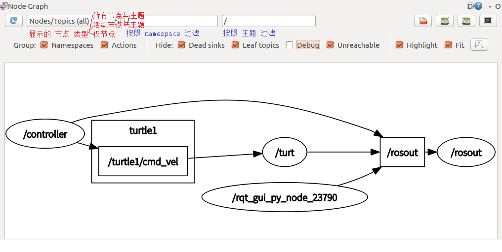
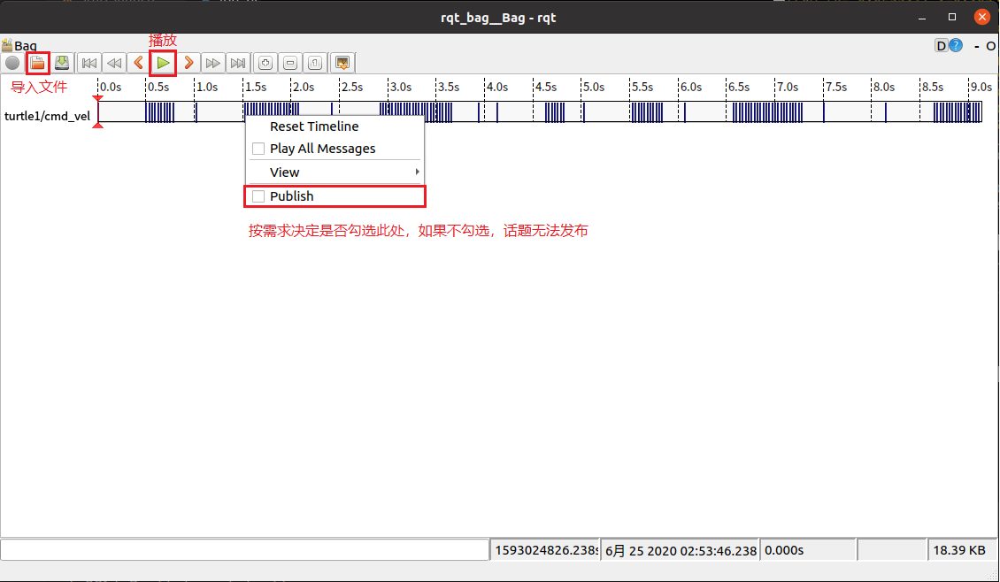

# 5.3 rqt工具箱

之前，在ROS中使用了一些实用的工具，比如：ros_bag用于录制与回放，tf2_tool可以生成TF树...这些工具大大提供了开发的便利性，但是也存在一些问题：这些工具的启动和使用过程中涉及到一些命令操作，应用起来不够方便，在ROS中，提供了rqt工具箱，在调用工具时以图形化操作代替了命令操作，应用更便利，提高了操作效率，优化了用户体验。

---

<B>概念</B>

ROS基于QT框架，针对机器人开发提供了一系列可视化的工具，这些工具的集合就是rqt。

<B>作用</B>

可以方便的实现ROS可视化调试，并且在同一窗口中打开多个部件，提高了开发效率，优化用户体验。

<B>组成</B>

rqt工具箱组成有三大部分：

- rqt --- 核心实现，开发人员无需关注
- rqt_common_plugins --- rqt中常用的工具套件
- rqt_robot_plugins --- 运行中和机器人交互的插件(比如：rviz)

---

## 5.3.1 rqt安装启动与基本使用

### 1. 安装

- 一般只要你安装的是desktop-full版本，rqt就默认安装好了，如果没有，则需要安装。

- 如果需要安装可以用如下方式安装

```bash
sudo apt-get install ros-noetic-rqt
sudo apt-get install ros-noetic-rqt-common-plugins
```

### 2. 启动

`rqt`的启动方式有两种：

- 方式1：`rqt`
- 方式2：`rosrun rqt_gui rqt_gui`

### 3. 基本使用

启动rqt之后，可以通过plugins添加所需的插件

<div align=center>
    
</div>

## 5.3.2 rqt常用插件：rqt_graph

<B>简介：</B>可视化显示计算图

<B>启动：</B>可以在rqt的plugins中添加，或者使用`rqt_graph`启动

<div align=center>
    
</div>

## 5.3.3 rqt常用插件：rqt_console

<B>简介：</B>rqt_console是ROS中用于显示和过滤日志的图形化插件

<B>准备：</B>编写Node节点输出各个级别的日志信息

```c++
/*  
    ROS 节点:输出各种级别的日志信息

*/
#include "ros/ros.h"

int main(int argc, char *argv[])
{
    ros::init(argc,argv,"log_demo");
    ros::NodeHandle nh;

    ros::Rate r(0.3);
    while (ros::ok())
    {
        ROS_DEBUG("Debug message d");
        ROS_INFO("Info message oooooooooooooo");
        ROS_WARN("Warn message wwwww");
        ROS_ERROR("Erroe message EEEEEEEEEEEEEEEEEEEE");
        ROS_FATAL("Fatal message FFFFFFFFFFFFFFFFFFFFFFFFFFFFF");
        r.sleep();
    }


    return 0;
}
```

<B>启动：</B>

可以在rqt的plugins中添加，或者使用`rqt_console`启动

<div align=center>
    
</div>

## 5.3.4 rqt常用插件：rqt_plot

<B>简介:</B>图形绘制插件，可以以 2D 绘图的方式绘制发布在 topic 上的数据

<B>准备:</B>启动 turtlesim 乌龟节点与键盘控制节点，通过 rqt_plot 获取乌龟位姿

<B>启动:</B>可以在 rqt 的 plugins 中添加，或者使用`rqt_plot`启动

<div align=center>
    
</div>

## 5.3.4 rqt常用插件：rqt_bag

<B>简介:</B>录制和重放 bag 文件的图形化插件

<B>准备:</B>启动 turtlesim 乌龟节点与键盘控制节点

<B>启动:</B>可以在 rqt 的 plugins 中添加，或者使用rqt_bag启动

<B>录制:</B>

<div align=center>
    
</div>

<B>重放:</B>

<div align=center>
    
</div>