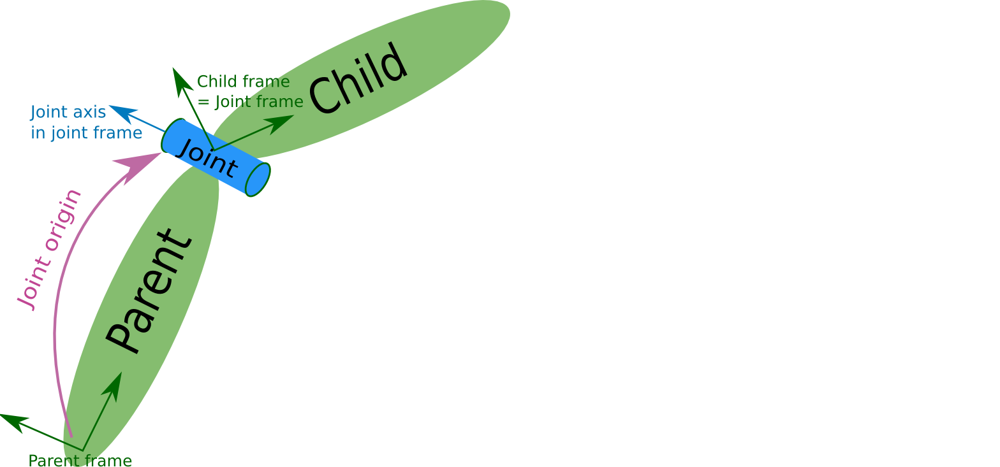

# 6.3 URDF 语法详解

URDF文件是一个标准的XML文件，在ROS中预定义了一系列的标签用于描述机器人模型，机器人模型可能较为复杂，但是ROS的URDF中机器人的组成确实较为简单，可以主要简化为两部分：连杆(link标签)与关节(joint标签)，接下来我们通过案例了解一下URDF中的不同标签：

- robot根标签，类似于launch文件中的launch标签
- link连杆标签
- joint关节标签
- gazebo集成gazebo需要使用的标签

关于gazebo标签，后期在使用gazebo仿真时，才需要使用到，用于配置仿真环境所需参数，比如：机器人材料属性、gazebo插件等，但是该标签不是机器人模型必须的，只有在仿真时才需设置。

---

## 6.3.1 URDF语法详解01_robot

<B>robot</B>

urdf中为了保证xml语法的完整性，使用了`robot`标签作为根标签，所有的`link`和`joint`以及其他标签都必须包含在robot标签内，在该标签内可以通过`name`属性设置机器人模型的名称

### 1. 属性

name:指定机器人模型的名称

### 2. 子标签

其他标签都是子级标签

---

## 6.3.2 URDF语法详解02_link

<B>link</B>

urdf中的link标签用于描述机器人某个部件(也即刚体部件)的外观和物理属性，比如：机器人底座、轮子、激光雷达、摄像头...每一个部件都对应一个link，在link标签内，可以设计该部件的形状、尺寸、颜色、惯性矩阵、碰撞参数等一系列属性

<div align=center>
    
</div>

### 1. 属性

- name ---> 为连杆命名

### 2.子标签

- visual ---> 描述外观(对应的数据是可视的)
  - geometry 设置连杆的形状
    - 标签1：box(盒装)
      - 属性：size=长(x)宽(y)高(z)
    - 标签2：cylinder(圆柱)
      - 属性：radius=半径 length=高度
    - 标签3：sphere(球体)
      - 属性：radius=半径
    - 标签4：mesh(网格)
      - 属性：filename=资源路径(格式：package://<packagename>/<path>/文件)
  - origin 设置偏移量与倾斜弧度
    - 属性1：xyz=x偏移量 y偏移 z偏移
    - 属性2：rpy=x翻滚 y俯仰 z偏航 (单位是弧度)
  - metrial 设置材料属性(颜色)
    - 属性：name
    - 标签：color
      - 属性：rgba=红(0-1)绿(0-1)蓝(0-1)透明度(0-1)
- collision ---> 描述碰撞属性(对应的数据是不可见的)
- inertial ---> 描述惯性属性

在此，只演示`visual`使用。

### 3. 案例

<B>需求：</B>分别生成长方体、圆柱体与球体的机器人部件

```xml
<!-- 需求：设置不同形状的机器人部件 -->
<robot name="mycar">
    <link name="base_link">
        <!-- 可视化标签 -->
        <visual>
            <!-- 1.形状 -->
            <geometry>
                <!-- 1.1 立方体 -->
                <box size="0.3 0.2 0.1" />
                <!-- 1.2 圆柱 -->
                <!-- <cylinder radius="0.1" length="2" /> -->
                <!-- 1.3 球体 -->
                <!-- <sphere radius="1" /> -->
                <!-- 1.4 皮肤 -->
                <!-- <mesh filename="package://urdf01_rviz/meshes/autolabor_mini.stl" /> -->
            </geometry>
            <!-- 2.偏移量与倾斜弧度 -->
            <!-- 
                xyz 设置机器人模型在 x y z 上的偏移量
                rpy 用于设置倾斜弧度 x(翻滚) y(俯仰) z(偏航)
             -->
            <origin xyz="0 0 0" rpy="1 1 1"/>

            <!-- 3.颜色 -->
            <!-- 
                r = red, g = green, b = blue, a = alpha表示透明度
             -->
            <material name="car_color">
                <color rgba="0.5 0.2 0.3 0.5"/>
            </material>
        </visual>
    </link>
</robot>
```

---


## 6.3.3 URDF语法详解03_joint

<B>joint</B>

urdf中的joint标签用于描述机器人关节的运动学和动力学属性，还可以指定关节运动的安全极限，机器人的两个部件(分别称之为parent link 与 child link)以“关节”的形式相连接，不同的关节有不同的运动形式：旋转、滑动、固定、旋转速度、旋转速度限制...，比如：安装在底座上的轮子可以360旋转，而摄像头则可能是完全固定在底座上的。

joint标签对应的数据在模型中是不可见的。

<div align=center>
  
</div>


### 1. 属性

- name ---> 为关节命名
- type ---> 关节运动形式
  - continuous：旋转关节，可以绕单轴无限旋转
  - revolute：旋转关节，类似于continuous，但是有旋转角度限制
  - prismatic：滑动关节，沿某一轴线移动的关节，有位置极限
  - planer:平面关节，允许在平面正交方向上平移或旋转
  - floating：浮动关节，允许进行平移、旋转运动
  - fixed：固定关节，不允许运动的特殊关节


### 2. 子标签

- parent(必需的)
  parent link的名字是一个强制的属性：
  - link：父级连杆的名字，是这个link在机器人结构树中的名字。
- child(必需的)
  child link的名字是一个强制的属性：
  - link:子级连杆的名字，是这个link在机器人结构树中的名字。
- origin
  - 属性：xyz=各轴线上的偏移量 rpy=各轴线上的偏移弧度。
- axis
  - 属性：xyz用于设置围绕哪个关节轴运动。


### 3. 案例


<B>需求：</B>创建机器人模型，底盘为长方体，在长方体的前面添加一摄像头，摄像头可以沿着Z轴360°旋转。

<B>URDF文件示例如下：</B>

```xml

```