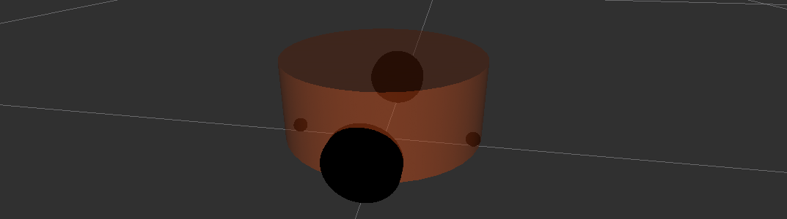

# 6.3 URDF 语法详解

URDF文件是一个标准的XML文件，在ROS中预定义了一系列的标签用于描述机器人模型，机器人模型可能较为复杂，但是ROS的URDF中机器人的组成确实较为简单，可以主要简化为两部分：连杆(link标签)与关节(joint标签)，接下来我们通过案例了解一下URDF中的不同标签：

- robot根标签，类似于launch文件中的launch标签
- link连杆标签
- joint关节标签
- gazebo集成gazebo需要使用的标签

关于gazebo标签，后期在使用gazebo仿真时，才需要使用到，用于配置仿真环境所需参数，比如：机器人材料属性、gazebo插件等，但是该标签不是机器人模型必须的，只有在仿真时才需设置。

---

## 6.3.1 URDF语法详解01_robot

<B>robot</B>

urdf中为了保证xml语法的完整性，使用了`robot`标签作为根标签，所有的`link`和`joint`以及其他标签都必须包含在robot标签内，在该标签内可以通过`name`属性设置机器人模型的名称

### 1. 属性

name:指定机器人模型的名称

### 2. 子标签

其他标签都是子级标签

---

## 6.3.2 URDF语法详解02_link

<B>link</B>

urdf中的link标签用于描述机器人某个部件(也即刚体部件)的外观和物理属性，比如：机器人底座、轮子、激光雷达、摄像头...每一个部件都对应一个link，在link标签内，可以设计该部件的形状、尺寸、颜色、惯性矩阵、碰撞参数等一系列属性

<div align=center>
    
</div>

### 1. 属性

- name ---> 为连杆命名

### 2.子标签

- visual ---> 描述外观(对应的数据是可视的)
  - geometry 设置连杆的形状
    - 标签1：box(盒装)
      - 属性：size=长(x)宽(y)高(z)
    - 标签2：cylinder(圆柱)
      - 属性：radius=半径 length=高度
    - 标签3：sphere(球体)
      - 属性：radius=半径
    - 标签4：mesh(网格)
      - 属性：filename=资源路径(格式：package://<packagename>/<path>/文件)
  - origin 设置偏移量与倾斜弧度
    - 属性1：xyz=x偏移量 y偏移 z偏移
    - 属性2：rpy=x翻滚 y俯仰 z偏航 (单位是弧度)
  - metrial 设置材料属性(颜色)
    - 属性：name
    - 标签：color
      - 属性：rgba=红(0-1)绿(0-1)蓝(0-1)透明度(0-1)
- collision ---> 描述碰撞属性(对应的数据是不可见的)
- inertial ---> 描述惯性属性

在此，只演示`visual`使用。

### 3. 案例

<B>需求：</B>分别生成长方体、圆柱体与球体的机器人部件

```xml
<!-- 需求：设置不同形状的机器人部件 -->
<robot name="mycar">
    <link name="base_link">
        <!-- 可视化标签 -->
        <visual>
            <!-- 1.形状 -->
            <geometry>
                <!-- 1.1 立方体 -->
                <box size="0.3 0.2 0.1" />
                <!-- 1.2 圆柱 -->
                <!-- <cylinder radius="0.1" length="2" /> -->
                <!-- 1.3 球体 -->
                <!-- <sphere radius="1" /> -->
                <!-- 1.4 皮肤 -->
                <!-- <mesh filename="package://urdf01_rviz/meshes/autolabor_mini.stl" /> -->
            </geometry>
            <!-- 2.偏移量与倾斜弧度 -->
            <!-- 
                xyz 设置机器人模型在 x y z 上的偏移量
                rpy 用于设置倾斜弧度 x(翻滚) y(俯仰) z(偏航)
             -->
            <origin xyz="0 0 0" rpy="1 1 1"/>

            <!-- 3.颜色 -->
            <!-- 
                r = red, g = green, b = blue, a = alpha表示透明度
             -->
            <material name="car_color">
                <color rgba="0.5 0.2 0.3 0.5"/>
            </material>
        </visual>
    </link>
</robot>
```

---


## 6.3.3 URDF语法详解03_joint

<B>joint</B>

urdf中的joint标签用于描述机器人关节的运动学和动力学属性，还可以指定关节运动的安全极限，机器人的两个部件(分别称之为parent link 与 child link)以“关节”的形式相连接，不同的关节有不同的运动形式：旋转、滑动、固定、旋转速度、旋转速度限制...，比如：安装在底座上的轮子可以360旋转，而摄像头则可能是完全固定在底座上的。

joint标签对应的数据在模型中是不可见的。

<div align=center>
  
</div>


### 1. 属性

- name ---> 为关节命名
- type ---> 关节运动形式
  - continuous：旋转关节，可以绕单轴无限旋转
  - revolute：旋转关节，类似于continuous，但是有旋转角度限制
  - prismatic：滑动关节，沿某一轴线移动的关节，有位置极限
  - planer:平面关节，允许在平面正交方向上平移或旋转
  - floating：浮动关节，允许进行平移、旋转运动
  - fixed：固定关节，不允许运动的特殊关节


### 2. 子标签

- parent(必需的)
  parent link的名字是一个强制的属性：
  - link：父级连杆的名字，是这个link在机器人结构树中的名字。
- child(必需的)
  child link的名字是一个强制的属性：
  - link:子级连杆的名字，是这个link在机器人结构树中的名字。
- origin
  - 属性：xyz=各轴线上的偏移量 rpy=各轴线上的偏移弧度。
- axis
  - 属性：xyz用于设置围绕哪个关节轴运动。


### 3. 案例


<B>需求：</B>创建机器人模型，底盘为长方体，在长方体的前面添加一摄像头，摄像头可以沿着Z轴360°旋转。

<B>URDF文件示例如下：</B>

```xml
<!-- 需求：设置机器人底盘，并添加摄像头 -->
<robot name="my_car">
    <!-- 1.底盘link -->
    <link name="base_link">
        <visual>
            <geometry>
                <box size="0.3 0.2 0.1" />
            </geometry>
            <origin xyz="0 0 0" rpy="0 0 0"/>
            <material name="car_color">
                <color rgba="0.8 0.5 0 0.5"/>
            </material>
        </visual>
    </link>
    <!-- 2.摄像头link -->
    <link name="camera">
        <visual>
            <geometry>
                <box size="0.02 0.05 0.05" />
            </geometry>
            <!-- 先使用默认(后期需要修改) -->
            <!-- 为什么是0.025，因为关节中心点距离父级link的中心刚好是父级link高度的一半，子级link的中心点距离关机的中心点，
            默认是0，所以会出现子级link半沉在父级link中，加上子级高度的一半偏移之后就可以正常了。-->
            <origin xyz="0 0 0.025" rpy="0 0 0"/>
            <material name="camera_color">
                <color rgba="0 0 1 0.5"/>
            </material>
        </visual>
    </link>

    <!-- 3.关节 -->
    <joint name="camera2base" type="continuous">
        <!-- 父级 link -->
        <parent link="base_link" />
        <!-- 子级 link -->
        <child link="camera" />
        <!-- 设置偏移量，关节相对于父级link的偏移量，如果全为0，则link会设置在父级link的中心位置 -->
        <!-- x = 0.12(小于0.05即可)，是让这个关节在相对父级x轴0.12的位置，y=0，z=0.05，关节中心点距离父级link 0.05，相当于就在父级link的表面，因为父级link的高度是0.1。 -->
        <origin xyz="0.12 0 0.05" rpy="0 0 0" />
        <!-- 设置关节旋转参考的坐标轴 -->
        <axis xyz="0 0 1" />
    </joint>
</robot>
```


<B>launch文件示例如下：</B>

```xml
<launch>
    <!-- 1.在参数服务器载入 urdf 文件 -->
    <param name="robot_description" textfile="$(find urdf01_rviz)/urdf/urdf/demo03_joint.urdf" />
    <!-- 2.启动 rviz -->
    <node pkg="rviz" type="rviz" name="rviz" args="-d $(find urdf01_rviz)/config/show_mycar.rviz" />

    <!-- 
        只有上述两条语句：
            表现：设置头显示位置与颜色异常
            提示：No transform from [camera] to [base_link]
            原因：rviz 中显示 URDF 时，必须发布不同部件之间的 坐标系 关系
            解决：ROS中提供了关于机器人模型显示的坐标发布相关节点(两个)
            rosrun joint_state_publisher joint_state_publisher  # 关节相关
            rosrun robot_state_publisher robot_state_publisher  # robot相关
     -->
    <!-- 关节状态发布节点 -->
    <node pkg="joint_state_publisher" type="joint_state_publisher" name="joint_state_publisher" />
    <!-- 机器人状态发布节点 -->
    <node pkg="robot_state_publisher" type="robot_state_publisher" name="robot_state_publisher" />
    <!-- 可选：添加控制关节运动的节点 -->
    <node pkg="joint_state_publisher_gui" type="joint_state_publisher_gui" name="joint_state_publisher_gui" />
</launch>
```

PS:

1. 状态发布节点在此是必须的：

```xml
<!-- 关节状态发布节点 -->
<node pkg="joint_state_publisher" type="joint_state_publisher" name="joint_state_publisher" />
<!-- 机器人状态发布节点 -->
<node pkg="robot_state_publisher" type="robot_state_publisher" name="robot_state_publisher" />
```

2. 关节运动控制节点(可选)，会生成关节控制的UI，用于测试关节运动是否正常。

```xml
<!-- 可选：添加控制关节运动的节点 -->
<node pkg="joint_state_publisher_gui" type="joint_state_publisher_gui" name="joint_state_publisher_gui" />
```


### 4. base_footprint优化urdf

前面实现的机器人模型是半沉到地下的，因为默认情况下：底盘的中心点位于地图圆点上，所以会导致这种情况产生，可以使用的优化策略，将初始link设置为一个尺寸极小的link(比如半径为0.001的球体，或边长为0.001m的立方体)，然后再在初始link上添加底盘等刚体，这样实现，虽然仍然存在初始link半沉的现场，但是基本可以忽略了。这个初始link一般称之为base_footprint。

```xml
<!-- 需求：设置机器人底盘，并添加摄像头 -->
<robot name="my_car">
    <!-- 0.base_footprint -->
    <!-- 添加一个尺寸极小的 link，
    再去关联初始link 与 base_link,
    关节的高度刚好和base_link下沉的高度一致(半个底盘高度) -->
    <link name="base_footprint">
        <visual>
            <geometry>
                <box size="0.001 0.001 0.001" />
            </geometry>
        </visual>
    </link>

    <!-- 1.底盘link -->
    <link name="base_link">
        <visual>
            <geometry>
                <box size="0.3 0.2 0.1" />
            </geometry>
            <origin xyz="0 0 0" rpy="0 0 0" />
            <material name="car_color">
                <color rgba="0.8 0.5 0 0.5" />
            </material>
        </visual>
    </link>

    <!-- 2.摄像头link -->
    <link name="camera">
        <visual>
            <geometry>
                <box size="0.02 0.05 0.05" />
            </geometry>
            <!-- 先使用默认(后期需要修改) -->
            <!-- 为什么是0.025，因为关节中心点距离父级link的中心刚好是父级link高度的一半，子级link的中心点距离关机的中心点，
            默认是0，所以会出现子级link半沉在父级link中，加上子级高度的一半偏移之后就可以正常了。-->
            <origin xyz="0 0 0.025" rpy="0 0 0" />
            <material name="camera_color">
                <color rgba="0 0 1 0.5"/>
            </material>
        </visual>
    </link>

    <!-- 3.1 basefootprint2base_link -->
    <joint name="base_link2base_footprint" type="fixed">
        <parent link="base_footprint" />
        <child link="base_link" />
        <origin xyz="0 0 0.05" rpy="0 0 0" />
    </joint>

    <!-- 3.关节 -->
    <joint name="camera2base" type="continuous">
        <!-- 父级 link -->
        <parent link="base_link" />
        <!-- 子级 link -->
        <child link="camera" />
        <!-- 设置偏移量，关节相对于父级link的偏移量，如果全为0，则link会设置在父级link的中心位置 -->
        <!-- x = 0.12(小于0.05即可)，是让这个关节在相对父级x轴0.12的位置，y=0，z=0.05，关节中心点距离父级link 0.05，相当于就在父级link的表面，因为父级link的高度是0.1。 -->
        <origin xyz="0.12 0 0.05" rpy="0 0 0" />
        <!-- 设置关节旋转参考的坐标轴 -->
        <axis xyz="0 0 1" />
    </joint>

</robot>
```

launch文件内容不变。

开启rviz时，记得将参考系从`base_link`改为`base_footprint`。


### 5. 遇到问题以及解决

<B>问题1：</B>

命令行输出如下错误提示：

```xshell
UnicodeEncodeError: 'ascii' codec can't encode characters in position 463-464: ordinal not in range(128)
[joint_state_publisher-3] process has died [pid 4443, exit code 1, cmd /opt/ros/melodic/lib/joint_state_publisher/joint_state_publisher __name:=joint_state_publisher __log:=/home/rosmelodic/.ros/log/b38967c0-0acb-11eb-aee3-0800278ee10c/joint_state_publisher-3.log].
log file: /home/rosmelodic/.ros/log/b38967c0-0acb-11eb-aee3-0800278ee10c/joint_state_publisher-3*.log
```

rviz中提示坐标变换异常，导致机器人部件显示结构异常。

<B>原因：</B>编码问题导致的

<B>解决：</B>去除URDF中的中文注释


<B>问题2：</B>[ERROR] [1584370263.037038]: Could not find the GUI, install the 'joint_state_publisher_gui' package

<B>解决：</B>`sudo apt install ros-noetic-joint-state-publisher-gui`

---


## 6.3.4 URDF练习

<B>需求描述：</B>

创建一个四轮圆柱状机器人模型，机器人参数如下，底盘为圆柱状，半径10cm，高8cm，四轮由两个驱动轮和两个万向支撑轮组成，两个驱动轮半径为3.25cm，轮胎宽度1.5cm，两个万向轮为球状，半径0.75cm，底盘离地间距为1.5cm(与万向轮直径一致)

<B>结果演示：</B>

<div align=center>
    
</div>

<B>实现流程：</B>

创建机器人模型可以分步骤实现

1. 新建urdf文件，并与launch文件集成
2. 搭建底盘
3. 在底盘上添加两个驱动轮
4. 在底盘上添加两个万向支撑轮

### 1. 新建urdf以及launch文件

urdf文件：基本实现

```xml
<robot name="mycar">
    <!-- 1.添加base_footprint -->
    <link name="base_footprint">
        <visual>
            <geometry>
                <sphere radius="0.001" />
            </geometry>
        </visual>
    </link>

    <!-- 2.添加底盘 -->
    <!-- 
        形状：圆柱
        半径：0.1m
        高度：0.08m
        离地间距：0.015m
     -->
    <!-- 2-1.link -->
    <link name="base_link">
        <visual>
            <geometry>
                <cylinder length="0.08" radius="0.1" />
            </geometry>

            <origin xyz="0.0 0.0 0" rpy="0.0 0.0 0.0" />

            <material name="baselink_color">
                <color rgba="1.0 0.5 0.2 0.5" />
            </material>
        </visual>
    </link>

    <!-- 2-2.joint -->
    <joint name="link2footprint" type="fixed">
        <parent link="base_footprint" />
        <child link="base_link" />
        <!-- z的偏移量=离地间距+base_link高度的一半=0.04+0.015=0.055 -->
        <!-- 如果这个偏移量设置为0，然后在base_link中设置z的偏移量为0.055，也可以得到一样的效果；但不建议这么做，因为相对坐标会重合。 -->
        <!-- 要求，在正常情况下，每个link的偏移都设置为0； -->
        <origin xyz="0.0 0.0 0.055" rpy="0.0 0.0 0.0" />
    </joint>

    <!-- 3.添加驱动轮 -->
    <!-- 
        形状:圆柱
        半径:0.0325m
        长度:0.015m
     -->
    <!-- 3-1.link -->
    <link name="left_wheel">
        <visual>
            <geometry>
                <cylinder radius="0.0325" length="0.015" />
            </geometry>
            <origin xyz="0.0 0.0 0.0" rpy="1.5708 0.0 0.0" />
            <material name="left_wheel_color">
                <color rgba="0.0 0.0 0.0 0.3" />
            </material>
        </visual>
    </link>
    <link name="right_wheel">
        <visual>
            <geometry>
                <cylinder radius="0.0325" length="0.015" />
            </geometry>
            <origin xyz="0.0 0.0 0.0" rpy="1.5708 0.0 0.0" />
            <material name="right_wheel_color">
                <color rgba="0.0 0.0 0.0 0.3" />
            </material>
        </visual>
    </link>
    <!-- 3-2.joint -->
    <joint name="left2link" type="continuous">
        <parent link="base_link" />
        <child link="left_wheel" />
        <!-- 
            x 无偏移
            y 车体的半径
            z =车体高度 / 2 + 离地间距 - 车轮半径=0.055-0.0325=0.0255m
         -->
        <origin xyz="0.0 0.1 -0.0255" rpy="0.0 0.0 0.0" />
        <axis xyz="0 1 0" />
    </joint>
    <joint name="right2link" type="continuous">
        <parent link="base_link" />
        <child link="right_wheel" />
        <!-- 
            x 无偏移
            y 车体的半径
            z =车体高度 / 2 + 离地间距 - 车轮半径=0.055-0.0325=0.0255m
         -->
        <origin xyz="0.0 -0.1 -0.0255" rpy="0.0 0.0 0.0" />
        <axis xyz="0 1 0" />
    </joint>

    <!-- 4.添加万向轮 -->
    <!-- 
        形状：球
        半径： 0.0075m
     -->
    <!-- 4-1.link -->
    <link name="front_wheel">
        <visual>
            <geometry>
                <sphere radius="0.0075" />
            </geometry>
            <origin xyz="0.0 0.0 0.0" rpy="0 0.0 0.0" />
            <material name="front_wheel_color">
                <color rgba="0.0 0.0 0.0 0.3" />
            </material>
        </visual>
    </link>
    <link name="back_wheel">
        <visual>
            <geometry>
                <sphere radius="0.0075" />
            </geometry>
            <origin xyz="0.0 0.0 0.0" rpy="0 0.0 0.0" />
            <material name="back_wheel_color">
                <color rgba="0.0 0.0 0.0 0.3" />
            </material>
        </visual>
    </link>
    <!-- 4-2.joint -->
    <joint name="front2link" type="continuous">
        <parent link="base_link" />
        <child link="front_wheel" />
        <!-- 
            x < 车体的半径
            y = 0
            z = 0.055 - 0.0075 = 0.0475
         -->
        <origin xyz="0.08 0 -0.0475" rpy="0.0 0.0 0.0" />
        <axis xyz="0 1 0" />
    </joint>
    <joint name="back2link" type="continuous">
        <parent link="base_link" />
        <child link="back_wheel" />
        <origin xyz="-0.08 0 -0.0475" rpy="0.0 0.0 0.0" />
        <axis xyz="0 1 0" />
    </joint>
</robot>
```


launch文件：

```xml
<launch>
    <!-- 1.在参数服务器中载入URDF -->
    <param name="robot_description" textfile="$(find urdf01_rviz)/urdf/urdf/demo05_test.urdf" />

    <!-- 2.启动rviz -->
    <node name="rviz" pkg="rviz" type="rviz" args="-d $(find urdf01_rviz)/config/show_mycar.rviz" />

    <!-- 3.添加关节状态发布节点 -->
    <node pkg="joint_state_publisher" name="joint_state_publisher" type="joint_state_publisher" />
    <!-- 4.添加机器人状态节点 -->
    <node pkg="robot_state_publisher" name="robot_state_publisher" type="robot_state_publisher" />
    <!-- 5.关节运动控制节点 -->
    <node pkg="joint_state_publisher_gui" name="joint_state_publisher_gui" type="joint_state_publisher_gui" />
</launch>
```


---


## 6.3.5 URDF工具

在ROS中，提供了一些工具来方便URDF文件的编写，比如：

- `check_urdf`命令可以检查复杂的urdf文件是否存在语法问题
- `urdf_to_graphiz`命令可以查看urdf模型结构，显示不同link的层级关系

当然，要使用工具之前，首先需要安装，安装命令：`sudo apt install liburdfdom-tools`

### 1.check_urdf语法检查

进入urdf文件所属目录，调用：`check_urdf urdf文件`，如果不抛出异常，说明文件合法，否则非法

<div align=center>
    
    
</div>

### 2.urdf_to_graphiz结构查看

进入urdf文件所属目录，调用：`urdf_to_graphiz urdf文件`，当前目录下会生成pdf文件

<div align=center>
    
</div>


---


