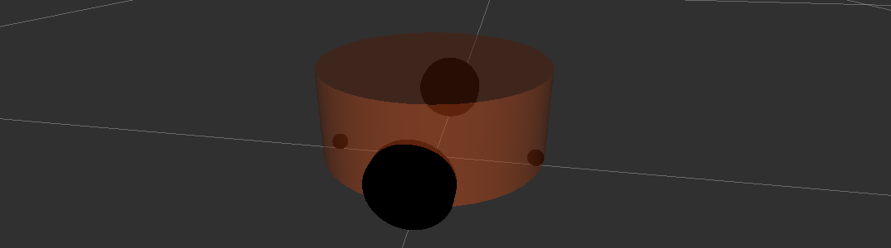

# 6.4 URDF优化_xacro

前面 URDF 文件构建机器人模型的过程中，存在若干问题。

>问题1:在设计关节的位置时，需要按照一定的公式计算，公式是固定的，但是在 URDF 中依赖于人工计算，存在不便，容易计算失误，且当某些参数发生改变时，还需要重新计算。
>
>问题2:URDF 中的部分内容是高度重复的，驱动轮与支撑轮的设计实现，不同轮子只是部分参数不同，形状、颜色、翻转量都是一致的，在实际应用中，构建复杂的机器人模型时，更是易于出现高度重复的设计，按照一般的编程涉及到重复代码应该考虑封装。
>
>......

如果在编程语言中，可以通过变量结合函数直接解决上述问题，在 ROS 中，已经给出了类似编程的优化方案，称之为:Xacro

---

<B>概念</B>

Xacro是XML Macros的缩写，Xacro是一种XML宏语言，是可编程的XML。

<B>原理</B>

Xacro可以声明变量，可以通过数学运算求解，使用流程控制控制执行顺序，还可以通过类似函数的实现，封装固定的逻辑，将逻辑中需要的可变的数据以参数的方式暴露出去，从而提高代码复用率以及程序的安全性。

<B>作用</B>

较之于纯粹的URDF实现，可以编写更安全、精简、易读性更强的机器人模型文件，且可以提高编写效率。


---


## 6.4.1 Xacro_快速体验

<B>目的：</B>简单了解xacro的基本语法。

<B>需求描述：</B>

使用xacro优化上一节案例中驱动轮实现，需要使用变量封装底盘的半径、高度，使用数学公式动态计算底盘的关节点坐标，使用Xacro宏封装轮子重复的代码并调用宏创建两个轮子(注意：在此，演示Xacro的基本使用，不必要生成合法的URDF)。

<B></B>

创建功能包，导入urdf与xacro。

### 1.Xacro文件编写

编写Xacro文件，以变量的方式封装属性(常量半径、高度、车轮半径...)，以函数的方式封装重复实现(车轮的添加)。

```xml
<robot name="mycar" xmlns:xacro="http://wiki.ros.org/xacro">
    <!-- 
        上节案例问题：
            1.代码复用 ==== Xacro宏(函数)
            2.参数设计 ==== Xacro变量
     -->
    <!-- 属性封装 -->
    <xacro:property name="wheel_radius" value="0.0325" />
    <xacro:property name="wheel_length" value="0.0015" />
    <xacro:property name="PI" value="3.1415927" />
    <xacro:property name="base_link_length" value="0.08" />
    <xacro:property name="lidi_space" value="0.015" />

    <!-- 宏 -->
    <xacro:macro name="wheel_func" params="wheel_name flag">
        <link name="${wheel_name}_wheel">
            <visual>
                <geometry>
                    <cylinder radius="${wheel_radius}" length="${wheel_length}"/>
                </geometry>

                <origin xyz="0 0 0" rpy="${PI / 2} 0 0" />

                <material name="wheel_color">
                    <color rgba="0.0 0.0 0.0 0.3"/>
                </material>
            </visual>
        </link>

        <joint name="${wheel_name}2link" type="continuous">
            <parent link="base_link" />
            <child link="${wheel_name}_wheel"/>
            <!-- 
                x 无偏移
                y 车体半径
                z = 车体高度 / 2 + 离地间距 - 车轮半径
             -->
            <origin xyz="0 ${0.1 * flag} ${(base_link_length / 2 + lidi_space - wheel_radius)*-1}" rpy="0 0 0" />
        </joint>
    </xacro:macro>
    <!-- 调用语法 -->
    <xacro:wheel_func wheel_name="left" flag="1" />
    <xacro:wheel_func wheel_name="right" flag="-1" />
</robot>
```

### 2.Xacro文件转换成urdf文件

命令行进入xacro文件所属目录，执行:`rosrun xacro xacro xxx.xacro > xxx.urdf`，会将xacro文件解析为urdf文件，内容如下：

```xml
<?xml version="1.0" ?>
<!-- =================================================================================== -->
<!-- |    This document was autogenerated by xacro from demo01_helloworld.urdf.xacro   | -->
<!-- |    EDITING THIS FILE BY HAND IS NOT RECOMMENDED                                 | -->
<!-- =================================================================================== -->
<robot name="mycar">
  <link name="left_wheel">
    <visual>
      <geometry>
        <cylinder length="0.0015" radius="0.0325"/>
      </geometry>
      <origin rpy="1.57079635 0 0" xyz="0 0 0"/>
      <material name="wheel_color">
        <color rgba="0.0 0.0 0.0 0.3"/>
      </material>
    </visual>
  </link>
  <joint name="left2link" type="continuous">
    <parent link="base_link"/>
    <child link="left_wheel"/>
    <!-- 
                x 无偏移
                y 车体半径
                z = 车体高度 / 2 + 离地间距 - 车轮半径
             -->
    <origin rpy="0 0 0" xyz="0 0.1 -0.0225"/>
  </joint>
  <link name="right_wheel">
    <visual>
      <geometry>
        <cylinder length="0.0015" radius="0.0325"/>
      </geometry>
      <origin rpy="1.57079635 0 0" xyz="0 0 0"/>
      <material name="wheel_color">
        <color rgba="0.0 0.0 0.0 0.3"/>
      </material>
    </visual>
  </link>
  <joint name="right2link" type="continuous">
    <parent link="base_link"/>
    <child link="right_wheel"/>
    <!-- 
                x 无偏移
                y 车体半径
                z = 车体高度 / 2 + 离地间距 - 车轮半径
             -->
    <origin rpy="0 0 0" xyz="0 -0.1 -0.0225"/>
  </joint>
</robot>
```

注意：该案例编写生成的是非法的URDF文件，目的在于演示Xacro的极简使用以及优点。

---


## 6.4.2 Xacro_语法详解

xacro提供了可编程接口，类似于计算机语言，包括变量声明调用、函数声明与调用等语法实现。在使用xacro生成urdf时，根标签`root`中必须包含命名空间声明：`xmlns:xacro="http://wiki.ros.org/xacro"`

### 1.属性与算数运算

用于封装URDF中的一些字段，比如：PAI值，小车的尺寸，轮子半径...

<B>属性定义</B>

```xml
<xacro:property name="xxx" value="yyy" />
```

<B>属性调用</B>

```xml
${属性名称}
```

<B>算数运算</B>

```xml
${数学表达式}
```

<B>举例：</B>

```xml
<robot name="mycar" xmlns:xacro="http://wiki.ros.org/xacro">
    <!-- 1.属性定义 -->
    <xacro:property name="PI" value="3.1415926" />
    <xacro:property name="radius" value="0.03" />
    <!-- 2.属性调用 -->
    <myUsePropertyxxx name="${PI}" />
    <myUsePropertyxxx name="${radius}" />
    <!-- 3.算数运算 -->
    <myUsePropertyyyy result="${PI / 2}" />
    <myUsePropertyyyy result="${radius * 2}" />
</robot>
```

<B>结果：</B>

```xml
<?xml version="1.0" ?>
<!-- =================================================================================== -->
<!-- |    This document was autogenerated by xacro from demo02_field.urdf.xacro        | -->
<!-- |    EDITING THIS FILE BY HAND IS NOT RECOMMENDED                                 | -->
<!-- =================================================================================== -->
<robot name="mycar">
  <!-- 2.属性调用 -->
  <myUsePropertyxxx name="3.1415926"/>
  <myUsePropertyxxx name="0.03"/>
  <!-- 3.算数运算 -->
  <myUsePropertyyyy result="1.5707963"/>
  <myUsePropertyyyy result="0.06"/>
</robot>
```

### 2.宏

类似于函数实现，提高代码复用率，优化代码结构，提高安全性

<B>宏定义</B>

```xml
<xacro:macro name="宏名称" params="参数列表(多参数之间使用空格分隔)">
    ......

    参数调用格式：${参数名}

</xacro:macro>
```

<B>宏调用</B>

```xml
<xacro:宏名称 参数1=xxx 参数2=xxx />
```

<B>举例：</B>

```xml
<robot name="mycar" xmlns:xacro="http://wiki.ros.org/xacro">
    <!-- 1.宏定义 -->
    <xacro:macro name="getSum" params="num1 num2">
        <result value="${num1 + num2}" />
    </xacro:macro>
    <!-- 2.宏调用 -->
    <xacro:getSum num1="1" num2="5" />
</robot>
```

<B>结果：</B>

```xml
<?xml version="1.0" ?>
<!-- =================================================================================== -->
<!-- |    This document was autogenerated by xacro from demo03_macro.urdf.xacro        | -->
<!-- |    EDITING THIS FILE BY HAND IS NOT RECOMMENDED                                 | -->
<!-- =================================================================================== -->
<robot name="mycar">
  <result value="6"/>
</robot>
```

### 3.文件包含

机器人由多部件组成，不同部件可能封装为单独的xacro文件，最后再将不同的文件集成，组合为完整机器人，可以使用文件包含实现。

<B>文件包含</B>

```xml
<robot name="xxx" xmlns:xacro="http://wiki.ros.org/xacro">
    <xacro:include filename="my_base.xacro" />
    <xacro:include filename="my_camera.xacro" />
    <xacro:include filename="my_laser.xacro" />
    ......
</robot>
```

<B>举例：</B>

```xml
<robot name="mycar" xmlns:xacro="http://wiki.ros.org/xacro">
    <!-- 1.宏定义 -->
    <xacro:macro name="getSum" params="num1 num2">
        <result value="${num1 + num2}" />
    </xacro:macro>
    <!-- 2.宏调用 -->
    <xacro:getSum num1="1" num2="5" />
</robot>
```

<B>结果：</B>

```xml
<?xml version="1.0" ?>
<!-- =================================================================================== -->
<!-- |    This document was autogenerated by xacro from demo04_sum.urdf.xacro          | -->
<!-- |    EDITING THIS FILE BY HAND IS NOT RECOMMENDED                                 | -->
<!-- =================================================================================== -->
<robot name="mycar">
  <!-- 2.属性调用 -->
  <myUsePropertyxxx name="3.1415926"/>
  <myUsePropertyxxx name="0.03"/>
  <!-- 3.算数运算 -->
  <myUsePropertyyyy result="1.5707963"/>
  <myUsePropertyyyy result="0.06"/>
  <result value="6"/>
</robot>
```

---


## 6.4.3 Xacro_完整使用流程示例

<B>需求描述：</B>

使用Xacro优化URDF版的小车底盘模型实现

<B>结果演示：</B>

<div align="center">
    
</div>

### 1. 编写Xacro文件

```xml
<robot name="mycar" xmlns:xacro="http://www.ros.org/wiki/xacro">

    <xacro:property name="footprint_radius" value="0.001" />
    <!-- 1.添加base_footprint -->
    <link name="base_footprint">
        <visual>
            <geometry>
                <sphere radius="${footprint_radius}" />
            </geometry>
        </visual>
    </link>

    <!-- 2.添加底盘 -->
    <!-- 
        形状：圆柱
        半径：0.1m
        高度：0.08m
        离地间距：0.015m
     -->
    <xacro:property name="base_radius" value="0.1" />
    <xacro:property name="base_length" value="0.08" />
    <xacro:property name="lidi" value="0.015" />
    <xacro:property name="base_joint_z" value="${base_length / 2 + lidi}" />
    <!-- 2-1.link -->
    <link name="base_link">
        <visual>
            <geometry>
                <cylinder length="${base_length}" radius="${base_radius}" />
            </geometry>

            <origin xyz="0.0 0.0 0" rpy="0.0 0.0 0.0" />

            <material name="baselink_color">
                <color rgba="1.0 0.5 0.2 0.5" />
            </material>
        </visual>
    </link>

    <!-- 2-2.joint -->
    <joint name="link2footprint" type="fixed">
        <parent link="base_footprint" />
        <child link="base_link" />
        <!-- z的偏移量=离地间距+base_link高度的一半=0.04+0.015=0.055 -->
        <!-- 如果这个偏移量设置为0，然后在base_link中设置z的偏移量为0.055，也可以得到一样的效果；但不建议这么做，因为相对坐标会重合。 -->
        <!-- 要求，在正常情况下，每个link的偏移都设置为0； -->
        <origin xyz="0.0 0.0 0.055" rpy="0.0 0.0 0.0" />
    </joint>

    <!-- 3.添加驱动轮 -->
    <!-- 驱动轮属性 -->
    <!-- 
        形状:圆柱
        半径:0.0325m
        长度:0.015m
     -->
    <xacro:property name="wheel_radius" value="0.0325" />
    <xacro:property name="wheel_length" value="0.015" />
    <xacro:property name="PI" value="3.1415927" />
    <xacro:property name="wheel_joint_z" value="${(base_length / 2 + lidi - wheel_radius)*-1}" />

    <material name="black">
        <color rgba="0.0 0.0 0.0 1.0" />
    </material>
    <!-- 驱动轮宏实现 -->
    <xacro:macro name="wheel_func" params="wheel_name flag">
        <link name="${wheel_name}_wheel">
            <visual>
                <geometry>
                    <cylinder radius="${wheel_radius}" length="${wheel_length}" />
                </geometry>
                <origin xyz="0.0 0.0 0.0" rpy="${PI / 2} 0.0 0.0" />
                <material name="black" />
            </visual>
        </link>
        <joint name="${wheel_name}2link" type="continuous">
            <parent link="base_link" />
            <child link="${wheel_name}_wheel" />
            <!-- 
                x 无偏移
                y 车体的半径
                z =车体高度 / 2 + 离地间距 - 车轮半径=0.055-0.0325=0.0255m
            -->
            <origin xyz="0.0 ${flag * 0.1} ${wheel_joint_z}" rpy="0.0 0.0 0.0" />
            <axis xyz="0 1 0" />
        </joint>
    </xacro:macro>

    <xacro:wheel_func wheel_name="left" flag="1" />
    <xacro:wheel_func wheel_name="right" flag="-1" />


    <!-- 4.添加万向轮 -->
    <!-- 
        形状：球
        半径： 0.0075m
     -->
    <xacro:property name="small_wheel_radius" value="0.0075" />
    <!-- Z的偏移量 = 车体高度 / 2 + 离地间距 - 万向轮半径 -->
    <xacro:property name="small_joint_z" value="${(base_length / 2 + lidi - small_wheel_radius) * -1}" />
    <xacro:macro name="small_wheel_func" params="small_wheel_name flag">
        <link name="${small_wheel_name}_wheel">
            <visual>
                <geometry>
                    <sphere radius="${small_wheel_radius}" />
                </geometry>
                <origin xyz="0.0 0.0 0.0" rpy="0 0.0 0.0" />
                <material name="small_wheel_color">
                    <color rgba="0.0 0.0 0.0 0.3" />
                </material>
            </visual>
        </link>
        <!-- 4-2.joint -->
        <joint name="${small_wheel_name}2link" type="continuous">
            <parent link="base_link" />
            <child link="${small_wheel_name}_wheel" />
            <!-- 
                x < 车体的半径
                y = 0
                z = 0.055 - 0.0075 = 0.0475
            -->
            <origin xyz="${flag * 0.08} 0 ${small_joint_z}" rpy="0.0 0.0 0.0" />
            <axis xyz="0 1 0" />
        </joint>
    </xacro:macro>

    <xacro:small_wheel_func small_wheel_name="front" flag="1" />
    <xacro:small_wheel_func small_wheel_name="back" flag="-1" />
    
</robot>
```

### 2. 集成launch文件

<B>方式1：</B> 先将xacro文件转换出urdf文件，然后集成

先将xacro文件解析成urdf文件，`rosrun xacro xacro xxx.xacro > xxx.urdf`然后再按照之前的集成方式直接整合launch文件，内容示例：

```xml
<launch>
    <!-- 1.在参数服务器中载入URDF -->
    <param name="robot_description" textfile="$(find urdf01_rviz)/urdf/urdf/demo05_test.urdf" />

    <!-- 2.启动rviz -->
    <node name="rviz" pkg="rviz" type="rviz" args="-d $(find urdf01_rviz)/config/show_mycar.rviz" />

    <!-- 3.添加关节状态发布节点 -->
    <node pkg="joint_state_publisher" name="joint_state_publisher" type="joint_state_publisher" />
    <!-- 4.添加机器人状态节点 -->
    <node pkg="robot_state_publisher" name="robot_state_publisher" type="robot_state_publisher" />
    <!-- 5.关节运动控制节点 -->
    <node pkg="joint_state_publisher_gui" name="joint_state_publisher_gui" type="joint_state_publisher_gui" />
</launch>
```  

<B>方式2：</B> 在launc文件中直接加载xacro(<B>建议使用</B>)

launch内容示例：

```xml
<launch>
    <!-- 1.在参数服务器中载入URDF -->
    <param name="robot_description" command="$(find xacro)/xacro $(find urdf01_rviz)/urdf/xacro/demo05_car_base.urdf.xacro" />

    <!-- 2.启动rviz -->
    <node name="rviz" pkg="rviz" type="rviz" args="-d $(find urdf01_rviz)/config/show_mycar.rviz" />

    <!-- 3.添加关节状态发布节点 -->
    <node pkg="joint_state_publisher" name="joint_state_publisher" type="joint_state_publisher" />
    <!-- 4.添加机器人状态节点 -->
    <node pkg="robot_state_publisher" name="robot_state_publisher" type="robot_state_publisher" />
    <!-- 5.关节运动控制节点 -->
    <node pkg="joint_state_publisher_gui" name="joint_state_publisher_gui" type="joint_state_publisher_gui" />
</launch>
```

核心代码：

```xml
<param name="robot_description" command="$(find xacro)/xacro $(find urdf01_rviz)/urdf/xacro/demo05_car_base.urdf.xacro">
```

加载`robot_description`时使用`command`属性，属性值就是调用`xacro`功能包的`xacro`程序直接解析`xacro`文件。

## 6.4.4 Xacro_实操

<B>需求描述：</B>

在前面小车底盘基础上，添加摄像头和雷达传感器。

<B>结果演示：</B>

<div align="center">
    
</div>

<B>实现分析：</B>

机器人模型由多部件组成，可以将不同组件设置进单独文件，最终通过文件包含实现组件的拼装。

<B>实现流程：</B>

1. 首先编写摄像头和雷达的xacro文件
2. 然后再编写一个组合文件，组合底盘、摄像头与雷达
3. 最后，通过launch文件启动Rviz并显示模型

### 1. 摄像头和雷达Xacro文件实现

摄像头`xacro`文件：

```xml

```

雷达`xacro`文件：

```xml

```

### 2. 组合底盘摄像头与雷达的xacro文件

### 3. launch文件

```xml

```