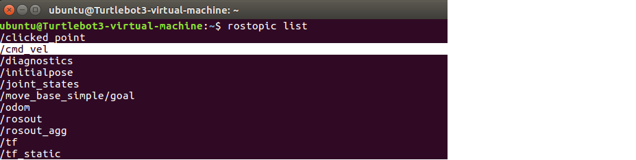

# 6.5 Rviz中控制机器人模型运动

通过URDF结合rviz可以创建并显示机器人模型，不过，当前实现的只是静态模型，如何控制模型的运动呢？在此，可以调用Arbotix实现此功能。

---

<B>简介</B>

<B>Arbotix：</B>Arbotix是一款控制电机、舵机的控制板，<B>并提供相应的ros功能包</B>，这个功能包的功能不仅可以驱动真实的Arbotix控制板，它还提供一个差速控制器，通过接受速度控制指令更新机器人的joint状态，从而帮助我们实现机器人在rviz中的运动。

这个差速控制器在Arbotix_python程序包中，完整的arbotix程序还包括多种控制器，分别对应dynamixel电机、多关节机械臂以及不同形状的夹持器。

---

## 6.5.1 Arbotix使用流程

接下来，通过一个案例演示arbotix的使用。

<B>需求描述：</B>

控制机器人模型在rviz中做圆周运动。

<B>结果演示：</B>

<div align="center">
    
</div>

<B>实现流程：</B>

1. 安装Arbotix
2. 创建新功能包，准备机器人urdf、xacro文件
3. 添加Arbotix配置文件
4. 编写launch文件配置Arbotix
5. 启动launch文件并控制机器人模型运动

### 1. 安装Arbotix

<B>方式一：</B>命令行调用

```bash
sudo apt-get install ros-<<VersionName()>>-arbotix
```

将<<VersionName()>>替换成当前ROS版本名称，如果提示功能包无法定位，请采用方式2。

<B>方式二：</B>源码安装

先从github下载源码，然后调用catkin_make编译

```bash
git clone https://github.com/vanadiumljk/arbotix.git
```

### 2.创建新功能包，准备机器人urdf、xacro文件

urdf和xacro调用上一讲实现即可

### 3.添加Arbotix所需的配置文件

<B>添加arbotix所需配置文件</B>

```yaml
# 该文件是控制器配置,一个机器人模型可能有多个控制器，比如: 底盘、机械臂、夹持器(机械手)....
# 因此，根 name 是 controller
controllers: {
   # 单控制器设置
   base_controller: {
          #类型: 差速控制器
       type: diff_controller,
       #参考坐标
       base_frame_id: base_footprint, 
       #两个轮子之间的间距
       base_width: 0.2,
       #控制频率
       ticks_meter: 2000, 
       #PID控制参数，使机器人车轮快速达到预期速度
       Kp: 12, 
       Kd: 12, 
       Ki: 0, 
       Ko: 50, 
       #加速限制
       accel_limit: 1.0 
    }
}
```

### 4. launch文件中配置arbotix节点

launch示例代码

```xml
<launch>
    <param name="robot_description" command="$(find xacro)/xacro $(find urdf01_rviz)/urdf/xacro/car.urdf.xacro" />
    <!-- 2.启动rviz -->
    <node name="rviz" pkg="rviz" type="rviz" args="-d $(find urdf01_rviz)/config/show_mycar.rviz" />

    <!-- 3.添加关节状态发布节点 -->
    <node pkg="joint_state_publisher" name="joint_state_publisher" type="joint_state_publisher" />
    <!-- 4.添加机器人状态节点 -->
    <node pkg="robot_state_publisher" name="robot_state_publisher" type="robot_state_publisher" />
    
    <!-- 集成 arbotix 运动控制节点，并且加载参数 -->
    <node name="arbotix" pkg="arbotix_python" type="arbotix_driver" output="screen">
        <rosparam file="$(find urdf01_rviz)/config/control.yaml" command="load" />
        <param name="sim" value="true" /> <!-- true表示这是一个仿真模型 -->
    </node>
</launch>
```

代码解释：

<node>调用了arbotix_python功能包下的arbotix_driver节点

<rosparam>arbotix驱动机器人运行时，需要获取机器人信息，可以通过file加载配置文件

<param>在仿真环境下，需要配置sim为true

### 5. 启动launch文件并控制机器人模型运动

<B>启动launch：</B>roslaunch xxxx ...launch

<B>配置rviz:</B>

<div align="center">
    
</div>

<B>控制小车运动：</B>

此时调用rostopic list会发现一个熟悉的话题：/cmd_vel

<div align="center">
    
</div>

也就是说我们可以发布cmd_vel话题消息控制小车运动了，该实现策略有多种，可以另行编写节点，或者更简单些，可以直接通过如下命令发布消息：

```bash
rostopic pub -r 10 /cmd_vel geometry_msgs/Twist '{linear: {x: 0.2, y: 0, z: 0}, angular: {x: 0, y: 0, z: 0.5}}'
```

现在，小车就可以运动起来了。

---