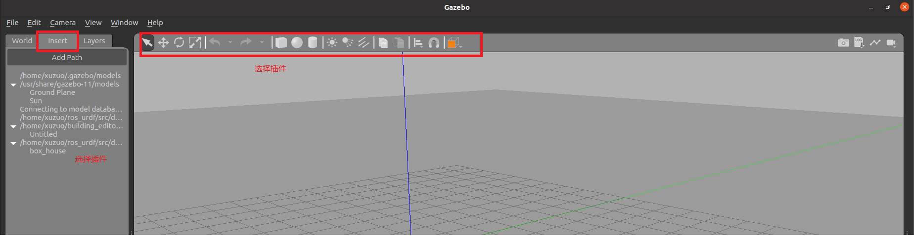
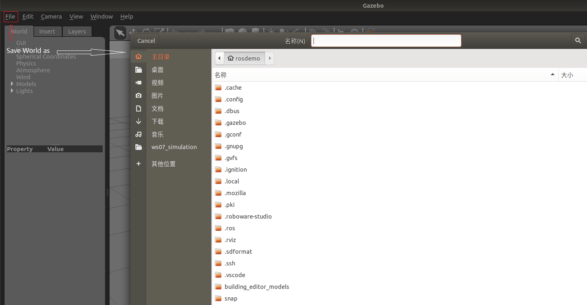
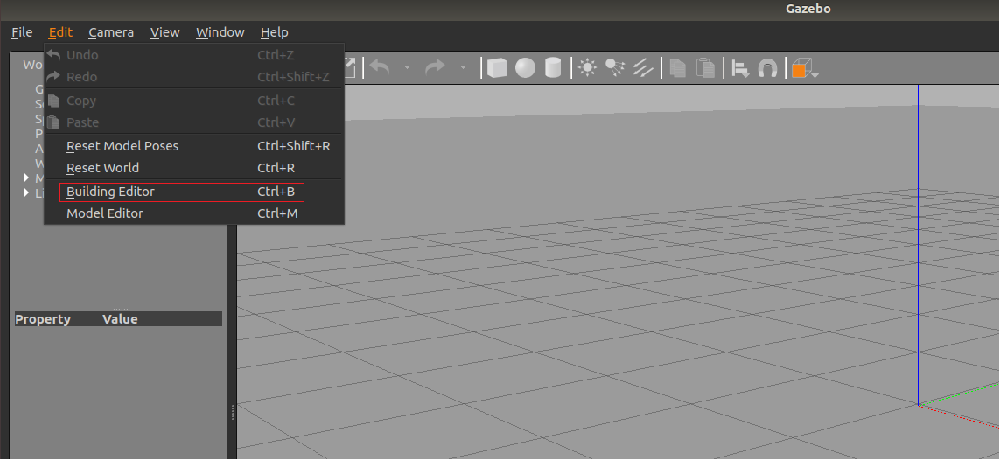
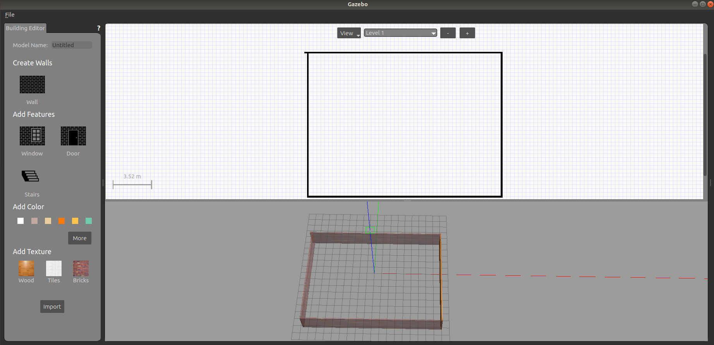

# 6.6 URDF集成Gazebo

URDF需要集成进Rviz或Gazebo才能显示可视化的机器人模型，前面已经介绍了URDF与Rviz的集成，本节主要介绍：

- URDF与Gazebo的基本集成流程；
- 如果要在Gazebo中显示机器人模型，URDF需要做的一些额外配置；
- 关于Gazebo仿真环境的搭建。

---

## 6.6.1 URDF与Gazebo基本集成流程

URDF与Gazebo集成流程与Rviz实现类似，主要步骤如下：

1. 创建功能包，导入依赖项
2. 编写URDF或Xacro文件
3. 启动Gazebo并显示机器人模型

### 1. 创建功能包

创建新功能包，导入依赖包：urdf、xacro、gazebo_ros、gazebo_ros_control、gazebo_plugins

### 2. 编写URDF文件

```xml
<robot name="mycar">
    <link name="base_link">
        <!-- 可视化部分 -->
        <visual>
            <geometry>
                <box size="0.5 0.3 0.1" />
            </geometry>
            <origin xyz="0 0 0" rpy="0 0 0" />
            <material name="yellow">
                <color rgba="0.5 0.3 0 0.5" />
            </material>
        </visual>
        <!-- 1.设置碰撞参数 -->
        <!-- 如果是标准几何体。直接复制 visual 的 geometry 和 origin 即可 -->
        <collision>
            <geometry>
                <box size="0.5 0.3 0.1" />
            </geometry>
            <origin xyz="0 0 0" rpy="0 0 0" />
        </collision>
        <!-- 2.设置惯性矩阵 -->
        <inertial>
            <!-- 重心的偏移 -->
            <origin xyz="0 0 0" />
            <!-- 惯性，和质量有关 -->
            <mass value="2" />
            <inertia ixx="1" ixy="0" ixz="0" iyy="1" iyz="0" izz="1" />
        </inertial>
    </link>

    <!-- gazebo 有自己的颜色设置标签 -->
    <gazebo reference="base_link">
        <material>Gazebo/Red</material>
    </gazebo>
</robot>
```

注意，当URDF需要与Gazebo集成时，和Rviz有明显区别：

1. 必须使用collision标签，因为既然是仿真环境，那么必然涉及到碰撞检测，collision提供碰撞检测的依据。
2. 必须使用inertial标签，此标签标注了当前机器人某个刚体部分的惯性矩阵，用于一些力学相关的仿真计算。
3. 颜色设置，也需要重新使用gazebo标签标注，因为之前的颜色设置为了方便调试包含透明度，仿真环境下没有此选项。

### 3. 启动Gazebo并显示模型

launch文件实现：

```xml
<launch>
    <!-- 1.需要在参数服务器中载入 urdf -->
    <param name="robot_description" textfile="$(find urdf02_gazebo)/urdf/demo01_helloworld.urdf" />
    <!-- 2.启动Gazebo仿真环境 -->
    <include file="$(find gazebo_ros)/launch/empty_world.launch" />
    <!-- 3.在Gazebo中添加机器人模型 -->
    <node pkg="gazebo_ros" type="spawn_model" name="urdf_spawner" args="-urdf -model mycar -param robot_description" />
</launch>
```

代码解释：

```xml
<include file="$(find gazebo_ros)/launch/empty_world.launch" />
<!-- 启动 Gazebo 的仿真环境，当前环境为空环境 -->
```

```xml
<node pkg="gazebo_ros" type="spawn_model" name="urdf_spawner" args="-urdf -model mycar -param robot_description" />
<!-- 
    在 Gazebo 中加载一个机器人模型，该功能由 gazebo_ros 下的 spawn_model 提供：
    -urdf 加载的是urdf文件
    -model mycar 模型名称是 mycar
    -param robot_description 从参数 robot_description 中载入模型
    -x 模型载入的x坐标
    -y 模型载入的y坐标
    -z 模型载入的z坐标
 -->
```

---


## 6.6.2 URDF集成Gazebo相关设置

较之于rviz，gazebo在集成URDF时，需要做些许修改，比如：必须添加collision碰撞属性相关参数、必须添加inertial惯性矩阵相关参数，另外，如果直接移植Rviz中机器人的颜色设置是没有显示的，颜色设置也必须做相应的变更。

### 1. collision

如果机器人link是标准的几何体形状，和link的visual属性设置一致即可。

### 2. inertial

惯性矩阵的设置需要结合link的质量与外形参数动态生成，标准的球体、圆柱与立方体的惯性矩阵公式如下(已经封装为xacro实现)：

球体惯性矩阵:

```xml
<!-- Macro for inertial matrix -->
<xacro:macro name="sphere_inertial_matrix" params="m r">
    <inertial>
        <mass value="${m}" />
        <inertia ixx="${2*m*r*r/5}" ixy="0" ixz="0" 
            iyy="${2*m*r*r/5}" iyz="0" 
            izz="${2*m*r*r/5}" />
    </inertial>
</xacro:macro>
```

圆柱惯性矩阵：

```xml
<xacro:macro name="cylinder_inertial_matrix" params="m r">
    <inertial>
        <mass value="${m}" />
        <inertia ixx="${m*(3*r*r + h*h)/12}" ixy="0" ixz="0"
            iyy="${m*(3*r*r + h*h)/12}" iyz="0" 
            izz="${m*r*r/2}" />
    </inertial>
</xacro:macro>
```

立方体惯性矩阵：

```xml
<xacro:macro name="Box_inertial_matrix" params="m l w h">
    <inertial>
        <mass value="${m}" />
        <inertia ixx="${m*(h*h + l*l)/12}" ixy="0" ixz="0" 
            iyy="${m*(w*w + l*l)/12}" iyz="0" 
            izz="${m*(w*w + h*h)/12}" />
    </inertial>
</xacro:macro>
```

需要注意的是，原则上，除了base_footprint外，机器人的每个刚体部分都需要设置惯性矩阵，且惯性矩阵必须经计算得出，如果随意定义刚体部分的惯性矩阵，那么可能会导致机器人在Gazebo中出现抖动，移动等现象。

### 3. 颜色设置

在 gazebo 中显示link的颜色，必须要使用指定的标签：

```xml
<gazebo reference="link节点名称">
    <material>Gazebo/Blue</material>
</gazebo>
```

<B>PS:</B>material标签中，设置的值区分大小写，颜色可以设置为Red Blue Green Black...

---

## 6.6.3 URDF集成Gazebo实操

<B>需求描述：</B>

将之前的机器人模型(xacro)显示在gazebo中

<B>结果演示：</B>

<div align="center">
    
</div>

<B>实现流程：</B>

1. 需要编写封装惯性矩阵算法的xacro文件
2. 为机器人模型中的每一个link添加collision和inertial标签，并且重置颜色属性
3. 在launch文件中启动gazebo并添加机器人模型

### 1. 编写封装惯性矩阵算法的xacro文件

```xml
<robot name="base" xmlns:xacro="http://wiki.ros.org/xacro">
    <!-- Macro for inertia matrix -->
    <xacro:macro name="sphere_inertial_matrix" params="m r">
        <inertial>
            <mass value="${m}" />
            <inertia ixx="${2*m*r*r/5}" ixy="0" ixz="0" 
                iyy="${2*m*r*r/5}" iyz="0" 
                izz="${2*m*r*r/5}" />
        </inertial>
    </xacro:macro>

    <xacro:macro name="cylinder_inertial_matrix" params="m r h">
        <inertial>
            <mass value="${m}" />
            <inertia ixx="${m*(3*r*r+h*h)/12}" ixy="0" ixz="0" 
                iyy="${m*(3*r*r+h*h)/12}" iyz="0"
                izz="${m*r*r/2}" />
        </inertial>
    </xacro:macro>

    <xacro:macro name="Box_inertial_matrix" params="m l w h">
        <inertial>
            <mass value="${m}" />
            <inertia ixx="${m*(w*w + l*l)/12}" ixy="0" ixz="0"
                iyy="${m*(w*w + l*l)/12}" iyz="0"
                izz="${m*(w*w + h*h)/12}" />
        </inertial>
    </xacro:macro>
</robot>
```

### 2. 复制相关的xacro文件，并设置collision inertial 以及 color 等参数

#### A. 底盘Xacro文件

```xml
<robot name="mycar" xmlns:xacro="http://www.ros.org/wiki/xacro">

    <xacro:property name="footprint_radius" value="0.001" />
    <!-- 1.添加base_footprint -->
    <link name="base_footprint">
        <visual>
            <geometry>
                <sphere radius="${footprint_radius}" />
            </geometry>
        </visual>
    </link>

    <!-- 2.添加底盘 -->
    <!-- 
        形状：圆柱
        半径：0.1m
        高度：0.08m
        离地间距：0.015m
     -->
    <xacro:property name="base_radius" value="0.1" />
    <xacro:property name="base_length" value="0.08" />
    <xacro:property name="base_mass" value="2" />
    <xacro:property name="lidi" value="0.015" />
    <xacro:property name="base_joint_z" value="${base_length / 2 + lidi}" />
    <!-- 2-1.link -->
    <link name="base_link">
        <visual>
            <geometry>
                <cylinder length="${base_length}" radius="${base_radius}" />
            </geometry>

            <origin xyz="0.0 0.0 0" rpy="0.0 0.0 0.0" />

            <material name="baselink_color">
                <color rgba="1.0 0.5 0.2 0.5" />
            </material>
        </visual>
        <!-- 碰撞属性 -->
        <collision>
            <geometry>
                <cylinder length="${base_length}" radius="${base_radius}" />
            </geometry>
            <origin xyz="0.0 0.0 0" rpy="0.0 0.0 0.0" />
        </collision>
        <!-- 调用惯性矩阵函数 -->
        <xacro:cylinder_inertial_matrix m="${base_mass}" r="${base_radius}" h="${base_length}" />
    </link>
    <!-- 颜色 -->
    <gazebo reference="base_link">
        <material>Gazebo/Yellow</material>
    </gazebo>

    <!-- 2-2.joint -->
    <joint name="link2footprint" type="fixed">
        <parent link="base_footprint" />
        <child link="base_link" />
        <!-- z的偏移量=离地间距+base_link高度的一半=0.04+0.015=0.055 -->
        <!-- 如果这个偏移量设置为0，然后在base_link中设置z的偏移量为0.055，也可以得到一样的效果；但不建议这么做，因为相对坐标会重合。 -->
        <!-- 要求，在正常情况下，每个link的偏移都设置为0； -->
        <origin xyz="0.0 0.0 0.055" rpy="0.0 0.0 0.0" />
    </joint>

    <!-- 3.添加驱动轮 -->
    <!-- 驱动轮属性 -->
    <!-- 
        形状:圆柱
        半径:0.0325m
        长度:0.015m
     -->
    <xacro:property name="wheel_radius" value="0.0325" />
    <xacro:property name="wheel_length" value="0.015" />
    <xacro:property name="wheel_mass" value="0.05" />
    <xacro:property name="PI" value="3.1415927" />
    <xacro:property name="wheel_joint_z" value="${(base_length / 2 + lidi - wheel_radius)*-1}" />

    <material name="black">
        <color rgba="0.0 0.0 0.0 1.0" />
    </material>
    <!-- 驱动轮宏实现 -->
    <xacro:macro name="wheel_func" params="wheel_name flag">
        <link name="${wheel_name}_wheel">
            <visual>
                <geometry>
                    <cylinder radius="${wheel_radius}" length="${wheel_length}" />
                </geometry>
                <origin xyz="0.0 0.0 0.0" rpy="${PI / 2} 0.0 0.0" />
                <material name="black" />
            </visual>
            <!-- 碰撞属性 -->
            <collision>
                <geometry>
                    <cylinder radius="${wheel_radius}" length="${wheel_length}" />
                </geometry>
                <origin xyz="0.0 0.0 0.0" rpy="${PI / 2} 0.0 0.0" />
            </collision>
            <!-- 调用惯性矩阵 -->
            <xacro:cylinder_inertial_matrix m="${wheel_mass}" r="${wheel_radius}" h="${wheel_length}" />
        </link>
        <!-- 颜色 -->
        <gazebo reference="${wheel_name}_wheel">
            <material>Gazebo/Red</material>
        </gazebo>
        <joint name="${wheel_name}2link" type="continuous">
            <parent link="base_link" />
            <child link="${wheel_name}_wheel" />
            <!-- 
                x 无偏移
                y 车体的半径
                z =车体高度 / 2 + 离地间距 - 车轮半径=0.055-0.0325=0.0255m
            -->
            <origin xyz="0.0 ${flag * 0.1} ${wheel_joint_z}" rpy="0.0 0.0 0.0" />
            <axis xyz="0 1 0" />
        </joint>
    </xacro:macro>

    <xacro:wheel_func wheel_name="left" flag="1" />
    <xacro:wheel_func wheel_name="right" flag="-1" />


    <!-- 4.添加万向轮 -->
    <!-- 
        形状：球
        半径： 0.0075m
     -->
    <xacro:property name="small_wheel_radius" value="0.0075" />
    <xacro:property name="small_wheel_mass" value="0.01" />
    <!-- Z的偏移量 = 车体高度 / 2 + 离地间距 - 万向轮半径 -->
    <xacro:property name="small_joint_z" value="${(base_length / 2 + lidi - small_wheel_radius) * -1}" />
    <xacro:macro name="small_wheel_func" params="small_wheel_name flag">
        <link name="${small_wheel_name}_wheel">
            <visual>
                <geometry>
                    <sphere radius="${small_wheel_radius}" />
                </geometry>
                <origin xyz="0.0 0.0 0.0" rpy="0 0.0 0.0" />
                <material name="small_wheel_color">
                    <color rgba="0.0 0.0 0.0 0.3" />
                </material>
            </visual>
            <collision>
                <geometry>
                    <sphere radius="${small_wheel_radius}" />
                </geometry>
                <origin xyz="0.0 0.0 0.0" rpy="0 0.0 0.0" />
            </collision>
            <xacro:sphere_inertial_matrix m="${small_wheel_mass}" r="${small_wheel_radius}" />
        </link>
        <gazebo reference="${small_wheel_name}_wheel">
            <material>Gazebo/Red</material>
        </gazebo>
        <!-- 4-2.joint -->
        <joint name="${small_wheel_name}2link" type="continuous">
            <parent link="base_link" />
            <child link="${small_wheel_name}_wheel" />
            <!-- 
                x < 车体的半径
                y = 0
                z = 0.055 - 0.0075 = 0.0475
            -->
            <origin xyz="${flag * 0.08} 0 ${small_joint_z}" rpy="0.0 0.0 0.0" />
            <axis xyz="0 1 0" />
        </joint>
    </xacro:macro>

    <xacro:small_wheel_func small_wheel_name="front" flag="1" />
    <xacro:small_wheel_func small_wheel_name="back" flag="-1" />
</robot>
```

注意：如果机器人模型在Gazebo中产生了抖动，滑动，缓慢位移....诸如此类情况，请查看

1. 惯性矩阵是否设置了，且设置是否正确合理
2. 车轮翻转需要依赖于PI值，如果PI值精度偏低，也可能导致上述情况产生

#### B. 摄像头Xacro文件

```xml
<robot name="mycar" xmlns:xacro="http://www.ros.org/wiki/xacro">
    <!-- 摄像头部件 -->
    <!-- 1.参数 -->
    <!-- 
        参数：
            连杆属性：厚度、宽度、高度
            关节属性：x y z
     -->
    
    <xacro:property name="camera_length" value="0.02" /> <!-- 厚度(x) -->
    <xacro:property name="camera_width" value="0.05" /> <!-- 厚度(y) -->
    <xacro:property name="camera_height" value="0.05" /> <!-- 高度(z) -->
    <xacro:property name="camera_mass" value="0.01" /> <!-- 质量 -->
    <xacro:property name="joint_camera_x" value="0.08" /> <!--  -->
    <xacro:property name="joint_camera_y" value="0" /> <!--  -->
    <xacro:property name="joint_camera_z" value="${base_length / 2 + camera_height / 2}" /> <!--  -->

    <!-- 2.设计连杆和关节 -->
    <link name="camera">
        <visual>
            <origin xyz="0 0 0" rpy="0 0 0" />
            <geometry>
                <box size="${camera_length} ${camera_width} ${camera_height}" />
            </geometry>
            <matrial name="black">
                <color rgba="0 0 0 0.8" />
            </matrial>
        </visual>
        <collision>
            <geometry>
                <box size="${camera_length} ${camera_width} ${camera_height}" />
            </geometry>
            <origin xyz="0 0 0" rpy="0 0 0" />
        </collision>
        <xacro:Box_inertial_matrix m="${camera_mass}" l="${camera_length}" w="${camera_width}" h="${camera_height}" />
    </link>
    <gazebo reference="camera">
        <material>Gazebo/Blue</material>
    </gazebo>
    <joint name="camera2base" type="fixed">
        <parent link="base_link" />
        <child link="camera" />
        <origin xyz="${joint_camera_x} ${joint_camera_y} ${joint_camera_z}" rpy="0 0 0" />
    </joint>
</robot>
```

#### C. 激光雷达Xacro文件

```xml
<robot name="mycar" xmlns:xacro="http://www.ros.org/wiki/xacro">
    <!-- 雷达部件 -->
    <!-- 参数 -->
    <!-- 
        1.支架
            支架尺寸：半径 高度
            关节偏移量：x y z
        2.雷达
            雷达尺寸：半径 高度
            关节偏移量：x y z
     -->
    <xacro:property name="support_radius"  value="0.01" />
    <xacro:property name="support_length"  value="0.15" />
    <xacro:property name="support_mass"  value="0.1" />
    <xacro:property name="laser_radius"  value="0.03" />
    <xacro:property name="laser_length"  value="0.05" />
    <xacro:property name="laser_mass"  value="0.15" />

    <xacro:property name="joint_support_x"  value="0" />
    <xacro:property name="joint_support_y"  value="0" />
    <!-- z = 车体高度 / 2 + 支架高度 / 2 -->
    <xacro:property name="joint_support_z"  value="${base_length / 2 + support_length / 2}" />

    <xacro:property name="joint_laser_x"  value="0" />
    <xacro:property name="joint_laser_y"  value="0" />
    <!-- z = 支架高度 / 2 + 雷达高度 / 2 -->
    <xacro:property name="joint_laser_z"  value="${support_length / 2 + laser_length / 2}" />

    <!-- 1.支架 -->
    <link name="support">
        <visual>
            <geometry>
                <cylinder radius="${support_radius}" length="${support_length}" />
            </geometry>
            <matrial name="yellow">
                <color rgba="0.8 0.5 0 0.5" />
            </matrial>
        </visual>
        <collision>
            <geometry>
                <cylinder radius="${support_radius}" length="${support_length}" />
            </geometry>
        </collision>
        <xacro:cylinder_inertial_matrix m="${support_mass}" r="${support_radius}" h="${support_length}" />
    </link>
    <gazebo reference="support">
        <material>Gazebo/Gray</material>
    </gazebo>
    <joint name="support2base" type="fixed">
        <parent link="base_link" />
        <child link="support" />
        <origin xyz="${joint_support_x} ${joint_support_y} ${joint_support_z}" rpy="0 0 0" />
    </joint>
    <!-- 2.雷达 -->
    <link name="laser">
        <visual>
            <geometry>
                <cylinder radius="${laser_radius}" length="${laser_length}" />
            </geometry>
            <matrial name="black">
                <color rgba="0 0 0 0.5" />
            </matrial>
        </visual>
        <collision>
            <geometry>
                <cylinder radius="${laser_radius}" length="${laser_length}" />
            </geometry>
        </collision>
        <xacro:cylinder_inertial_matrix m="${laser_mass}" r="${laser_radius}" h="${laser_length}" />
    </link>
    <gazebo reference="laser">
        <material>Gazebo/Black</material>
    </gazebo>
    <joint name="laser2support" type="fixed">
        <parent link="support" />
        <child link="laser" />
        <origin xyz="${joint_laser_x} ${joint_laser_y} ${joint_laser_z}" rpy="0 0 0" />
    </joint>
</robot>
```

#### D. 组合底盘、摄像头与雷达的Xacro文件

```xml
<robot name="mycar" xmlns:xacro="http://wiki.ros.org/xacro">
    <!-- 包含惯性矩阵文件 -->
    <xacro:include filename="head.xacro" />
    <!-- 包含底盘、摄像头与雷达的 xacro 文件 -->
    <xacro:include filename="demo05_car_base.urdf.xacro" />
    <xacro:include filename="demo06_car_camera.urdf.xacro" />
    <xacro:include filename="demo07_car_laser.urdf.xacro" />
</robot>
```

### 3. 在gazebo中执行

launch文件：

```xml
<launch>
    <!-- 1.需要在参数服务器中载入 urdf -->
    <param name="robot_description" command="$(find xacro)/xacro $(find urdf02_gazebo)/urdf/car.urdf.xacro" />
    <!-- 2.启动Gazebo仿真环境 -->
    <include file="$(find gazebo_ros)/launch/empty_world.launch" />
    <!-- 3.在Gazebo中添加机器人模型 -->
    <node pkg="gazebo_ros" type="spawn_model" name="urdf_spawner" args="-urdf -model mycar -param robot_description" />
</launch>
```

---

## 6.6.4 Gazebo仿真环境搭建

到目前为止，我们已经可以将机器人模型显示在Gazebo之中了，但是当前默认情况下，在Gazebo中机器人模型是在empty world中，并没有类似于房间、家具、道路、树木...之类的仿真物，如何在Gazebo中创建仿真环境呢？

Gazebo中创建仿真实现方式有两种：

- 方式1：直接添加内置组件创建仿真环境
- 方式2：手动绘制仿真黄金(更为灵活)

也还可以直接下载使用官方或第三方提供的仿真环境插件。

### 1. 添加内置组件创建仿真环境

#### 1.1 启动Gazebo并添加组件

<div align="center">
    
</div>

#### 1.2 保存仿真环境

添加完毕后，选择file ---> Save World as选择保存路径(功能包下：worlds目录)，文件名自定义，后缀名设置为.world

<div align="center">
    
</div>


#### 1.3 启动

```xml
<launch>
    <!-- 1.需要在参数服务器中载入 urdf -->
    <param name="robot_description" command="$(find xacro)/xacro $(find urdf02_gazebo)/urdf/car.urdf.xacro" />
    <!-- 2.启动Gazebo仿真环境 -->
    <include file="$(find gazebo_ros)/launch/empty_world.launch">
        <arg name="world_name" value="$(find urdf02_gazebo)/worlds/box_house.world" />
    </include>
    <!-- 3.在Gazebo中添加机器人模型 -->
    <node pkg="gazebo_ros" type="spawn_model" name="urdf_spawner" args="-urdf -model mycar -param robot_description" />
</launch>
```

核心代码：启动empty_world后，再根据`arg`加载自定义的仿真环境

```xml
<include file="$(find gazebo_ros)/launch/empty_world.launch">
    <arg name="world_name" value="$(find urdf02_gazebo)/worlds/box_house.world" />
</include>
```

### 2. 自定义仿真环境

#### 2.1 启动 gazebo 打开构建面板，绘制仿真环境

<div align="center">
    
    
</div>

#### 2.2 保存构建的环境

点击：左上角 file ---> Save (保存路径功能包下的：models)

然后 file ---> Exit Building Editor

#### 2.3 保存为 world 文件

可以像方式1一样再添加一些插件，然后保存为world文件(保存路径功能包下的：worlds)

<div align="center">
    
</div>

#### 2.4 启动

同方式1

### 3. 使用官方提供的插件

当前 Gazebo 提供的仿真道具有限，还可以下载官方支持，可以提供更为丰富的仿真实现，具体实现如下：

#### 3.1 下载官方模型库

```
git clone https://github.com/osrf/gazebo_models.git
```

之前是：`hg clone https://bitbucket.org/osrf/gazebo_models`但是已经不可用

注意：此过程可能比较耗时

#### 3.2 将模型复制进gazebo

将得到的gazebo_models复制到`/usr/share/gazebo-*/models`

#### 3.3 应用

重启`Gazebo`，选择左侧菜单栏的insert可以选择并插入相关道具了。

---