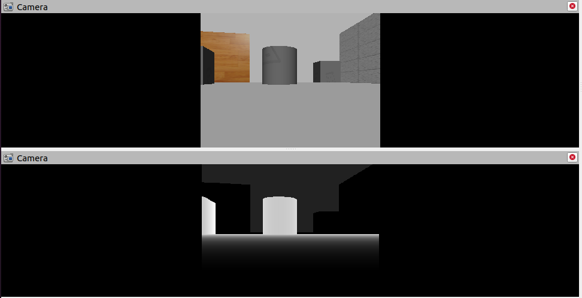

# 6.7 URDF、Gazebo与Rviz综合应用

关于URDF(Xacro)，Rviz和Gazebo三者的关系，前面已有阐述：URDF用于创建机器人模型、Rviz可以显示机器人感知到的环境信息，Gazebo用于仿真，可以模拟外界环境，以及机器人的一些传感器，如何在Gazebo中运行这些传感器，并显示这些传感器的数据(机器人的视角)呢？本节主要介绍的重点就是将三者结合：通过Gazebo模拟机器人的传感器，然后在Rviz中显示这些传感器感知到的数据。主要内容包括：

- 运动控制以及里程计信息显示
- 雷达信息仿真以及显示
- 摄像头信息仿真以及显示
- kinect信息仿真以及显示

---

## 6.7.1 机器人运动控制以及里程计信息显示

gazebo中已经可以正常显示机器人模型了，那么如何像在rviz中一样控制机器人运动呢？在此，需要涉及到ros中的组件：ros_control。

### 1. ros_control简介

<B>场景：</B>同一套ROS程序，如何部署在不同的机器人系统上，比如：开发阶段为了提高效率是在仿真平台上测试的，部署时又有不同的实体机器人平台，不同平台的实现是有差异的，如何保证ROS程序的可移植性？ROS内置的解决方式是ros_control。

<B>ros_control:</B>是一组软件包，它包含了控制器接口，控制器管理器，传输和硬件接口。ros_control是一套机器人控制的中间件，是一套规范，不同的机器人平台只要按照这套规范实现，那么就可以保证与ROS程序兼容，通过这套规范，实现了一种可插拔的架构设计，大大提高了程序设计的效率与灵活性。

gazebo已经实现了ros_control的相关接口，如果需要在gazebo中控制机器人运动，直接调用相关接口即可。

### 2. 运动控制实现流程(Gazebo)

承上，运动控制基本流程：

1. 已经创建完毕的机器人模型，编写一个单独的xacro文件，为机器人模型添加传动装置以及控制器

2. 将此文件集成进xacro文件

3. 启动Gazebo并发布`/cmd_vel`消息控制机器人运动


#### 2.1 为joint添加传动装置以及控制器

两轮差速装置

```xml
<robot name="my_car_move" xmlns:xacro="http://wiki.ros.org/xacro">

    <!-- 传动实现:用于连接控制器与关节 -->
    <xacro:macro name="joint_trans" params="joint_name">
        <!-- Transmission is important to link the joints and the controller -->
        <transmission name="${joint_name}_trans">
            <type>transmission_interface/SimpleTransmission</type>
            <joint name="${joint_name}">
                <hardwareInterface>hardware_interface/VelocityJointInterface</hardwareInterface>
            </joint>
            <actuator name="${joint_name}_motor">
                <hardwareInterface>hardware_interface/VelocityJointInterface</hardwareInterface>
                <mechanicalReduction>1</mechanicalReduction>
            </actuator>
        </transmission>
    </xacro:macro>

    <!-- 每一个驱动轮都需要配置传动装置 -->
    <xacro:joint_trans joint_name="left2link" />
    <xacro:joint_trans joint_name="right2link" />

    <!-- 差速控制器 -->
    <gazebo>
        <plugin name="differential_drive_controller" filename="libgazebo_ros_diff_drive.so">
            <rosDebugLevel>Debug</rosDebugLevel>
            <publishWheelTF>true</publishWheelTF>
            <robotNamespace>/</robotNamespace>
            <publishTf>1</publishTf>
            <publishWheelJointState>true</publishWheelJointState>
            <alwaysOn>true</alwaysOn>
            <updateRate>100.0</updateRate>
            <legacyMode>true</legacyMode>
            <leftJoint>left2link</leftJoint> <!-- 左轮 -->
            <rightJoint>right2link</rightJoint> <!-- 右轮 -->
            <wheelSeparation>${base_radius * 2}</wheelSeparation> <!-- 车轮间距 -->
            <wheelDiameter>${wheel_radius * 2}</wheelDiameter> <!-- 车轮直径 -->
            <broadcastTF>1</broadcastTF>
            <wheelTorque>30</wheelTorque>
            <wheelAcceleration>1.8</wheelAcceleration>
            <commandTopic>cmd_vel</commandTopic> <!-- 运动控制话题 -->
            <odometryFrame>odom</odometryFrame> 
            <odometryTopic>odom</odometryTopic> <!-- 里程计话题 -->
            <robotBaseFrame>base_footprint</robotBaseFrame> <!-- 根坐标系 -->
        </plugin>
    </gazebo>

</robot>
```

#### 2.2 xacro文件集成

最后还需要将上述xacro文件集成进总的机器人模型文件，代码示例如下：

```xml
<robot name="mycar" xmlns:xacro="http://wiki.ros.org/xacro">
    <!-- 包含惯性矩阵文件 -->
    <xacro:include filename="head.xacro" />
    <!-- 包含底盘、摄像头与雷达的 xacro 文件 -->
    <xacro:include filename="demo05_car_base.urdf.xacro" />
    <xacro:include filename="demo06_car_camera.urdf.xacro" />
    <xacro:include filename="demo07_car_laser.urdf.xacro" />

    <!-- 运动控制 -->
    <xacro:include filename="gazebo/move.xacro" />
    
</robot>
```

当前核心：包括 控制器以及传动配置的 xacro 文件

```xml
<xacro:include filename="gazebo/move.xacro" />
```

#### 2.3 启动Gazebo并控制机器人运动

launch文件：

```xml
<launch>
    <!-- 1.需要在参数服务器中载入 urdf -->
    <param name="robot_description" command="$(find xacro)/xacro $(find urdf02_gazebo)/urdf/car.urdf.xacro" />
    <!-- 2.启动Gazebo仿真环境 -->
    <include file="$(find gazebo_ros)/launch/empty_world.launch">
        <arg name="world_name" value="$(find urdf02_gazebo)/worlds/box_house.world" />
    </include>
    <!-- 3.在Gazebo中添加机器人模型 -->
    <node pkg="gazebo_ros" type="spawn_model" name="urdf_spawner" args="-urdf -model mycar -param robot_description" />
</launch>
```

启动launch文件，使用topic list查看话题列表，会发现多了`/cmd_vel`然后发布`cmd_vel`消息控制即可使用命令控制(或者可以编写单独的节点控制)

```bash
rostopic pub -r 10 /cmd_vel geometry_msgs/Twist "linear:
  x: 0.0
  y: 0.0
  z: 0.0
angular:
  x: 0.0
  y: 0.0
  z: 0.0" 
```

也可以：

```bash
rosrun teleop_twist_keyboard  teleop_twist_keyboard.py
```
使用键盘控制：

```bash

Reading from the keyboard  and Publishing to Twist!
---------------------------
Moving around:
   u    i    o
   j    k    l
   m    ,    .

For Holonomic mode (strafing), hold down the shift key:
---------------------------
   U    I    O
   J    K    L
   M    <    >

t : up (+z)
b : down (-z)

anything else : stop

q/z : increase/decrease max speeds by 10%
w/x : increase/decrease only linear speed by 10%
e/c : increase/decrease only angular speed by 10%

CTRL-C to quit

currently:	speed 0.3	turn 0.5 
```


接下来我们会发现：小车在Gazebo中已经正常运行起来了

<div align="center">
    
</div>

### 3. Rviz查看里程计信息

在Gazebo的仿真环境中，机器人的里程计信息以及运动朝向等信息是无法获取的，可以通过Rviz显示机器人的里程计信息以及运动朝向

<B>里程计：</B>机器人相对出发点坐标系的位姿状态(X坐标 Y坐标 Z坐标以及朝向)

#### 3.1 启动Rviz

launch文件

```xml
<launch>
    <node pkg="rviz" type="rviz" name="rviz" args="-d $(find urdf01_rviz)/config/show_mycar.rviz" />

    <!-- 添加关节状态发布节点 -->
    <node pkg="joint_state_publisher" type="joint_state_publisher" name="joint_state_publisher" />
    <!-- 添加机器人状态发布节点 -->
    <node pkg="robot_state_publisher" type="robot_state_publisher" name="robot_state_publisher" />
</launch>
```

#### 3.2 添加组件

执行launch文件后，在Rviz中添加图示组件：

<div align="center">
    
</div>

---

## 6.7.2 雷达信息仿真以及显示

通过Gazebo模拟激光雷达传感器，并在Rviz中显示激光数据。

<B>实现流程：</B>

雷达仿真基本流程：

1. 已经创建完毕的机器人模型，编写一个单独的xacro文件，为机器人模型添加雷达配置；
2. 将此文件集成进xacro文件；
3. 启动Gazebo，使用Rviz显示雷达信息。

### 1. Gazebo仿真雷达

#### 1.1 新建Xacro文件，配置雷达传感器信息

```xml
<robot name="my_sensors" xmlns:xacro="http://wiki.ros.org/xacro">
  <!-- 雷达 -->
  <gazebo reference="laser">
    <sensor type="ray" name="rplidar">
      <pose>0 0 0 0 0 0</pose><!-- 雷达位姿 -->
      <visualize>true</visualize>
      <update_rate>5.5</update_rate>
      <ray>
        <scan>
          <horizontal>
            <samples>360</samples>
            <resolution>1</resolution>
            <min_angle>-3</min_angle>
            <max_angle>3</max_angle>
          </horizontal>
        </scan>
        <range>
          <min>0.10</min>
          <max>30.0</max>
          <resolution>0.01</resolution>
        </range>
        <noise>
          <type>gaussian</type>
          <mean>0.0</mean>
          <stddev>0.01</stddev>
        </noise>
      </ray>
      <plugin name="gazebo_rplidar" filename="libgazebo_ros_laser.so">
        <topicName>/scan</topicName>
        <frameName>laser</frameName><!-- 坐标系 -->
      </plugin>
    </sensor>
  </gazebo>
</robot>
```

#### 1.2 xacro文件集成

将步骤1的Xacro文件集成进总的机器人模型文件，代码示例如下：

```xml
<robot name="mycar" xmlns:xacro="http://wiki.ros.org/xacro">
    <!-- 包含惯性矩阵文件 -->
    <xacro:include filename="head.xacro" />
    <!-- 包含底盘、摄像头与雷达的 xacro 文件 -->
    <xacro:include filename="demo05_car_base.urdf.xacro" />
    <xacro:include filename="demo06_car_camera.urdf.xacro" />
    <xacro:include filename="demo07_car_laser.urdf.xacro" />

    <!-- 运动控制 -->
    <xacro:include filename="gazebo/move.xacro" />
    <!-- 雷达 -->
    <xacro:include filename="gazebo/laser.xacro" />
</robot>
```

#### 1.3 启动仿真环境

编写launch文件，启动gazebo：

```xml
<launch>
    <!-- 1.需要在参数服务器中载入 urdf -->
    <param name="robot_description" command="$(find xacro)/xacro $(find urdf02_gazebo)/urdf/car.urdf.xacro" />
    <!-- 2.启动Gazebo仿真环境 -->
    <include file="$(find gazebo_ros)/launch/empty_world.launch">
        <arg name="world_name" value="$(find urdf02_gazebo)/worlds/box_house.world" />
    </include>
    <!-- 3.在Gazebo中添加机器人模型 -->
    <node pkg="gazebo_ros" type="spawn_model" name="urdf_spawner" args="-urdf -model mycar -param robot_description" />
</launch>
```

### 2. Rviz显示雷达数据

先启动rviz，添加雷达信息显示插件：

<div align="center">
    
</div>

---

## 6.7.3 摄像头信息仿真以及显示

通过Gazebo模拟摄像头传感器，并在Rviz中显示摄像头数据。

<B>实现流程：</B>

摄像头仿真基本数据：

1. 已经创建完毕的机器人模型，编写一个单独的 xacro 文件，为机器人模型添加摄像头配置；

2. 将此文件集成进xacro文件；

3. 启动 Gazebo，使用Rviz显示摄像头信息。

### 1. Gazebo仿真摄像头

#### 1.1 新建Xacro文件，配置摄像头传感器信息

```xml
<robot name="my_sensors" xmlns:xacro="http://wiki.ros.org/xacro">
  <!-- 被引用的link -->
  <gazebo reference="camera">
    <!-- 类型设置为 camara -->
    <sensor type="camera" name="camera_node">
      <update_rate>30.0</update_rate> <!-- 更新频率 -->
      <!-- 摄像头基本信息设置 -->
      <camera name="head">
        <horizontal_fov>1.3962634</horizontal_fov>
        <image>
          <width>1280</width>
          <height>720</height>
          <format>R8G8B8</format>
        </image>
        <clip>
          <near>0.02</near>
          <far>300</far>
        </clip>
        <noise>
          <type>gaussian</type>
          <mean>0.0</mean>
          <stddev>0.007</stddev>
        </noise>
      </camera>
      <!-- 核心插件 -->
      <plugin name="gazebo_camera" filename="libgazebo_ros_camera.so">
        <alwaysOn>true</alwaysOn>
        <updateRate>0.0</updateRate>
        <cameraName>/camera</cameraName>
        <imageTopicName>image_raw</imageTopicName>
        <cameraInfoTopicName>camera_info</cameraInfoTopicName>
        <frameName>camera</frameName>
        <hackBaseline>0.07</hackBaseline>
        <distortionK1>0.0</distortionK1>
        <distortionK2>0.0</distortionK2>
        <distortionK3>0.0</distortionK3>
        <distortionT1>0.0</distortionT1>
        <distortionT2>0.0</distortionT2>
      </plugin>
    </sensor>
  </gazebo>
</robot>
```

#### 1.2 xacro文件集成

将步骤1的Xacro文件集成进总的机器人模型文件，代码示例如下：

```xml
<robot name="mycar" xmlns:xacro="http://wiki.ros.org/xacro">
    <!-- 包含惯性矩阵文件 -->
    <xacro:include filename="head.xacro" />
    <!-- 包含底盘、摄像头与雷达的 xacro 文件 -->
    <xacro:include filename="demo05_car_base.urdf.xacro" />
    <xacro:include filename="demo06_car_camera.urdf.xacro" />
    <xacro:include filename="demo07_car_laser.urdf.xacro" />

    <!-- 运动控制 -->
    <xacro:include filename="gazebo/move.xacro" />
    <!-- 雷达 -->
    <xacro:include filename="gazebo/laser.xacro" />
    <!-- 摄像头 -->
    <xacro:include filename="gazebo/camera.xacro" />    
</robot>
```

#### 1.3 启动仿真环境

编写launch文件，启动gazebo，与上节相同。

### 2. Rviz显示摄像头数据

执行gazebo并启动Rviz，在Rviz中添加摄像头组件。

<div align="center">
    
    
</div>

---

## 6.7.4 kinect信息仿真以及显示

通过 Gazebo 模拟kinect摄像头，并在 Rviz 中显示kinect摄像头数据。

<B>实现流程:</B>

kinect摄像头仿真基本流程:

1. 已经创建完毕的机器人模型，编写一个单独的 xacro 文件，为机器人模型添加kinect摄像头配置；

2. 将此文件集成进xacro文件；

3. 启动 Gazebo，使用 Rviz 显示kinect摄像头信息。

### 1. Gazebo 仿真 kinect

#### 1.1 新建 xacro文件，配置kinetic传感器信息

```xml
<robot name="my_sensors" xmlns:xacro="http://wiki.ros.org/xacro">
    <gazebo reference="support">  <!-- 将support当成深度相机 -->
      <sensor type="depth" name="camera">
        <always_on>true</always_on>
        <update_rate>20.0</update_rate>
        <camera>
          <horizontal_fov>${60.0*PI/180.0}</horizontal_fov>
          <image>
            <format>R8G8B8</format>
            <width>640</width>
            <height>480</height>
          </image>
          <clip>
            <near>0.05</near>
            <far>8.0</far>
          </clip>
        </camera>
        <plugin name="kinect_camera_controller" filename="libgazebo_ros_openni_kinect.so">
          <cameraName>camera</cameraName>
          <alwaysOn>true</alwaysOn>
          <updateRate>10</updateRate>
          <imageTopicName>rgb/image_raw</imageTopicName>
          <depthImageTopicName>depth/image_raw</depthImageTopicName>
          <pointCloudTopicName>depth/points</pointCloudTopicName>
          <cameraInfoTopicName>rgb/camera_info</cameraInfoTopicName>
          <depthImageCameraInfoTopicName>depth/camera_info</depthImageCameraInfoTopicName>
          <frameName>support_depth</frameName>
          <baseline>0.1</baseline>
          <distortion_k1>0.0</distortion_k1>
          <distortion_k2>0.0</distortion_k2>
          <distortion_k3>0.0</distortion_k3>
          <distortion_t1>0.0</distortion_t1>
          <distortion_t2>0.0</distortion_t2>
          <pointCloudCutoff>0.4</pointCloudCutoff>
        </plugin>
      </sensor>
    </gazebo>
</robot>
```

#### 1.2 xacro 文件集成

将步骤1的 Xacro 文件集成进总的机器人模型文件，代码示例如下：

```xml
<robot name="mycar" xmlns:xacro="http://wiki.ros.org/xacro">
    <!-- 包含惯性矩阵文件 -->
    <xacro:include filename="head.xacro" />
    <!-- 包含底盘、摄像头与雷达的 xacro 文件 -->
    <xacro:include filename="demo05_car_base.urdf.xacro" />
    <xacro:include filename="demo06_car_camera.urdf.xacro" />
    <xacro:include filename="demo07_car_laser.urdf.xacro" />

    <!-- 运动控制 -->
    <xacro:include filename="gazebo/move.xacro" />
    <!-- 雷达 -->
    <xacro:include filename="gazebo/laser.xacro" />
    <!-- 摄像头 -->
    <xacro:include filename="gazebo/camera.xacro" />
    <!-- kinect -->
    <xacro:include filename="gazebo/kinect.xacro" />
</robot>
```

#### 1.3 启动仿真环境

编写launch文件，启动gazebo，与上节相同。


### 2. Rviz显示 Kinect 数据

启动 rviz，添加摄像头组件查看数据

<div align="center">
    
    
</div>

---

<B>补充：kinect 点云数据显示</B>

在kinect中也可以以点云的方式显示感知周围环境，在rviz中操作如下：

<div align="center">
    
</div>

<B>问题：</B>在rviz中显示时错位。
<B>原因：</B>在kinect中图像数据与点云数据使用了两套坐标系统，且两套坐标系统位姿并不一致。
<B>解决：</B>

1. 在插件中为kinect设置坐标系，修改配置文件的`<frameName>`标签内容：

```xml
<frameName>support_depth</frameName>
```

2. 发布新设置的坐标系到kinect连杆的坐标变换关系，在启动rviz的launch中，添加：

```xml
<!-- 添加点云坐标系到kinect连杆坐标系的变换 -->
<node pkg="tf2_ros" type="static_transform_publisher" name="static_transform_publisher" args="0 0 0 -1.57 0 -1.57 /support /support_depth"  />
```

3. 启动rviz，重新显示

<div align="center">
    
</div>

---


# 6.8 本章小结

本章主要介绍了ROS中仿真实现涉及的三大知识点：

- URDF(Xacro)
- Rviz
- Gazebo
  
URDF是用于描述机器人模型的xml文件，可以使用不同的标签去代表不同含义，URDF编写机器人模型代码冗余，xacro可以优化URDF实现，代码实现更为精简、高效、易读。容易混淆的是Rviz与Gazebo，在此我们着重比较以下二者的区别：

> rviz是<B>三维可视化工具</B>，强调把已有的数据可视化显示；
> 
> gazebo是<B>三维物理仿真平台</B>，强调的是创建一个虚拟的仿真环境。
> 
> rviz需要<B>已有数据</B>。
> 
> rviz提供了很多插件，这些插件可以显示图像、模型、路径等信息，但是前提都是这些数据已经以话题、参数的形式发布，rviz做的事情就是订阅这些数据，并完成可视化的渲染，让开发者更容易理解数据的意义。
>
> gazebo不是显示工具，强调的是仿真，<B>它不需要数据，而是创造数据。</B>
>
> 我们可以在gazebo中免费创建一个机器人世界，不仅可以仿真机器人的运动功能，还可以仿真机器人的传感器数据。而这些数据就可以放到rviz中显示，所以使用gazebo的时候，经常也会和rviz配合使用。当我们手上没有机器人硬件或实验环境难以搭建时，仿真往往是非常有用的利器。
>
> 综上，如果你手上已经有机器人硬件平台，并且在上边可以完成需要的功能，用rviz应该就可以满足开发需求。
>
> 如果你手上没有机器人硬件，或者想在仿真环境中做一些算法、应用的测试，gazebo+rviz应该是你需要的。
>
> 另外，rviz配合其他功能包也可以建立一个简单的仿真环境，比如rviz+Arbotix。

---