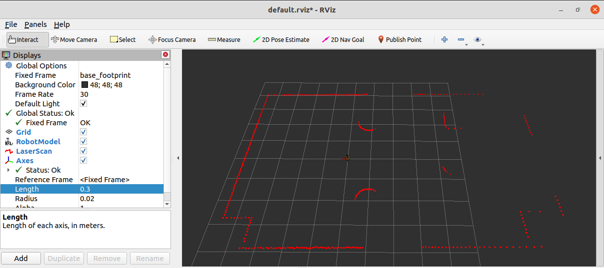

# 6.7 URDF、Gazebo与Rviz综合应用

关于URDF(Xacro)，Rviz和Gazebo三者的关系，前面已有阐述：URDF用于创建机器人模型、Rviz可以显示机器人感知到的环境信息，Gazebo用于仿真，可以模拟外界环境，以及机器人的一些传感器，如何在Gazebo中运行这些传感器，并显示这些传感器的数据(机器人的视角)呢？本节主要介绍的重点就是将三者结合：通过Gazebo模拟机器人的传感器，然后在Rviz中显示这些传感器感知到的数据。主要内容包括：

- 运动控制以及里程计信息显示
- 雷达信息仿真以及显示
- 摄像头信息仿真以及显示
- kinect信息仿真以及显示

---

## 6.7.1 机器人运动控制以及里程计信息显示

gazebo中已经可以正常显示机器人模型了，那么如何像在rviz中一样控制机器人运动呢？在此，需要涉及到ros中的组件：ros_control。

### 1. ros_control简介

<B>场景：</B>同一套ROS程序，如何部署在不同的机器人系统上，比如：开发阶段为了提高效率是在仿真平台上测试的，部署时又有不同的实体机器人平台，不同平台的实现是有差异的，如何保证ROS程序的可移植性？ROS内置的解决方式是ros_control。

<B>ros_control:</B>是一组软件包，它包含了控制器接口，控制器管理器，传输和硬件接口。ros_control是一套机器人控制的中间件，是一套规范，不同的机器人平台只要按照这套规范实现，那么就可以保证与ROS程序兼容，通过这套规范，实现了一种可插拔的架构设计，大大提高了程序设计的效率与灵活性。

gazebo已经实现了ros_control的相关接口，如果需要在gazebo中控制机器人运动，直接调用相关接口即可。

### 2. 运动控制实现流程(Gazebo)

承上，运动控制基本流程：

1. 已经创建完毕的机器人模型，编写一个单独的xacro文件，为机器人模型添加传动装置以及控制器

2. 将此文件集成进xacro文件

3. 启动Gazebo并发布`/cmd_vel`消息控制机器人运动


#### 2.1 为joint添加传动装置以及控制器

两轮差速装置

```xml
<robot name="my_car_move" xmlns:xacro="http://wiki.ros.org/xacro">

    <!-- 传动实现:用于连接控制器与关节 -->
    <xacro:macro name="joint_trans" params="joint_name">
        <!-- Transmission is important to link the joints and the controller -->
        <transmission name="${joint_name}_trans">
            <type>transmission_interface/SimpleTransmission</type>
            <joint name="${joint_name}">
                <hardwareInterface>hardware_interface/VelocityJointInterface</hardwareInterface>
            </joint>
            <actuator name="${joint_name}_motor">
                <hardwareInterface>hardware_interface/VelocityJointInterface</hardwareInterface>
                <mechanicalReduction>1</mechanicalReduction>
            </actuator>
        </transmission>
    </xacro:macro>

    <!-- 每一个驱动轮都需要配置传动装置 -->
    <xacro:joint_trans joint_name="left2link" />
    <xacro:joint_trans joint_name="right2link" />

    <!-- 差速控制器 -->
    <gazebo>
        <plugin name="differential_drive_controller" filename="libgazebo_ros_diff_drive.so">
            <rosDebugLevel>Debug</rosDebugLevel>
            <publishWheelTF>true</publishWheelTF>
            <robotNamespace>/</robotNamespace>
            <publishTf>1</publishTf>
            <publishWheelJointState>true</publishWheelJointState>
            <alwaysOn>true</alwaysOn>
            <updateRate>100.0</updateRate>
            <legacyMode>true</legacyMode>
            <leftJoint>left2link</leftJoint> <!-- 左轮 -->
            <rightJoint>right2link</rightJoint> <!-- 右轮 -->
            <wheelSeparation>${base_radius * 2}</wheelSeparation> <!-- 车轮间距 -->
            <wheelDiameter>${wheel_radius * 2}</wheelDiameter> <!-- 车轮直径 -->
            <broadcastTF>1</broadcastTF>
            <wheelTorque>30</wheelTorque>
            <wheelAcceleration>1.8</wheelAcceleration>
            <commandTopic>cmd_vel</commandTopic> <!-- 运动控制话题 -->
            <odometryFrame>odom</odometryFrame> 
            <odometryTopic>odom</odometryTopic> <!-- 里程计话题 -->
            <robotBaseFrame>base_footprint</robotBaseFrame> <!-- 根坐标系 -->
        </plugin>
    </gazebo>

</robot>
```

#### 2.2 xacro文件集成

最后还需要将上述xacro文件集成进总的机器人模型文件，代码示例如下：

```xml
<robot name="mycar" xmlns:xacro="http://wiki.ros.org/xacro">
    <!-- 包含惯性矩阵文件 -->
    <xacro:include filename="head.xacro" />
    <!-- 包含底盘、摄像头与雷达的 xacro 文件 -->
    <xacro:include filename="demo05_car_base.urdf.xacro" />
    <xacro:include filename="demo06_car_camera.urdf.xacro" />
    <xacro:include filename="demo07_car_laser.urdf.xacro" />

    <!-- 运动控制 -->
    <xacro:include filename="gazebo/move.xacro" />
    
</robot>
```

当前核心：包括 控制器以及传动配置的 xacro 文件

```xml
<xacro:include filename="gazebo/move.xacro" />
```

#### 2.3 启动Gazebo并控制机器人运动

launch文件：

```xml
<launch>
    <!-- 1.需要在参数服务器中载入 urdf -->
    <param name="robot_description" command="$(find xacro)/xacro $(find urdf02_gazebo)/urdf/car.urdf.xacro" />
    <!-- 2.启动Gazebo仿真环境 -->
    <include file="$(find gazebo_ros)/launch/empty_world.launch">
        <arg name="world_name" value="$(find urdf02_gazebo)/worlds/box_house.world" />
    </include>
    <!-- 3.在Gazebo中添加机器人模型 -->
    <node pkg="gazebo_ros" type="spawn_model" name="urdf_spawner" args="-urdf -model mycar -param robot_description" />
</launch>
```

启动launch文件，使用topic list查看话题列表，会发现多了`/cmd_vel`然后发布`cmd_vel`消息控制即可使用命令控制(或者可以编写单独的节点控制)

```bash
rostopic pub -r 10 /cmd_vel geometry_msgs/Twist "linear:
  x: 0.0
  y: 0.0
  z: 0.0
angular:
  x: 0.0
  y: 0.0
  z: 0.0" 
```

也可以：

```bash
rosrun teleop_twist_keyboard  teleop_twist_keyboard.py
```
使用键盘控制：

```bash

Reading from the keyboard  and Publishing to Twist!
---------------------------
Moving around:
   u    i    o
   j    k    l
   m    ,    .

For Holonomic mode (strafing), hold down the shift key:
---------------------------
   U    I    O
   J    K    L
   M    <    >

t : up (+z)
b : down (-z)

anything else : stop

q/z : increase/decrease max speeds by 10%
w/x : increase/decrease only linear speed by 10%
e/c : increase/decrease only angular speed by 10%

CTRL-C to quit

currently:	speed 0.3	turn 0.5 
```


接下来我们会发现：小车在Gazebo中已经正常运行起来了

<div align="center">
    
</div>

### 3. Rviz查看里程计信息

在Gazebo的仿真环境中，机器人的里程计信息以及运动朝向等信息是无法获取的，可以通过Rviz显示机器人的里程计信息以及运动朝向

<B>里程计：</B>机器人相对出发点坐标系的位姿状态(X坐标 Y坐标 Z坐标以及朝向)

#### 3.1 启动Rviz

launch文件

```xml
<launch>
    <node pkg="rviz" type="rviz" name="rviz" args="-d $(find urdf01_rviz)/config/show_mycar.rviz" />

    <!-- 添加关节状态发布节点 -->
    <node pkg="joint_state_publisher" type="joint_state_publisher" name="joint_state_publisher" />
    <!-- 添加机器人状态发布节点 -->
    <node pkg="robot_state_publisher" type="robot_state_publisher" name="robot_state_publisher" />
</launch>
```

#### 3.2 添加组件

执行launch文件后，在Rviz中添加图示组件：

<div align="center">
    
</div>

---

## 6.7.2 雷达信息仿真以及显示

通过Gazebo模拟激光雷达传感器，并在Rviz中显示激光数据。

<B>实现流程：</B>

雷达仿真基本流程：

1. 已经创建完毕的机器人模型，编写一个单独的xacro文件，为机器人模型添加雷达配置；
2. 将此文件集成进xacro文件；
3. 启动Gazebo，使用Rviz显示雷达信息。

### 1. Gazebo仿真雷达

#### 1.1 新建Xacro文件，配置雷达传感器信息

```xml
```

#### 1.2 xacro文件集成

将步骤1的Xacro文件集成进总的机器人模型文件，代码示例如下：

```xml

```

#### 1.3 启动仿真环境

编写launch文件，启动gazebo：

```xml
```

### 2. Rviz显示雷达数据

先启动rviz，添加雷达信息显示插件：

<div align="center">
    
</div>

---

## 6.7.3 摄像头信息仿真以及显示

## 6.7.4 kinect信息仿真以及显示