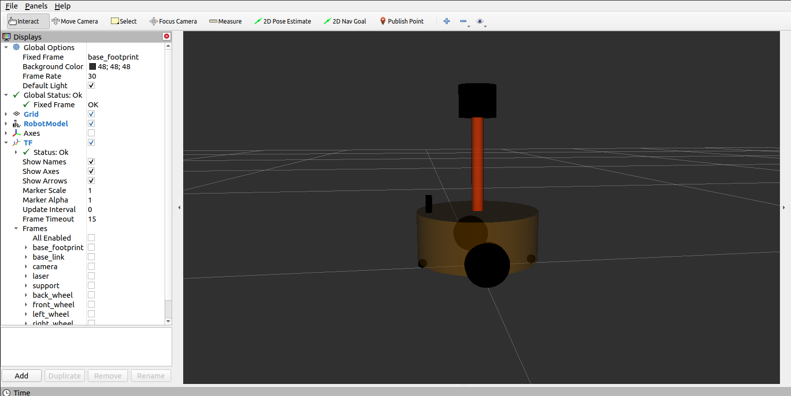
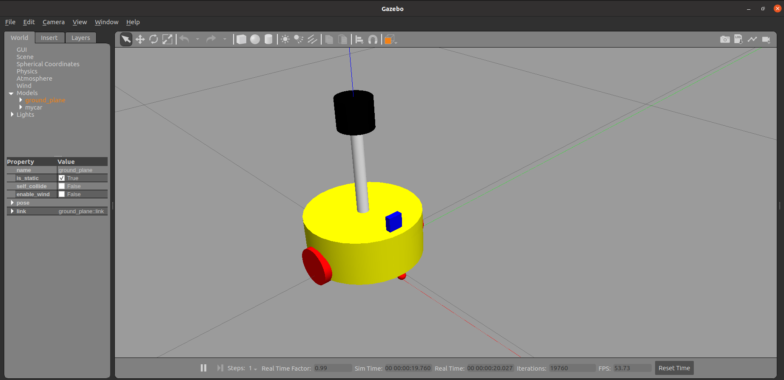
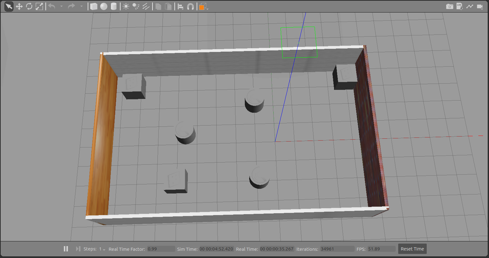
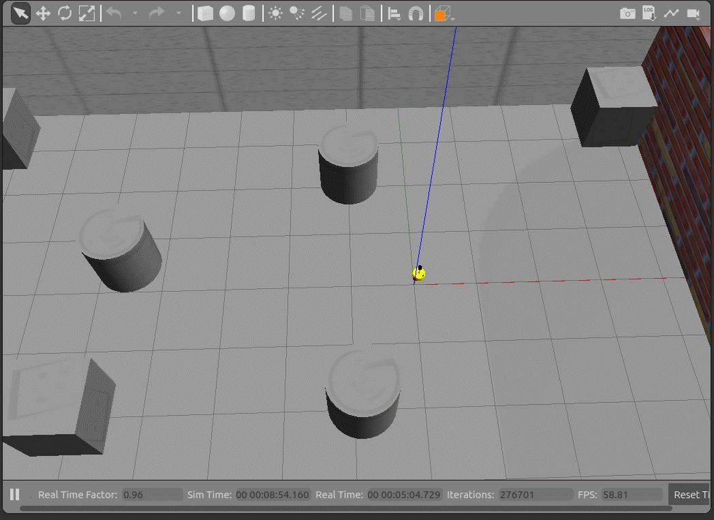
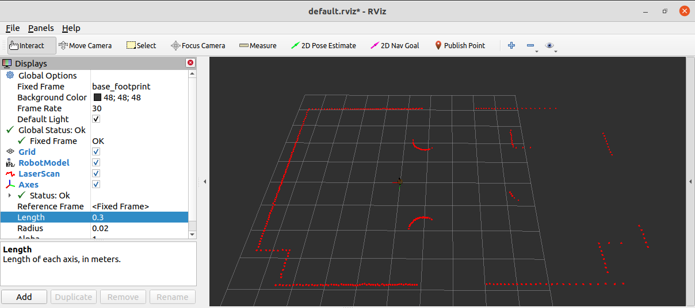
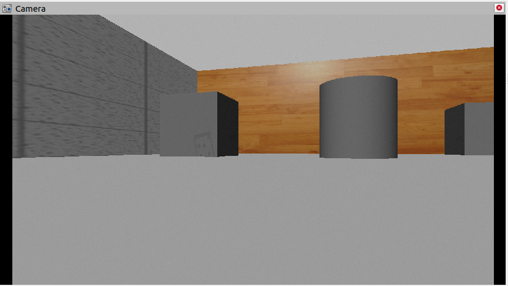
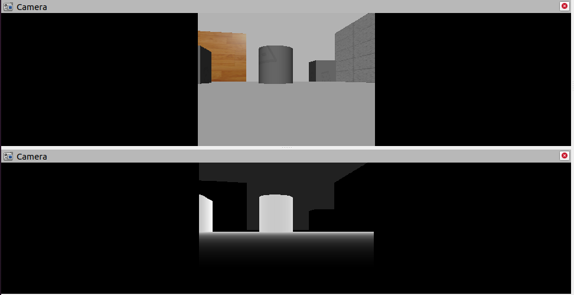
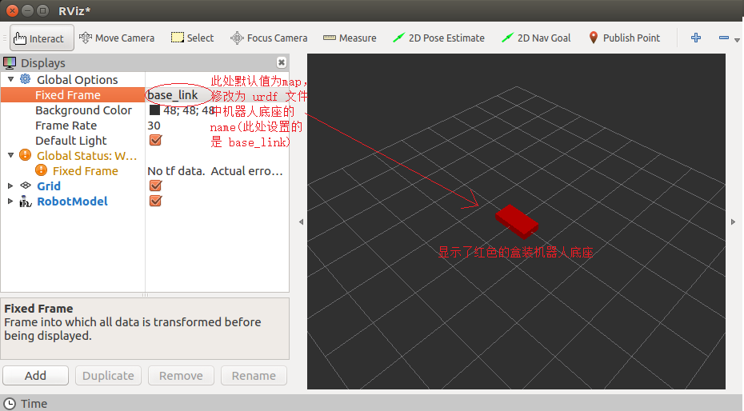
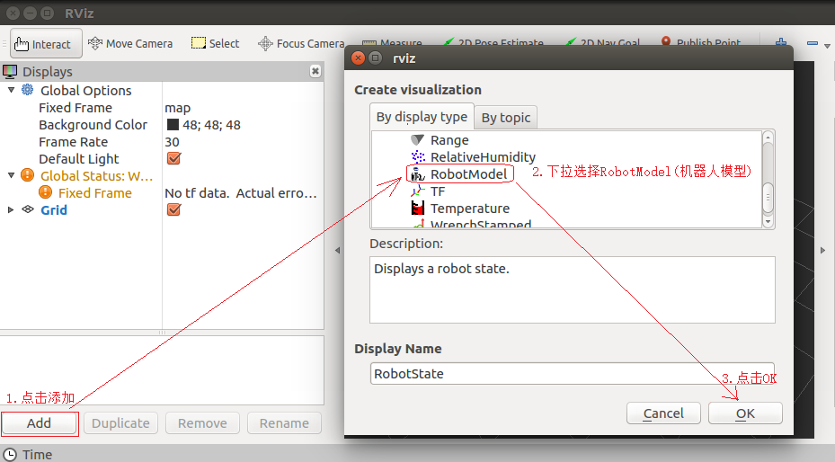

# 第6章 机器人系统仿真

对于ROS新手而言，可能会有疑问：学习机器人操作系统，实体机器人是必须的吗？答案是否定的，机器人一般价格不菲，为了降低机器人学习、调试成本，在ROS中提供了系统的机器人仿真实现，通过仿真，可以实现大部分需求，本章主要就是围绕“仿真”展开的，比如，本章会介绍：

- 如何创建并显示机器人模型；
- 如何搭建仿真环境；
- 如何实现机器人模型与仿真环境的交互。

本章预期的学习目标如下：

- 能够独立使用URDF创建机器人模型，并在Rviz和Gazebo中分别显示；
- 能够使用Gazebo搭建仿真环境；
- 能够使用机器人模型中的传感器(雷达、摄像头、编码器...)获取仿真环境数据。

案例演示：

1. 创建并显示机器人模型

<div align=center>
    
    
</div>

2. 仿真环境搭建

<div align=center>
    
</div>


3. 控制机器人运动

<div align=center>
    
    
</div>

4. 雷达仿真

<div align=center>
    
</div>

5. 摄像头仿真

<div align=center>
    
    
</div>


---

## 6.1 概述

机器人操作系统学习、开发与测试过程中，会遇到诸多问题，比如：

>场景1：机器人价格不菲，学习ROS要购买一台机器人吗？

>场景2：机器人与之交互的外界环境具有多样性，如何实现复杂的环境设计？

>场景3：测试时，直接将未经验证的程序部署到实体机器人运行，安全吗？

诸如此类的场景中，ROS中的仿真就显得尤为重要了。

---

### 1. 概念

<B>机器人系统仿真：</B>是通过计算机对实体机器人系统进行模拟的技术，在ROS中，仿真实现涉及的主要内容有三：对机器人建模(YRDF)】、创建仿真环境(Gazebo)以及感知环境(Rviz)等系统性实现。

### 2. 作用

#### 2.1 仿真优势：

仿真在机器人系统研发过程中占有举足轻重的地位，在研发与测试中较之于实体机器人实现，仿真有如下几点的显著优势：


1. <B>低成本：</B>当前机器人成本居高不下，动辄几十万，仿真可以大大降低成本，减小风险
2. <B>高效：</B>搭建的环境更为多样且灵活，可以提高测试效率以及测试覆盖率
3. <B>高安全性：</B>仿真环境下，无需考虑耗损问题

#### 2.2 仿真缺陷：

机器人在仿真环境与实际环境下的表现差异较大，换言之，仿真并不能完全做到模拟真实的物理世界，存在一些“失真”的情况，原因：

1. 仿真器所使用的物理引擎目前还不能够完全精确模拟真实世界的物理情况
2. 仿真器构建的是关节驱动器(电机&齿轮箱)、传感器与信号通信的绝对理想情况，目前不支持模拟实际硬件缺陷或者一些临界状态等情形。

### 3. 相关组件

#### 3.1 URDF

<B>URDF</B>是Unified Robot Description Format的首字母缩写，直译为<B>统一(标准化)机器人描述格式</B>，可以以一种XML的方式描述机器人的各部分结构，比如底盘、摄像头、激光雷达、机械臂以及不同关节的自由度......，该文件可以被C++内置的解释器转化成可视化机器人模型，是ROS中实现机器人仿真的重要组件。

#### 3.2 rviz

Rviz是ROS Visualization Tool的首字母缩写，直译为<B>ROS的三维可视化工具</B>。它的主要目的是以三维方式显示ROS消息，可以将数据进行可视化表达。例如：可以显示机器人模型，可以无需编程就能表达激光测距仪(LRF)传感器中的传感器到障碍物的距离，RealSense、Kinect或Xtion等三维距离传感器的点云数据(PCD，Point Cloud Data)，从相机获取的图像值等

以`ros-[ROS_DISTRO]-desktop-full`命令安装ROS时，RViz会默认被安装。

运行使用命令`rviz`或`rosrun rviz rviz`

<B>如果rviz没有安装，请调用如下命令自行安装：</B>

```bash
sudo apt install ros-[ROS_DISTRO]-rviz
```

#### 3.3 Gazebo

Gazebo是一款3D动态模拟器，用于显示机器人模型并创建仿真环境，能够在复杂的室内和室外环境中准确有效地模拟机器人。与游戏引擎提供高保真度的视觉模拟类似，Gazebo提供了高保真度的物理模拟，其提供一整套传感器模型，以及对用户和程序非常友好的交互方式。

以`ros-[ROS_DISTRO]`-desktop-full命令安装ROS时，Gazebo会默认被安装。

运行使用命令`gazebo`或`rosrun gazebo_ros gazebo`


---

<B>注意1：在Ubuntu20.04与ROS Noetic环境下，gazebo启动异常以及解决</B>

- 问题1：VMware：vmw_ioctl_command error Invalid argument（无效的参数）
  解决：
  ```bash
  echo "export SVGA_VGPU10=0" >> ~/.bashrc
  source ~/.bashrc
  ```
- 问题2：[Err][REST.cc"205]Error in REST request
  解决：`sudo gedit ~/.ignition/fuel/config.yaml`
  然后将`url:https://api.ignitionfuel.org`使用#注释
  再添加`url:https://api.ignitionrobotics.org`
- 问题3：启动时抛出异常：`[gazebo-2] process has died [pid xxx, exit code 255, cmd.....`
  解决：`killall gzserver`和`killall gzclient`

<B>注意2：如果gazebo没有安装，请自行安装：</B>

1. 添加源：

```bash
sudo sh -c 'echo "deb http://packages.osrfoundation.org/gazebo/ubuntu-stable `lsb_release -cs` main" 
> /etc/apt/sources.list.d/gazebo-stable.list'
```

```bash
wget http://packages.osrfoundation.org/gazebo.key -O - | sudo apt-key add -
```

2. 安装：

```bash
sudo apt update
```

```bash
sudo apt install gazebo11
sudo apt install libgazebo11-dev
```

---


## 6.2 URDF集成Rviz基本流程

前面介绍过，URDF不能单独使用，需要结合Rviz或Gazebo，URDF只是一个文件，需要在Rviz或Gazebo中渲染成图形化的机器人模型，当前，首先演示URDF与Rviz的集成使用，因为URDF与Rviz的集成较之于URDF与Gazebo的集成更为简单，后期，基于Rviz的集成实现，我们再进一步介绍URDF语法。

<B>需求描述:</B>

在Rviz中显示一个盒状机器人

<B>结果演示：</B>

<div align=center>
    
</div>

<B>实现流程：</B>

1. 准备：新建功能包，导入依赖
2. 核心：编写urdf文件
3. 核心：在launch文件集成URDF与Rviz
4. 在Rviz中显示机器人模型

### 1. 创建功能包，导入依赖

创建一个新的功能包，名称自定义，导入依赖包：`urdf`与`xacro`

在当前功能包下，再新建几个目录：

`urdf`：存储urdf文件的目录
`meshes`：机器人模型渲染文件(暂不使用)
`config`：配置文件
`launch`：存储launch启动文件

### 2. 编写URDF文件

新建一个子级文件夹:`urdf`(可选)，文件夹中添加一个`.urdf`文件，赋值如下内容：

```xml
<robot name="mycar">
    <link name="base_link">
        <visual>
            <geometry>
                <box size="0.5 0.2 0.1" />
            </geometry>
        </visual>
    </link>
</robot>
```

### 3. 在launch文件中集成URDF与Rviz

在`launch`目录下，新建一个`mycar.launch`文件，该launch文件需要启动Rviz，并导入urdf文件，Rviz启动后可以自动载入解析`urdf`文件，并显示机器人模型，核心问题：如何导入urdf文件？在ROS中，可以将urdf文件的路径设置到参数服务器，使用的参数名是：`robot_description`，示例代码如下：

```xml
<launch>
    <!-- 1.在参数服务器载入 urdf 文件 -->
    <param name="robot_description" textfile="$(find urdf01_rviz)/urdf/urdf/demo01_helloworld.urdf" />
    <!-- 2.启动 rviz -->
    <node pkg="rviz" type="rviz" name="rviz" />
</launch>
```

### 4. 在Rviz中显示机器人模型

rviz启动后，会发现并没有盒装的机器人模型，这是因为默认情况下没有添加机器人显示组件，需要手动添加，添加方式如下：

<div align=center>
    
    
</div>

设置完毕后，可以正常显示了

### 5. 优化rviz启动

重复启动`launch`文件时，Rviz之前的组件配置信息不会自动保存，需要重复执行步骤4的操作，为了方便使用，可以使用如下方式优化：

首先，将当前配置保存进`config`目录

<div align=center>
    
</div>

然后，`launch`文件中Rviz的启动配置添加参数：`args`，值设置为`-d`配置文件路径：

```xml
<launch>
    <!-- 1.在参数服务器载入 urdf 文件 -->
    <param name="robot_description" textfile="$(find urdf01_rviz)/urdf/urdf/demo01_helloworld.urdf" />
    <!-- 2.启动 rviz -->
    <node pkg="rviz" type="rviz" name="rviz" args="-d $(find urdf01_rviz)/config/show_mycar.rviz" />
</launch>
```

再启动时，就可以包含之前的组件配置了，使用更方便快捷。