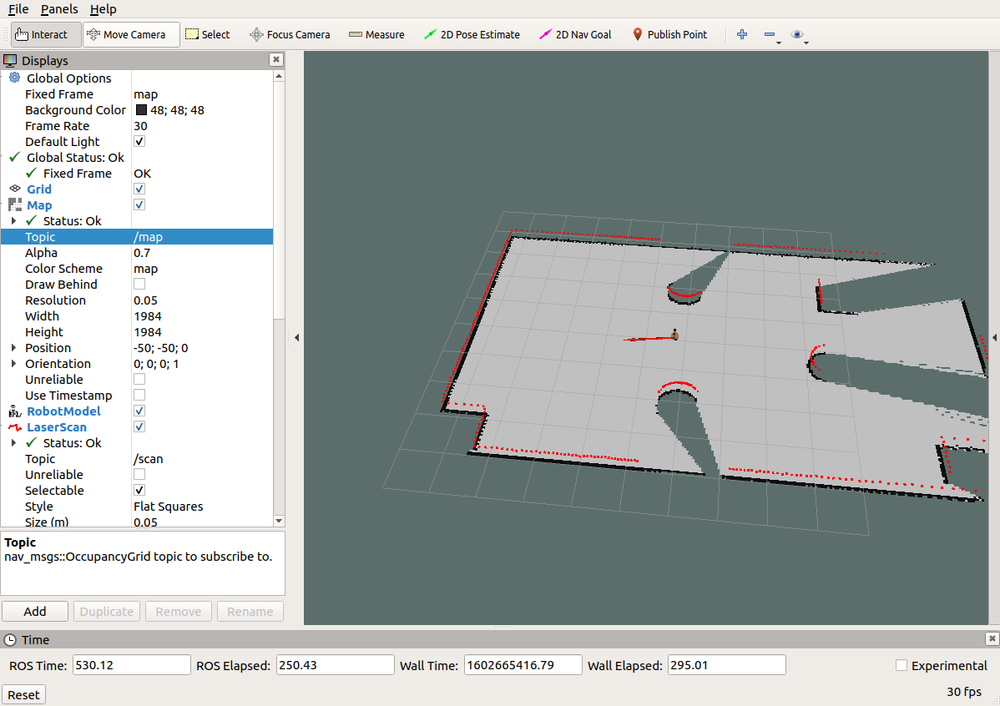
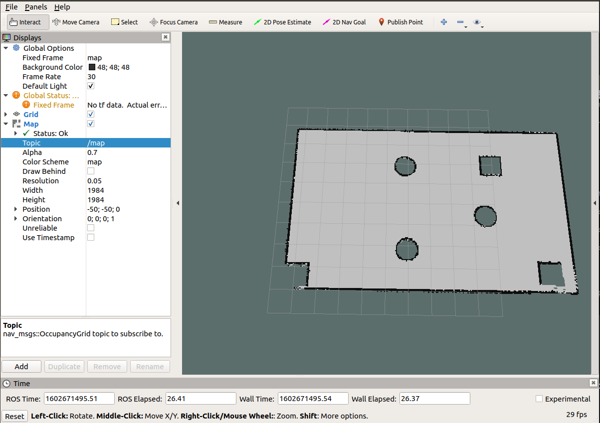

# 7.2 导航实现

本届内容主要介绍导航的完整性实现，旨在掌握机器人导航的基本流程，该章涉及的主要内容如下：

- SLAM建图(选用较为常见的gmapping)
- 地图服务(可以保存和重现地图)
- 机器人定位
- 路径规划
- 上述流程介绍完毕，还会对功能进一步集成实现探索式的SLAM建图。

---

<B>准备工作</B>

请先安装相关的ROS功能包：

- 安装gmapping包(用于构建地图):`sudo apt install ros-<ROS版本>-gmapping`
- 安装地图服务包(用于保存与读取地图)：`sudo apt install ros-<ROS版本>-map-server`
- 安装navigation包(用于定位以及路径规划)：`sudo apt install ros-<ROS版本>-navigation`

新建功能包，并导入依赖：`gmapping map_server amcl move_base`

---

## 7.2.1 导航实现01_SLAM建图

SLAM算法有多种，当前我们选用gmapping，后续会再介绍其他几种常用的SLAM实现。

### 1. gmapping简介

gmapping是ROS开源社区中较为常用且比较熟的SLAM算法之一，gmapping可以根据移动机器人里程计数据和激光雷达数据来绘制二维的栅格地图，对应的，gmapping对硬件也有一定的要求：

- 该移动机器人可以发布里程计消息
- 机器人需要发布雷达消息(该消息可以通过水平固定安装的雷达发布，或者也可以将深度相机转换成雷达消息)

关于里程计与雷达数据，仿真环境中可以正常获取的，不再赘述，栅格地图如案例所示。

gmapping安装前面也有介绍，命令如下：

>`sudo apt install ros-<ROS版本>-gmapping`

### 2. gmapping节点说明

gmapping功能包中的核心节点是：slam_gmapping。为了方便调用，需要先了解该点订阅的话题、发布的话题、服务以及相关参数。

#### 2.1 订阅的Topic

tf(tf/tfMessage)
- 用于雷达、地盘与里程计之间的坐标变换消息。

scan(sensor_msgs/LaserScan)
- SLAM所需的雷达信息。

#### 2.2 发布的Topic

map_metadata(nav_msgs/MapMetaData)
- 地图元数据，包括地图的宽度、高度、分辨率等，该消息会固定更新。

map(nav_msgs/OccupancyGrid)
- 地图栅格数据，一般会在rviz中以图形化的方式显示。

~entropy(std_msgs/Float64)
- 机器人姿态分布熵估计(值越大，不确定性越大)。

#### 2.3 服务

dynamic_map(nav_msgs/GetMap)
- 用于获取地图数据。

#### 2.4 参数

~base_frame(string, default:"base_link")
- 机器人基坐标系。

~map_frame(string, default:"map")
- 地图坐标系

~odom_frame(string, default:"odom")
- 里程计坐标系

~map_update_interval(double, default:0.05)
- 地图更新频率，根据指定的值设计更新间隔。

~maxUrange(float, default: 80.0)
- 激光探测的最大可用范围(超出此阈值，被截断)。

~maxRange(float)
- 激光探测的最大范围。

...参数较多，上述是几个较为常用的参数，其他参数介绍可参考官网。

#### 2.5 所需的坐标变换

雷达坐标系→基坐标系
- 一般由`robot_state_publisher` 或 `static_transform_publisher`发布。

基坐标系→里程计坐标系
- 一般由里程计节点发布。

#### 2.6 发布的坐标变换

地图坐标系→里程计坐标系
- 地图到里程计坐标系之间的变换。

### 3. gmapping使用

#### 3.1 编写gmapping节点相关launch文件

launch文件编写可以参考github的演示launch文件：https://github.com/ros-perception/slam_gmapping/blob/melodic-devel/gmapping/launch/slam_gmapping_pr2.launch

复制并修改如下：

```xml
<launch>
    <!-- 仿真环境下，将该参数设置为 true -->
    <param name="use_sim_time" value="true"/>
    <!-- gmapping 节点 -->
    <node pkg="gmapping" type="slam_gmapping" name="slam_gmapping" output="screen">
        <!-- 设置雷达话题 -->
		<remap from="scan" to="scan"/>
		<!-- 关键参数：坐标系 -->
		<param name="base_frame" value="base_footprint"/><!--底盘坐标系-->
		<param name="map_frame" value="map"/> <!--地图坐标系-->
		<param name="odom_frame" value="odom"/> <!--里程计坐标系-->
		<param name="map_update_interval" value="5.0"/>
		<param name="maxUrange" value="16.0"/>
		<param name="sigma" value="0.05"/>
		<param name="kernelSize" value="1"/>
		<param name="lstep" value="0.05"/>
		<param name="astep" value="0.05"/>
		<param name="iterations" value="5"/>
		<param name="lsigma" value="0.075"/>
		<param name="ogain" value="3.0"/>
		<param name="lskip" value="0"/>
		<param name="srr" value="0.1"/>
		<param name="srt" value="0.2"/>
		<param name="str" value="0.1"/>
		<param name="stt" value="0.2"/>
		<param name="linearUpdate" value="1.0"/>
		<param name="angularUpdate" value="0.5"/>
		<param name="temporalUpdate" value="3.0"/>
		<param name="resampleThreshold" value="0.5"/>
		<param name="particles" value="30"/>
		<param name="xmin" value="-50.0"/>
		<param name="ymin" value="-50.0"/>
		<param name="xmax" value="50.0"/>
		<param name="ymax" value="50.0"/>
		<param name="delta" value="0.05"/>
		<param name="llsamplerange" value="0.01"/>
		<param name="llsamplestep" value="0.01"/>
		<param name="lasamplerange" value="0.005"/>
		<param name="lasamplestep" value="0.005"/>
    </node>

    <node pkg="joint_state_publisher" name="joint_state_publisher" type="joint_state_publisher" />
    <node pkg="robot_state_publisher" name="robot_state_publisher" type="robot_state_publisher" />

    <node pkg="rviz" type="rviz" name="rviz" />
    <!-- 可以保存 rviz 配置并后期直接使用-->
    <!--
    <node pkg="rviz" type="rviz" name="rviz" args="-d $(find my_nav_sum)/rviz/gmapping.rviz"/>
    -->
</launch>
```

关键代码解释：

```xml
<remap from="scan" to="scan"/><!-- 雷达话题 -->
<param name="base_frame" value="base_footprint"/><!--底盘坐标系-->
<param name="odom_frame" value="odom"/> <!--里程计坐标系-->
```

#### 3.2 执行

1. 先启动 Gazebo 仿真环境(此过程省略)
2. 然后再启动地图绘制的launch文件：
`roslaunch 包名 launch文件名`
3. 启动键盘控制节点，用于控制机器人运动建图

`rosrun teleop_twist_keyboard teleop_twist_keyboard.py`

4. 在rviz中添加组件，显示栅格地图

<div align="center">
    
</div>

最后，就可以通过键盘控制gazebo中的机器人运动，同时，在rviz中可以显示gamapping发布的栅格地图数据了，下一步，还需要将地图单独保存。

---

<B>另请参考:</B>
- http://wiki.ros.org/gmapping

## 7.2.2 导航实现02_地图服务

上一节我们已经实现通过gmapping的构建地图并在rviz中显示了地图，不过，上一节中地图数据是保存在内存中的，当节点关闭时，数据也会被一并释放，我们需要将栅格地图序列化到磁盘中以持久化存储，后期还要通过反序列化读取磁盘的地图数据再执行后续操作。在ROS中，地图数据的序列化与反序列化可以通过map_server功能包实现。

### 1. map_server简介

map_server功能包中提供了两个节点：map_saver和map_server，前者用于将栅格地图保存到磁盘，后者读取磁盘的栅格地图并以服务的方式提供出去。

map_server安装前面也有介绍，命令如下：

>`sudo apt-get install ros-<ROS版本>-map-server`

### 2. map_server使用之地图保存节点(map_saver)

#### 2.1 map_saver节点说明

<B>订阅的topic：</B>

map(nav_msgs/OccupancyGrid)
- 订阅此话题用于生成地图文件。

#### 2.2 地图保存launch文件

地图保存的语法比较简单，编写一个launch文件，内容如下：

```xml
<launch>
    <arg name="filename" value="$(find nav_demo)/map/nav" />
    <node name="map_save" pkg="map_server" type="map_saver" args="-f $(arg filename)" />
</launch>
```

其中 mymap 是指地图的保存路径以及保存的文件名称。

SLAM建图完毕后，执行该launch文件即可。

测试：

> 首先，参考上一节，以此启动仿真环境，键盘控制节点与SLAM节点；
> 
> 然后，通过键盘控制机器人运动并绘图；
>
> 最后，通过上述地图保存方式保存地图；
>
> 结果：在指定路径下会生成两个文件，xxx.pgm 与 xxx.yaml

#### 2.3 保存结果解释

<div align="center">
    
</div>

xxx.pgm 本质是一张图片，直接使用图片查看程序即可打开。

xxx.yaml 保存的是地图的元数据信息，用于描述图片，内容格式如下：

```yaml
image: /home/fgs/Workstation/ROS/Chapter7/demo08_ws/src/nav_demo/map/nav.pgm
resolution: 0.050000
origin: [-50.000000, -50.000000, 0.000000]
negate: 0
occupied_thresh: 0.65
free_thresh: 0.196
```

解释：

- image: 被描述的图片资源文件，可以是绝对路径也可以是相对路径。
- resolution: 图片分辨率，单位是米/像素。
- origin: 地图中左下像素的二维姿势，为（x，y，偏航），偏航为逆时针旋转（偏航=0表示无旋转）。
- occupied_thresh: 占据阈值，大于该阈值则表示为占据。
- free_thresh: 空闲阈值，小于该阈值则表示为空闲。
- negate: 是否应该颠倒白色/黑色自由/占用的语义。

map_server 中障碍物计算规则：

1. 地图中的每一个像素取值在[0,255]之间，白色为255，黑色为0，该值设为x;
2. map_server会将像素值作为判断是否是障碍物的依据，首先计算比例：p=(255 - x) / 255.0，白色为0，黑色为1(negate为true，则p=x / 255.0)；
3. 根据步骤2计算的比例判断是否是障碍物，如果p > occupied_thresh，则该像素为障碍物，否则为空闲。

备注：
- 图片也可以根据需求编辑。

### 3. map_server使用之地图服务(map_server)

#### 3.1 map_server节点说明

<B>发布的话题：</B>

map_metadata(nav_msgs/MapMetaData)
- 发布地图元数据。

map(nav_msgs/OccupancyGrid)
- 地图数据。

<B>服务</B>

static_map(nav_msgs/GetMap)
- 通过此服务获取地图。

<B>参数</B>

~frame_id(字符串，默认值："map")
- 地图坐标系。

#### 3.2 地图读取

通过map_server的map_server节点可以读取栅格地图数据，编写launch文件如下：

```xml
<launch>
    <arg name="map" default="nav.yaml" />
    <node pkg="map_server" type="map_server" name="map_server" args="$(find nav_demo)/map/$(arg map)" />
</launch>
```

其中参数是地图描述文件的资源路径，执行该launch文件，节点会发布话题：map(nav_msgs/OccupancyGrid)

#### 3.3 地图显示

在rviz中使用 map 组件可以显示栅格地图：

<div align="center">
	
</div>

---

<B>另请参考:</B>

- http://wiki.ros.org/map_server


## 7.2.3 导航实现03_定位

## 7.2.4 导航实现04_路径规划

## 7.2.5 导航与SLAM建图

---