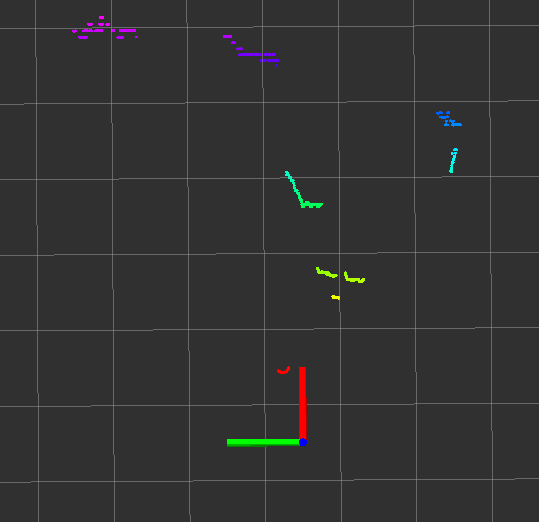

# 7.3 导航相关消息

在导航功能包集中包含了诸多节点，毋庸置疑的，不同节点之间的通信使用到了消息中间件(数据载体)，在上一节的实现中，这些消息已经在rviz中做了可视化处理，比如：地图、雷达、摄像头、里程计、路径规划...的相关消息在rviz中提供了相关组件，本节主要介绍这些消息的具体格式。

## 7.3.1 导航之地图

地图相关的消息主要有两个：

nav_msgs/MapMetaData
- 地图元数据，包括地图的宽度、高度、分辨率等。

nav_msgs/OccupancyGrid
- 地图栅格数据，一般会在rviz中以图形化的方式显示。

### 1. nav_msgs/MapMetaData

调用`rosmsg info nav_msgs/MapMetaData`显示消息内容如下：

```yaml
time map_load_time
float32 resolution                      # 地图分辨率
uint32 width                            # 地图宽度
uint32 height                           # 地图高度
geometry_msgs/Pose origin               # 地图位姿数据
  geometry_msgs/Point position
    float64 x
    float64 y
    float64 z
  geometry_msgs/Quaternion orientation
    float64 x
    float64 y
    float64 z
    float64 w
```

### 2. nav_msgs/OccupancyGrid

调用`rosmsg info nav_msgs/OccupancyGrid`显示消息内容如下：

```yaml
std_msgs/Header header
  uint32 seq
  time stamp
  string frame_id
# 地图元数据
nav_msgs/MapMetaData info
  time map_load_time
  float32 resolution
  uint32 width
  uint32 height
  geometry_msgs/Pose origin
    geometry_msgs/Point position
      float64 x
      float64 y
      float64 z
    geometry_msgs/Quaternion orientation
      float64 x
      float64 y
      float64 z
      float64 w
# 地图内容数据，数组长度 = width * height
int8[] data
```

## 7.3.2 导航之里程计

里程计相关消息是：nav_msgs/Odometry，调用`rosmsg info nav_msgs/Odometry`显示消息内容如下：

```yaml
std_msgs/Header header
  uint32 seq
  time stamp
  string frame_id
string child_frame_id
geometry_msgs/PoseWithCovariance pose
  geometry_msgs/Pose pose					# 里程计位姿
    geometry_msgs/Point position
      float64 x
      float64 y
      float64 z
    geometry_msgs/Quaternion orientation
      float64 x
      float64 y
      float64 z
      float64 w
  float64[36] covariance
geometry_msgs/TwistWithCovariance twist
  geometry_msgs/Twist twist					# 速度
    geometry_msgs/Vector3 linear
      float64 x
      float64 y
      float64 z
    geometry_msgs/Vector3 angular
      float64 x
      float64 y
      float64 z
  # 协方差矩阵
  float64[36] covariance
```

## 7.3.3 导航之坐标变换

坐标变换相关消息是：tf/tfMessage，调用`rosmsg info tf/tfMessage`显示消息内容如下：

```yaml
geometry_msgs/TransformStamped[] transforms	# 包含了多个坐标系相对关系数据的数组
  std_msgs/Header header
    uint32 seq
    time stamp
    string frame_id
  string child_frame_id
  geometry_msgs/Transform transform
    geometry_msgs/Vector3 translation
      float64 x
      float64 y
      float64 z
    geometry_msgs/Quaternion rotation
      float64 x
      float64 y
      float64 z
      float64 w
```

## 7.3.4 导航之定位

定位相关消息是：geometry_msgs/PoseArray，调用`rosmsg info geometry_msgs/PoseArray`显示消息内容如下：

```yaml
std_msgs/Header header
  uint32 seq
  time stamp
  string frame_id
geometry_msgs/Pose[] poses		# 预估的点位姿组成的数组
  geometry_msgs/Point position
    float64 x
    float64 y
    float64 z
  geometry_msgs/Quaternion orientation
    float64 x
    float64 y
    float64 z
    float64 w
```

## 7.3.5 导航之目标点与路径规划

目标点相关消息是：move_base_msgs/MoveBaseActionGoal，调用`rosmsg info move_base_msgs/MoveBaseActionGoal`显示消息内容如下：

```yaml
std_msgs/Header header
  uint32 seq
  time stamp
  string frame_id
actionlib_msgs/GoalID goal_id
  time stamp
  string id
move_base_msgs/MoveBaseGoal goal
  geometry_msgs/PoseStamped target_pose
    std_msgs/Header header
      uint32 seq
      time stamp
      string frame_id
    geometry_msgs/Pose pose			# 目标点位姿
      geometry_msgs/Point position
        float64 x
        float64 y
        float64 z
      geometry_msgs/Quaternion orientation
        float64 x
        float64 y
        float64 z
        float64 w
```

路径规划相关消息是：nav_msgs/Path，调用`rosmsg info nav_msgs/Path`显示消息内容如下：

```yaml
std_msgs/Header header
  uint32 seq
  time stamp
  string frame_id
geometry_msgs/PoseStamped[] poses
  std_msgs/Header header
    uint32 seq
    time stamp
    string frame_id
  geometry_msgs/Pose pose
    geometry_msgs/Point position
      float64 x
      float64 y
      float64 z
    geometry_msgs/Quaternion orientation
      float64 x
      float64 y
      float64 z
      float64 w
```

## 7.3.6 导航之激光雷达

激光雷达相关消息是：sensor_msgs/LaserScan，调用`rosmsg info sensor_msgs/LaserScan`显示消息内容如下：

```yaml
std_msgs/Header header
  uint32 seq
  time stamp
  string frame_id
float32 angle_min		# 起始扫描角度(rad)
float32 angle_max		# 终止扫描角度(rad)
float32 angle_increment	# 测量值之间的角距离(rad)
float32 time_increment	# 测量间隔时间(s)
float32 scan_time		# 扫描间隔时间(s)
float32 range_min		# 最小有效距离值(m)
float32 range_max		# 最大有效距离值(m)
float32[] ranges		# 一个周期的扫描数据
float32[] intensities	# 扫描强度数据，如果设备不支持强度数据，该数组为空
```

## 7.3.7 导航之相机

深度相机相关消息有：sensor_msgs/Image、sensor_msgs/CompressedImage、sensor_msgs/PointCloud2。sensor_msgs/Image对应的一般的图像数据，sensor_msgs/CompressedImage对应压缩后的图像数据，sensor_msgs/PointCloud2对应的是点云数据(带有深度信息的图像数据)。

调用`rosmsg info sensor_msgs/Image`显示消息内容如下：

```yaml
std_msgs/Header header
  uint32 seq
  time stamp
  string frame_id
uint32 height		# 高度
uint32 width		# 宽度
string encoding		# 编码格式：RGB、YUV等
uint8 is_bigendian	# 图像大小端存储模式
uint32 step			# 一行图像数据的字节数，作为步进参数
uint8[] data		# 图像数据，长度等于 step*height
```

调用`rosmsg info sensor_msgs/CompressedImage`显示消息内容如下：

```yaml
std_msgs/Header header
  uint32 seq
  time stamp
  string frame_id
string format		# 压缩编码格式(jpeg、png、bmp)
uint8[] data		# 压缩后的数据
```

调用`rosmsg info sensor_msgs/PointCloud2`显示消息内容如下：

```yaml
std_msgs/Header header
  uint32 seq
  time stamp
  string frame_id
uint32 height					# 高度
uint32 width					# 宽度
sensor_msgs/PointField[] fields	# 每个点的数据类型
  uint8 INT8=1
  uint8 UINT8=2
  uint8 INT16=3
  uint8 UINT16=4
  uint8 INT32=5
  uint8 UINT32=6
  uint8 FLOAT32=7
  uint8 FLOAT64=8
  string name
  uint32 offset
  uint8 datatype
  uint32 count
bool is_bigendian				# 图像大小端存储格式
uint32 point_step				# 单点的数据字节步长
uint32 row_step					# 一行数据的字节步长
uint8[] data					# 存储点云的数组，总长度为 row_step * height
bool is_dense					# 是否有无效点
```

## 7.3.8 深度图像转激光数据

本届介绍ROS中的一个功能包：depthimage_to_laserscan，顾名思义，该功能包可以将深度图像信息转换成激光雷达信息，应用场景如下：

> 在诸多SLAM算法中，一般都需要订阅激光雷达数据用于构建地图，因为激光雷达可以感知周围环境的深度信息，而深度相机也具备感知深度信息的功能，且最初激光雷达价格比较昂贵，那么在传感器选型上可以选用深度相机代替激光雷达吗？

答案是可以的，不过二者发布的消息类型是完全不同的，如果想要实现传感器的置换，那么就需要将深度相机发布的三维的图形信息转换成二维的激光雷达信息，这一功能就是通过depthimage_to_laserscan来实现的。

### 1. depthimage_to_laserscan简介

#### 1.1 原理

depthimage_to_laserscan将实现深度图像与雷达数据转换的原理比较简单，雷达数据是二维的、平面的，深度图像是三维的，是若干二维(水平)数据的纵向叠加，如果将三维的数据转换成二维数据，只需要取深度图的某一层即可，为了方便理解，请看官方示例：

图一：深度相机与外部环境(实物图)

<div align="center">
	
</div>

图二：深度相机发布的图片信息，图中彩线对应的是要转换成雷达信息的数据

<div align="center">
	
</div>

图三：将图二以点云的方式显示更为直观，图中彩线对应的仍然是要转换成雷达信息的数据

<div align="center">
	
</div>

图四：转换之后的结果图(俯视)

<div align="center">
	
</div>

#### 1.2 优缺点

<B>优点：</B>深度相机的成本一般低于激光雷达，可以降低硬件成本；

<B>缺点：</B>深度相机较之于激光雷达无论是检测范围还是精度都有不小的差距，SLAM效果可能不如激光雷达理想。

#### 1.3 安装

使用之前请先安装，命令如下：

```bash
sudo apt-get install ros-noetic-depthimage-to-laserscan
```

### 2. depthimage_to_laserscan节点说明

depthimage_to_laserscan功能包的核心节点是：depthimage_to_laserscan，为了方便调用，需要先了解该节点订阅的话题、发布的话题以及相关参数。

#### 2.1 订阅的Topic

image(sensor_msgs/Image)
- 输入图像信息。

camera_info(sensor_msgs/CameraInfo)
- 关联图像的相机信息。通常不需要重新映射，因为camera_info将从与image相同的命名空间中进行订阅。

#### 2.2 发布的Topic

scan(sensor_msgs/LaserScan)
- 发布转换成的激光雷达类型数据。

#### 2.3 参数

该节点参数较少，只有如下几个，一般需要设置的是：output_frame_id。

~scan_height(int, default:1 pixel)
- 设置用于生成激光雷达信息的像素行数。

~scan_time(double, default:1/30.0Hz(0.033s))
- 两次扫描的时间间隔

~range_min(double, default:0.45m)
- 返回的最小范围。结合range_max使用，只会获取 range_min 与 range_max 之间的数据。

~range_max(double, default:10.0m)
- 返回的最大范围。结合range_min使用，只会获取 range_min 与 range_max 之间的数据。

~output_frame_id(str, default:camera_depth_frame)
- 激光信息的ID。

### 3. depthimage_to_laserscan使用

#### 3.1 编写launch文件

编写launch文件执行，将深度信息转换成雷达信息

```xml

```

订阅的话题需要根据深度相机发布的话题设置，output_frame_id需要与深度相机的坐标系一致。

#### 3.2 修改URDF文件

经过信息转换之后，深度相机也将发布雷达数据，为了不产生混淆，可以注释掉 xacro 文件中的关于激光雷达的部分内容。

#### 3.3 执行

1. 启动gazebo仿真环境，如下：

<div align="center">
	
</div>

2. 启动rviz并添加相关组件(iamge、LaserScan)，结果如下：

<div align="center">
	
</div>

### 4. SLAM应用

现在我们已经实现并测试通过深度图像信息转换成激光雷达信息了，接下来是实践阶段，通过深度相机实现SLAM，流程如下：

1. 先启动 Gazebo 仿真环境；

2. 启动转换节点；

3. 再启动地图绘制的 launch 文件；

4. 启动键盘控制节点，用于控制机器人运动建图；`rosrun teleop_twist_keyboard teleop_twist_keyboard.py`

5. 在rviz中添加组件，显示栅格地图之后，就可以通过键盘控制 gazebo 中的机器人运动，同时，在rviz中可以显示gmapping发布的栅格地图数据了，但是，前面也介绍了，由于精度和检测范围的原因，尤其再加之环境的特征点偏少，建图效果可能并不理想，建图中甚至会出现地图偏移的情况。

---


# 7.4 本章小结

本章介绍了在仿真环境下的机器人导航实现，主要内容如下:

- 导航概念以及架构设计
- SLAM概念以及gmapping实现
- 地图的序列化与反序列化
- 定位实现
- 路径规划实现
- 导航中涉及的消息解释

导航整体设计架构中，包含地图、定位、路径规划、感知以及控制等实现，感知与控制模块在上一章机器人系统仿真中已经实现了，因此没有做过多介绍，其他部分，当前也是基于仿真环境实现的，后续，我们将搭建一台实体机器人并实现导航功能。