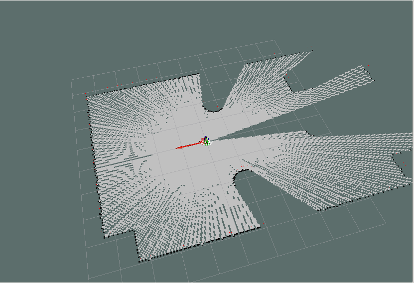
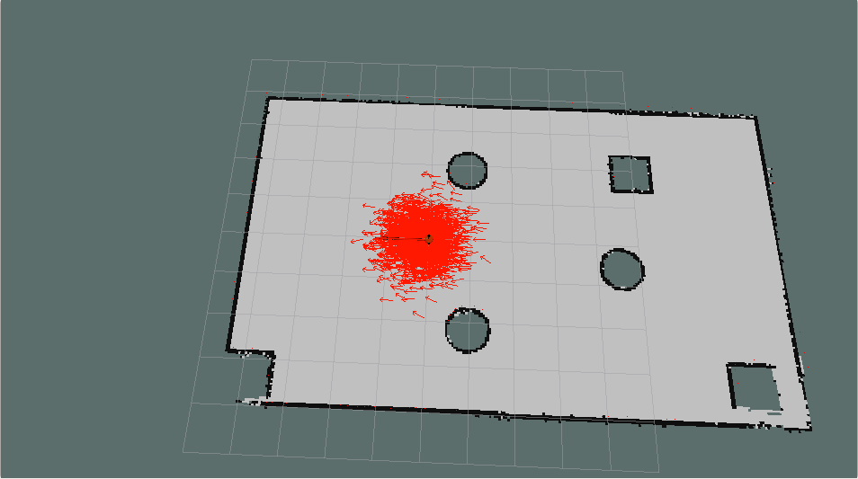

# 第7章 机器人导航(仿真)

导航是机器人系统中最重要的模块之一，比如现在较为流行的服务型室内机器人，就是依赖于机器人导航来实现室内自主移动的，本章主要就是介绍仿真环境下的导航实现，主要内容有：

- 导航相关概念
- 导航实现：机器人建图(SLAM)、地图服务、定位、路径规划...以可视化操作为主。
- 导航消息：了解地图、里程计、雷达、摄像头等相关消息格式。

预期达成的学习目标：

- 了解导航模块中的组成部分以及相关概念
- 能够在仿真环境下独立完成机器人导航

<B>案例演示：</B>

SLAM建图：

    

定位：

    

导航实现：

    

---